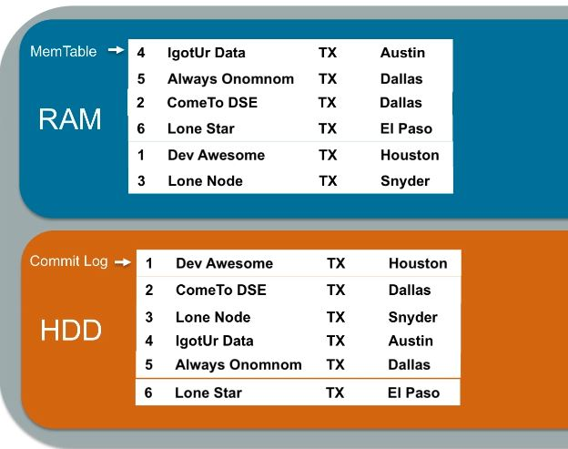

-   [(Section: TDG) - RDBMS history](#section-tdg---rdbms-history)
-   [(Section: TDG) - RDBMS Pros and
    cons](#section-tdg---rdbms-pros-and-cons)
-   [(Section: TDG) - Why RDBMS is
    successful?](#section-tdg---why-rdbms-is-successful)
-   [(Section: TDG) - How RDBMS is
    tuned](#section-tdg---how-rdbms-is-tuned)
-   [(Section: TDG) - Two-phase commit vs
    Compensation](#section-tdg---two-phase-commit-vs-compensation)
-   [(Section: TDG) - Sharding (Share
    nothing)](#section-tdg---sharding-share-nothing)
-   [(Section: TDG) - List of NoSQL
    databases](#section-tdg---list-of-nosql-databases)
-   [(Section: TDG) - Apache Cassandra - Official
    definition](#section-tdg---apache-cassandra---official-definition)
-   [(Section: TDG) - Cassandra
    Features](#section-tdg---cassandra-features)
-   [(Section: TDG) - What are all Consistency
    Forms?](#section-tdg---what-are-all-consistency-forms)
-   [(Section: TDG) - Strong consistency in
    Cassandra](#section-tdg---strong-consistency-in-cassandra)
-   [(Section: TDG) - Row-Oriented data
    store](#section-tdg---row-oriented-data-store)
-   [(Section: TDG) - Always writeable](#section-tdg---always-writeable)
-   [(Section: TDG) - Notable tools](#section-tdg---notable-tools)
-   [(Section: TDG) - Few use cases](#section-tdg---few-use-cases)
-   [(Section: TDG) - Updated CAP - Brewer's
    Theorem](#section-tdg---updated-cap---brewers-theorem)
-   [(Section: TDG) - What is the alternative for Two-phase
    commit](#section-tdg---what-is-the-alternative-for-two-phase-commit)
-   [(Section: TDG) - How to horizontally scale RDBMS
    (shard)](#section-tdg---how-to-horizontally-scale-rdbms-shard)
-   [(Section: TDG) - There are three basic strategies for determining
    shard
    structure:](#section-tdg---there-are-three-basic-strategies-for-determining-shard-structure)
-   [(Section: TDG) - Shared nothing](#section-tdg---shared-nothing)
-   [(Section: TDG) - New SQL (Scalable ACID
    transactions)](#section-tdg---new-sql-scalable-acid-transactions)
-   [(Section: TDG) - Cassandra
    features](#section-tdg---cassandra-features-1)
-   [(Section: TDG) - Cap Theorem (Brewer's
    theorem)](#section-tdg---cap-theorem-brewers-theorem)
-   [(Section: TDG) - Cassandra Lightweight transaction (LWT) -
    Linearizable
    consistency](#section-tdg---cassandra-lightweight-transaction-lwt---linearizable-consistency)
-   [(Section: TDG) - Row-Oriented (Wide column
    store)](#section-tdg---row-oriented-wide-column-store)
-   [(Section: TDG) - Cassandra - schema
    free?](#section-tdg---cassandra---schema-free)
-   [(Section: TDG) - Cassandra -
    use-cases?](#section-tdg---cassandra---use-cases)
-   [(Section: TDG) - Cassandra
    directories](#section-tdg---cassandra-directories)
-   [(Section: TDG) - Cassandra directories and
    files](#section-tdg---cassandra-directories-and-files)
-   [(Section: TDG) - Cassandra run-time
    properties](#section-tdg---cassandra-run-time-properties)
-   [(Section: TDG) - Cassandra cqlsh](#section-tdg---cassandra-cqlsh)
-   [(Section: TDG) - How to run apache Cassandra using
    docker](#section-tdg---how-to-run-apache-cassandra-using-docker)
-   [(Section: TDG) - Datamodel quick
    checklist](#section-tdg---datamodel-quick-checklist)
-   [(Section: TDG) - THE WIDE PARTITION
    PATTERN](#section-tdg---the-wide-partition-pattern)
-   [(Section: TDG) - Cassandra Architecture - logical components
    (2+4+3+4+1)](#section-tdg---cassandra-architecture---logical-components-24341)
-   [(Section: TDG) - Cassandra token
    ring](#section-tdg---cassandra-token-ring)
-   [(Section: TDG) - Hinted Handoff](#section-tdg---hinted-handoff)
-   [(Section: TDG) - Conflict-free replicated data
    type](#section-tdg---conflict-free-replicated-data-type)
-   [(Section: TDG) - What is anti-entropy
    repair?](#section-tdg---what-is-anti-entropy-repair)
-   [(Section: TDG) - MERKLE TREE usage in
    Cassandra?](#section-tdg---merkle-tree-usage-in-cassandra)
-   [(Section: TDG) - Commit Log](#section-tdg---commit-log)
-   [(Section: TDG) - Comapaction stragies in
    Cassandra](#section-tdg---comapaction-stragies-in-cassandra)
-   [(Section: TDG) - Cassandra under the
    hood](#section-tdg---cassandra-under-the-hood)
-   [(Section: TDG) - Deletion and
    Tombstones](#section-tdg---deletion-and-tombstones)
-   [(Section: TDG) - Bloom Filter](#section-tdg---bloom-filter)
-   [(Section: TDG) - cluster topology of
    Cassandra](#section-tdg---cluster-topology-of-cassandra)
-   [(Section: TDG) - CQL - Primary key and Clustering
    key](#section-tdg---cql---primary-key-and-clustering-key)
-   [(Section: TDG) - CQLSH - useful](#section-tdg---cqlsh---useful)
-   [(Section: TDG) - How to remove node using
    nodetool](#section-tdg---how-to-remove-node-using-nodetool)
-   [(Section: TDG) - Cassandra linux
    limits](#section-tdg---cassandra-linux-limits)
-   [(Section: TDG) - Cassandra troubleshoot linux
    commands](#section-tdg---cassandra-troubleshoot-linux-commands)
-   [(Section: TDG) - How does cassandra-topolgoy.properties look
    alike](#section-tdg---how-does-cassandra-topolgoy.properties-look-alike)
-   [(Section: TDG) - Cassandra Client - features (Datastax Driver
    4.9.0)](#section-tdg---cassandra-client---features-datastax-driver-4.9.0)
-   [(Section: TDG) - Cassandra Client - Retry Failied Queries (if node
    failed)](#section-tdg---cassandra-client---retry-failied-queries-if-node-failed)
-   [(Section: TDG) - Cassandra Client side - SPECULATIVE
    EXECUTION](#section-tdg---cassandra-client-side---speculative-execution)
-   [(Section: TDG) - Cassandra Client side - CONNECTION
    POOLING](#section-tdg---cassandra-client-side---connection-pooling)
-   [(Section: TDG) - Cassandra Client side driver
    configuration](#section-tdg---cassandra-client-side-driver-configuration)
-   [(Section: TDG) - Cassandra Client (Datastax Driver 4.9.0) - Java
    API](#section-tdg---cassandra-client-datastax-driver-4.9.0---java-api)
-   [(Section: TDG) - Cassandra Client Mapper/Entity
    Annotations](#section-tdg---cassandra-client-mapperentity-annotations)
-   [(Section: TDG) - Cassandra Client (Datastax Driver 5.0) -
    QueryBuilder API
    API](#section-tdg---cassandra-client-datastax-driver-5.0---querybuilder-api-api)
-   [(Section: TDG) - Cassandra Client (Datastax Driver 5.0) - Async
    API](#section-tdg---cassandra-client-datastax-driver-5.0---async-api)
-   [(Section: TDG) - JDK 9 - Reactive style
    API](#section-tdg---jdk-9---reactive-style-api)
-   [(Section: TDG) - Cassandra write
    path](#section-tdg---cassandra-write-path)
-   [(Section: TDG) - Cassandra write path - Materialized
    view](#section-tdg---cassandra-write-path---materialized-view)
-   [(Section: TDG) - Cassandra write/read - consistency
    CQLS](#section-tdg---cassandra-writeread---consistency-cqls)
-   [(Section: TDG) - Cassandra failures and
    solutions](#section-tdg---cassandra-failures-and-solutions)
-   [(Section: TDG) - Scaling Quotes](#section-tdg---scaling-quotes)
-   [(Section: TDG) - Performance
    Quotes](#section-tdg---performance-quotes)
-   [(Section: TDG) - Nodetool](#section-tdg---nodetool)
-   [(Section: TDG) - Building
    Cassandra](#section-tdg---building-cassandra)
-   [(Section: TDG) - Resources](#section-tdg---resources)
-   [(Section: TDG) - Follow-up questions for
    Cassandra](#section-tdg---follow-up-questions-for-cassandra)
-   [(Section: TDG) - Definitive Guide
    References](#section-tdg---definitive-guide-references)
-   [(Section: TDG) - Code](#section-tdg---code)
-   [(Section: TDG) - How to create anki from this markdown
    file](#section-tdg---how-to-create-anki-from-this-markdown-file)
-   [(Section: Installation) - Pre-requisite for this tutorial is
    docker](#section-installation---pre-requisite-for-this-tutorial-is-docker)
-   [(Section: Installation) - Use Os-boxes as virtual machine to
    install
    cassandra](#section-installation---use-os-boxes-as-virtual-machine-to-install-cassandra)
    -   [To start Cassandra](#to-start-cassandra)
-   [(Section: Installation) - Cassandra cluster using apache cassandra
    (Wait at-least 1 minute between successive container
    spin-off)](#section-installation---cassandra-cluster-using-apache-cassandra-wait-at-least-1-minute-between-successive-container-spin-off)
-   [(Section: Installation) - Connect to cassandra docker
    cluster](#section-installation---connect-to-cassandra-docker-cluster)
-   [(Section: Installation) - Run commands into cassandra docker
    node](#section-installation---run-commands-into-cassandra-docker-node)
-   [(Section: Installation) - Via docker for DSE
    server](#section-installation---via-docker-for-dse-server)
-   [(Section: Installation) - Setting up application using DSE image
    -Running Cassandra in
    Docker](#section-installation---setting-up-application-using-dse-image--running-cassandra-in-docker)
-   [(Section: Installation) - Copy files into and out-of
    containers](#section-installation---copy-files-into-and-out-of-containers)
-   [(Section: Installation) - Some Cassandra
    commands](#section-installation---some-cassandra-commands)
-   [(Section: Installation) - Cassandra directory (Apache
    Cassandra)](#section-installation---cassandra-directory-apache-cassandra)
-   [(Section: Installation) - Cassandra
    stress-tool](#section-installation---cassandra-stress-tool)
-   [(Section: Installation) - To start
    CQLSH](#section-installation---to-start-cqlsh)
-   [(Section: Installation) -
    References](#section-installation---references)
-   [(Section: Architecture) -
    nodetool](#section-architecture---nodetool)
-   [(Section: Architecture) - Ring](#section-architecture---ring)
-   [(Section: Architecture) - When a new node joins the
    ring](#section-architecture---when-a-new-node-joins-the-ring)
-   [(Section: Architecture) - Driver](#section-architecture---driver)
-   [(Section: Architecture) -
    Peer-to-Peer](#section-architecture---peer-to-peer)
-   [(Section: Architecture) - VNode](#section-architecture---vnode)
-   [(Section: Architecture) - Why
    Vnode?](#section-architecture---why-vnode)
-   [(Section: Architecture) - Gossip
    protocol](#section-architecture---gossip-protocol)
-   [(Section: Architecture) - What is
    gossiped?](#section-architecture---what-is-gossiped)
-   [(Section: Architecture) - Snitch](#section-architecture---snitch)
-   [(Section: Architecture) - Property File
    Snitch](#section-architecture---property-file-snitch)
-   [(Section: Architecture) - Gossiping Property File
    Snitch](#section-architecture---gossiping-property-file-snitch)
-   [(Section: Architecture) - Cassandra
    replication](#section-architecture---cassandra-replication)
-   [(Section: Architecture) - Consistency
    Level](#section-architecture---consistency-level)
-   [(Section: Architecture) - Consistency level in
    Cassandra](#section-architecture---consistency-level-in-cassandra)
-   [(Section: Architecture) - Hinted
    hand-off](#section-architecture---hinted-hand-off)
-   [(Section: Architecture) - Read repair (Assume
    RF=3)](#section-architecture---read-repair-assume-rf3)
-   [(Section: Architecture) - Read Repair
    Chance](#section-architecture---read-repair-chance)
-   [(Section: Architecture) -
    Node-repai](#section-architecture---node-repai)
-   [(Section: Architecture) - Nodetool has a repair tool that can
    repair entire cluster - Quite expensive
    operation](#section-architecture---nodetool-has-a-repair-tool-that-can-repair-entire-cluster---quite-expensive-operation)
-   [(Section: Architecture) - Datastax
    Node-sync](#section-architecture---datastax-node-sync)
-   [(Section: Architecture) - Write
    path](#section-architecture---write-path)
-   [(Section: Architecture) - Read
    path](#section-architecture---read-path)
-   [(Section: Architecture) -
    Data-stax](#section-architecture---data-stax)
-   [(Section: Architecture) -
    Compaction](#section-architecture---compaction)
-   [(Section: Architecture) - Compacting
    partition](#section-architecture---compacting-partition)
-   [(Section: Architecture) - Compacting
    SSTables](#section-architecture---compacting-sstables)
-   [(Section: Architecture) - Types of
    compaction](#section-architecture---types-of-compaction)
-   [(Section: Architecture) - Datastax
    ES6](#section-architecture---datastax-es6)
-   [(Section: Architecture) - Under what circumstances is the use of
    lightweight transactions
    justified?](#section-architecture---under-what-circumstances-is-the-use-of-lightweight-transactions-justified)
-   [(Section: Architecture) -
    Reference](#section-architecture---reference)
-   [(Section: Partition) - Partition](#section-partition---partition)
-   [(Section: Partition) - Clustering
    Columns](#section-partition---clustering-columns)
-   [(Section: Partition) - Primary
    Key](#section-partition---primary-key)
-   [(Section: Partition) - Impact of partition key on query
    (CQL)](#section-partition---impact-of-partition-key-on-query-cql)
-   [(Section: Partition) - Querying](#section-partition---querying)
-   [(Section: Partition) - CQL](#section-partition---cql)
-   [(Section: Partition) - Datastax
    slides](#section-partition---datastax-slides)
-   [What is Each_Quorum](#what-is-each_quorum)
-   [(Section: Performance) - Performance could be degraded for many
    reasons](#section-performance---performance-could-be-degraded-for-many-reasons)
-   [(Section: Performance) - Dropped
    Mutataions](#section-performance---dropped-mutataions)
-   [(Section: Performance) - Configuration that affects dropped
    mutations](#section-performance---configuration-that-affects-dropped-mutations)
-   [(Section: Performance) - When does Cassandra end up having useless
    data](#section-performance---when-does-cassandra-end-up-having-useless-data)
-   [(Section: Performance) - How to find the largest SSTable (or
    largest partition) in the
    cluster](#section-performance---how-to-find-the-largest-sstable-or-largest-partition-in-the-cluster)
-   [(Section: Performance) - Usage statistics of thread-pool -
    output](#section-performance---usage-statistics-of-thread-pool---output)
-   [(Section: DS210) - What is D210 Course
    about](#section-ds210---what-is-d210-course-about)
-   [(Section: DS210) - What are basic parameter required for Cassandra
    quickstart](#section-ds210---what-are-basic-parameter-required-for-cassandra-quickstart)
-   [(Section: DS210) - What is the location of default
    Cassandra.yaml?](#section-ds210---what-is-the-location-of-default-cassandra.yaml)
-   [(Section: DS210) - What are two file-systedm that should be
    separated](#section-ds210---what-are-two-file-systedm-that-should-be-separated)
-   [(Section: DS210) - Cluster Sizing](#section-ds210---cluster-sizing)
-   [(Section: DS210) - Cluster Sizing - Writethrough put
    example](#section-ds210---cluster-sizing---writethrough-put-example)
-   [(Section: DS210) - Cluster Sizing - Read throughput
    example](#section-ds210---cluster-sizing---read-throughput-example)
-   [(Section: DS210) - Cluster-sizing - Monthly
    calculate](#section-ds210---cluster-sizing---monthly-calculate)
-   [(Section: DS210) - Cluster-sizing - Latency
    calculate](#section-ds210---cluster-sizing---latency-calculate)
-   [(Section: DS210) - Cluster Sizing - Probing
    Questions](#section-ds210---cluster-sizing---probing-questions)
-   [(Section: DS210) - Cassandra stress
    tool](#section-ds210---cassandra-stress-tool)
-   [(Section: DS210) - Linux top
    command](#section-ds210---linux-top-command)
-   [(Section: DS210) - Linux top command -
    Cassandra](#section-ds210---linux-top-command---cassandra)
-   [(Section: DS210) - Linux dstat command (alternative to
    top)](#section-ds210---linux-dstat-command-alternative-to-top)
-   [(Section: DS210) - Nodetool (Performance Analysis inside cluster
    node)](#section-ds210---nodetool-performance-analysis-inside-cluster-node)
-   [(Section: DS210) - Nodetool compaction-history - what are all the
    fields and
    output?](#section-ds210---nodetool-compaction-history---what-are-all-the-fields-and-output)
-   [(Section: DS210) - To figure out the name of a node's datacenter
    and rack, which nodetool sub-command should you
    use?](#section-ds210---to-figure-out-the-name-of-a-nodes-datacenter-and-rack-which-nodetool-sub-command-should-you-use)
-   [(Section: DS210) - Nodetool
    gcstats](#section-ds210---nodetool-gcstats)
-   [(Section: DS210) - Nodetool
    Gossipinfo](#section-ds210---nodetool-gossipinfo)
-   [(Section: DS210) - Nodetool Ring
    command](#section-ds210---nodetool-ring-command)
-   [(Section: DS210) - Nodetool Tableinfo (tablestats) - Quite useful
    for data-modelling
    information](#section-ds210---nodetool-tableinfo-tablestats---quite-useful-for-data-modelling-information)
-   [(Section: DS210) - How to find large
    partition?](#section-ds210---how-to-find-large-partition)
-   [(Section: DS210) - Nodetool Threadpoolinfo
    (tpstats)](#section-ds210---nodetool-threadpoolinfo-tpstats)
-   [(Section: DS210) - Cassandra
    logging](#section-ds210---cassandra-logging)
-   [(Section: DS210) - Cassandra JVM GC
    logging](#section-ds210---cassandra-jvm-gc-logging)
-   [(Section: DS210) - How Cassandra JVM GC logging can be
    configured](#section-ds210---how-cassandra-jvm-gc-logging-can-be-configured)
-   [(Section: DS210) - How to read
    GC.log?](#section-ds210---how-to-read-gc.log)
-   [(Section: DS210) - Adding a node](#section-ds210---adding-a-node)
-   [(Section: DS210) - Bootstrapping (Adding a
    note)](#section-ds210---bootstrapping-adding-a-note)
-   [(Section: DS210) - What are the steps followed by a boostrapping
    node when
    joining?](#section-ds210---what-are-the-steps-followed-by-a-boostrapping-node-when-joining)
-   [(Section: DS210) - What are the help rendered by a existing node to
    a
    joining?](#section-ds210---what-are-the-help-rendered-by-a-existing-node-to-a-joining)
-   [(Section: DS210) - Issues during
    bootstrap](#section-ds210---issues-during-bootstrap)
-   [(Section: DS210) - If Bootstrap
    fails](#section-ds210---if-bootstrap-fails)
-   [(Section: DS210) - After Boostrap
    (Cleanup)](#section-ds210---after-boostrap-cleanup)
-   [(Section: DS210) - Removing node](#section-ds210---removing-node)
-   [(Section: DS210) - Where is the data coming from when a node is
    removed?](#section-ds210---where-is-the-data-coming-from-when-a-node-is-removed)
-   [(Section: DS210) - How to replace a
    down-node](#section-ds210---how-to-replace-a-down-node)
-   [(Section: DS210) - Why replace a node than
    removing-and-adding?](#section-ds210---why-replace-a-node-than-removing-and-adding)
-   [(Section: DS210) - STCS - Size Tieres Compaction
    Strategy](#section-ds210---stcs---size-tieres-compaction-strategy)
-   [(Section: DS210) - STCS Pros and
    Disadvantage](#section-ds210---stcs-pros-and-disadvantage)
-   [(Section: DS210) - What triggers a STCS
    Compaction](#section-ds210---what-triggers-a-stcs-compaction)
-   [(Section: DS210) - STCS -
    Tombstones](#section-ds210---stcs---tombstones)
-   [(Section: DS210) - LCS - Leveled Compaction
    Strategy](#section-ds210---lcs---leveled-compaction-strategy)
-   [(Section: DS210) - LCS Pros and
    Cons](#section-ds210---lcs-pros-and-cons)
-   [(Section: DS210) - LCS - Lagging
    behind](#section-ds210---lcs---lagging-behind)
-   [(Section: DS210) -
    LeveledCompactionStrategy](#section-ds210---leveledcompactionstrategy)
-   [(Section: DS210) - TWCS - Time-window compaction
    strategies](#section-ds210---twcs---time-window-compaction-strategies)
-   [(Section: DS210) - Nodesync (Datastax Enterprise
    6.0)](#section-ds210---nodesync-datastax-enterprise-6.0)
-   [(Section: DS210) - What are all the possible reason for large
    SSTable](#section-ds210---what-are-all-the-possible-reason-for-large-sstable)
-   [(Section: DS210) -
    Multi-Datacenter](#section-ds210---multi-datacenter)
-   [(Section: DS210) - Multi-Datacenter Consistency
    Level](#section-ds210---multi-datacenter-consistency-level)
-   [(Section: DS210) - What if one datacenter goes
    down?](#section-ds210---what-if-one-datacenter-goes-down)
-   [(Section: DS210) - Why we need additional
    DC?](#section-ds210---why-we-need-additional-dc)
-   [(Section: DS210) - SSTableDump](#section-ds210---sstabledump)
-   [(Section: DS210) - SSTableloader](#section-ds210---sstableloader)
-   [(Section: DS210) - Loading different formats of data into
    Cassandra](#section-ds210---loading-different-formats-of-data-into-cassandra)
-   [(Section: DS210) - Datstax - DSE Bulk (configuration should be in
    HOCON
    format)](#section-ds210---datstax---dse-bulk-configuration-should-be-in-hocon-format)
-   [(Section: DS210) - Backup and
    Snapshots](#section-ds210---backup-and-snapshots)
-   [(Section: DS210) - What is Cassandra
    snapshots?](#section-ds210---what-is-cassandra-snapshots)
-   [(Section: DS210) - How do incrementa backup
    works](#section-ds210---how-do-incrementa-backup-works)
-   [(Section: DS210) - Where to store
    snapshots?](#section-ds210---where-to-store-snapshots)
-   [(Section: DS210) - How Truncate
    works?](#section-ds210---how-truncate-works)
-   [(Section: DS210) - How to
    snapshot?](#section-ds210---how-to-snapshot)
-   [(Section: DS210) - Restore (We get 1 point for backup, 99 point for
    restore)](#section-ds210---restore-we-get-1-point-for-backup-99-point-for-restore)
-   [(Section: DS210) - Steps to restore from
    snapshots](#section-ds210---steps-to-restore-from-snapshots)
-   [(Section: DS210) - JVM settings](#section-ds210---jvm-settings)
-   [(Section: DS210) - Garbage Collections (Apache
    Cassandra)](#section-ds210---garbage-collections-apache-cassandra)
-   [(Section: DS210) - Why does full GC
    runs?](#section-ds210---why-does-full-gc-runs)
-   [(Section: DS210) - How to troubleshoot OutOfMemoryError issues in
    Casssandra?](#section-ds210---how-to-troubleshoot-outofmemoryerror-issues-in-casssandra)
-   [(Section: DS210) - What is TSC?](#section-ds210---what-is-tsc)
-   [(Section: DS210) - Tuning the Linux
    Kernel](#section-ds210---tuning-the-linux-kernel)
-   [(Section: DS210) - What should be removed/disabled from Linux for
    Cassandra to work? How to
    remove](#section-ds210---what-should-be-removeddisabled-from-linux-for-cassandra-to-work-how-to-remove)
-   [(Section: DS210) - Hardware resources to
    consider](#section-ds210---hardware-resources-to-consider)
-   [(Section: DS210) - Datastax on
    Cloud](#section-ds210---datastax-on-cloud)
-   [(Section: DS210) - Cassandra on Cloud
    Challenges](#section-ds210---cassandra-on-cloud-challenges)
-   [(Section: DS210) - Cassandra on cloud
    security](#section-ds210---cassandra-on-cloud-security)
-   [(Section: DS210) - Cassandra Security
    Considerations](#section-ds210---cassandra-security-considerations)
-   [(Section: DS210) - What is the default security
    configuration](#section-ds210---what-is-the-default-security-configuration)
-   [(Section: DS210) - Where is roles are stored in internal-scheme?
    (in default
    scheme)](#section-ds210---where-is-roles-are-stored-in-internal-scheme-in-default-scheme)
-   [(Section: DS210) - Cassandra Authentication table
    (system_auth.roles - in default
    scheme)](#section-ds210---cassandra-authentication-table-system_auth.roles---in-default-scheme)
-   [(Section: DS210) - What are best practices for Cassandra
    security](#section-ds210---what-are-best-practices-for-cassandra-security)
-   [(Section: DS210) - Cassandra Role/Authorization
    management](#section-ds210---cassandra-roleauthorization-management)
-   [(Section: DS210) - Cassandra encryption
    SSL](#section-ds210---cassandra-encryption-ssl)
-   [(Section: DS210) - What are two artifacts required for Cassandra to
    enable
    SSL](#section-ds210---what-are-two-artifacts-required-for-cassandra-to-enable-ssl)
-   [(Section: DS210) - 8 Steps for SSL setup
    (node-to-node)](#section-ds210---8-steps-for-ssl-setup-node-to-node)
-   [(Section: DS210) - How to harden Cassandra
    security](#section-ds210---how-to-harden-cassandra-security)
-   [(Section: DS210) - Datastax
    OpsCenter](#section-ds210---datastax-opscenter)
-   [(Section: DS210) - Datastax OpsCenter (Cluster
    Monitoring/Alert)](#section-ds210---datastax-opscenter-cluster-monitoringalert)
-   [(Section: DS210) - Datastax OpsCenter (Management
    Service)](#section-ds210---datastax-opscenter-management-service)
-   [(Section: DS210) - Datastax OpsCenter (Backup and restore
    Service)](#section-ds210---datastax-opscenter-backup-and-restore-service)
-   [(Section: DS210) - Datastax OpsCenter LifeCycle Manager
    (Provisioning)](#section-ds210---datastax-opscenter-lifecycle-manager-provisioning)
-   [(Section: DS210) - Datastax OpsCenter
    NodeSync](#section-ds210---datastax-opscenter-nodesync)
-   [(Section: DS210) - Datastax OpsCenter other
    features](#section-ds210---datastax-opscenter-other-features)
-   [(Section: DS210) - Follow-up
    course](#section-ds210---follow-up-course)
-   [(Section: DS210) - Lab notes](#section-ds210---lab-notes)
-   [(Section: DS210) - Cassandra
    people](#section-ds210---cassandra-people)
-   [Cassandra production error](#cassandra-production-error)
-   [(Server side) -
    com.datastax.oss.driver.api.core.connection.ConnectionIntiException..
    ssl should be
    configured](#server-side---com.datastax.oss.driver.api.core.connection.connectionintiexception..-ssl-should-be-configured)
-   [How to connect to Cassandra from
    API](#how-to-connect-to-cassandra-from-api)
-   [TO setup python](#to-setup-python)
-   [Cluster level monitoring](#cluster-level-monitoring)
-   [Top worst performing](#top-worst-performing)
-   [List monitoring elements](#list-monitoring-elements)
-   [List table level](#list-table-level)
-   [Node Status](#node-status)
-   [(Section: Nodetool) - Nodetool
    usage](#section-nodetool---nodetool-usage)
-   [(Section: Nodetool) - Nodetool
    commands](#section-nodetool---nodetool-commands)
-   [(Section: Repair) - Repair Service (on
    OpsCenter)](#section-repair---repair-service-on-opscenter)
-   [(Section: Repair) - Repair
    command](#section-repair---repair-command)
-   [(Section: Repair) - Why repairs are
    necessary?](#section-repair---why-repairs-are-necessary)
-   [(Section: Repair) - Repair
    guideline](#section-repair---repair-guideline)
-   [(Section: Repair) - What is Primary Range
    Repair?](#section-repair---what-is-primary-range-repair)
-   [(Section: Repair) - How does repair
    work?](#section-repair---how-does-repair-work)
-   [(Section: Repair) - Events that trigger
    Repair](#section-repair---events-that-trigger-repair)
-   [(Section: Repair) - Dropped Mutation vs
    Repair](#section-repair---dropped-mutation-vs-repair)
-   [(Section: Repair) - If 10 nodes equally sharing data with RF=3, if
    we try to repair 'nodetool repair on node-3', How many node will be
    involved in
    repair?](#section-repair---if-10-nodes-equally-sharing-data-with-rf3-if-we-try-to-repair-nodetool-repair-on-node-3-how-many-node-will-be-involved-in-repair)
-   [(Section: Repair) - How to specifically use only one node to repair
    itself](#section-repair---how-to-specifically-use-only-one-node-to-repair-itself)
-   [(Section: Repair) - If we run full repair on a 'n' node cluster
    with RF=3, How many times we are repairing the
    data?](#section-repair---if-we-run-full-repair-on-a-n-node-cluster-with-rf3-how-many-times-we-are-repairing-the-data)
-   [(Section: Repair) - Developer who maintains/presented about
    Reaper](#section-repair---developer-who-maintainspresented-about-reaper)
-   [(Section: Repair) - Repair
    documentation](#section-repair---repair-documentation)
-   [(Section: Repair) - Repair and some number related to
    time](#section-repair---repair-and-some-number-related-to-time)
-   [(Section: Repair) - What are Reaper
    settings](#section-repair---what-are-reaper-settings)
-   [(Section: Repair) - Reaper is predominantly used for repair
    tasks](#section-repair---reaper-is-predominantly-used-for-repair-tasks)
-   [(Section: Repair) - Repair related
    commands](#section-repair---repair-related-commands)
-   [(Section: Repair) - Reference](#section-repair---reference)
-   [(Section: Repair) - How to create anki from this markdown
    file](#section-repair---how-to-create-anki-from-this-markdown-file)
-   [(Section: Cqls) - Create KeySpace (and use
    it)](#section-cqls---create-keyspace-and-use-it)
-   [(Section: Cqls) - Partition Key vs Primary
    Key](#section-cqls---partition-key-vs-primary-key)
-   [(Section: Cqls) - Create TABLE and load/export data in and
    out-of-tables](#section-cqls---create-table-and-loadexport-data-in-and-out-of-tables)
-   [(Section: Cqls) - How to select token values of
    primary-key](#section-cqls---how-to-select-token-values-of-primary-key)
-   [(Section: Cqls) - What is Conditional
    Insert?](#section-cqls---what-is-conditional-insert)
-   [(Section: Cqls) - IS CQL
    Case-sensitive](#section-cqls---is-cql-case-sensitive)
-   [(Section: Cqls) - Create Keyspace/Table
    Syntax](#section-cqls---create-keyspacetable-syntax)
-   [(Section: Cqls) - CQL Copy and
    rules](#section-cqls---cql-copy-and-rules)
-   [(Section: Cqls) - CQL Copy
    options](#section-cqls---cql-copy-options)
-   [(Section: Cqls) - How to list partition_key (or the actual token)
    along with other
    columns](#section-cqls---how-to-list-partition_key-or-the-actual-token-along-with-other-columns)
-   [(Section: Cqls) - Gosspinfo](#section-cqls---gosspinfo)
-   [(Section: Cqls) - nodetool getendpoints killrvideo videos_by_tag
    cassandra](#section-cqls---nodetool-getendpoints-killrvideo-videos_by_tag-cassandra)
-   [(Section: Cqls) - What are all the System
    Schema](#section-cqls---what-are-all-the-system-schema)
-   [(Section: Cqls) - See how many rows have been written into this
    table (Warning - row scans are expensive operations on large
    tables)](#section-cqls---see-how-many-rows-have-been-written-into-this-table-warning---row-scans-are-expensive-operations-on-large-tables)
-   [(Section: Cqls) - Write a couple of rows, populate different
    columns for each, and view the
    results](#section-cqls---write-a-couple-of-rows-populate-different-columns-for-each-and-view-the-results)
-   [(Section: Cqls) - View the timestamps generated for previous
    writes](#section-cqls---view-the-timestamps-generated-for-previous-writes)
-   [(Section: Cqls) - Note that we're not allowed to ask for the
    timestamp on primary key
    columns](#section-cqls---note-that-were-not-allowed-to-ask-for-the-timestamp-on-primary-key-columns)
-   [(Section: Cqls) - Set the timestamp on a
    write](#section-cqls---set-the-timestamp-on-a-write)
-   [(Section: Cqls) - Verify the timestamp
    used](#section-cqls---verify-the-timestamp-used)
-   [(Section: Cqls) - View the time to live value for a
    column](#section-cqls---view-the-time-to-live-value-for-a-column)
-   [(Section: Cqls) - Set the TTL on the last name column to one
    hour](#section-cqls---set-the-ttl-on-the-last-name-column-to-one-hour)
-   [(Section: Cqls) - View the TTL of the last_name - (counting
    down)](#section-cqls---view-the-ttl-of-the-last_name---counting-down)
-   [(Section: Cqls) - Find the token](#section-cqls---find-the-token)
-   [(Section: Cqls) - Clear the screen of output from previous
    commands](#section-cqls---clear-the-screen-of-output-from-previous-commands)
-   [(Section: Cqls) - Cassandra Dual equivalent table and
    SQL](#section-cqls---cassandra-dual-equivalent-table-and-sql)
-   [(Section: Cqls) - How to find avg, sum, min, max within Partition
    (use ratings_by_movie) as
    example??](#section-cqls---how-to-find-avg-sum-min-max-within-partition-use-ratings_by_movie-as-example)
-   [(Section: Cqls) - Sample function to find days between two
    date?](#section-cqls---sample-function-to-find-days-between-two-date)
-   [(Section: Cqls) - How to add/delete column to a
    table?](#section-cqls---how-to-adddelete-column-to-a-table)
-   [(Section: Cqls) - Exit cqlsh](#section-cqls---exit-cqlsh)
-   [(Section: Cqls) - What would happen if we use Clustering Column
    where STATIC columns are
    updated](#section-cqls---what-would-happen-if-we-use-clustering-column-where-static-columns-are-updated)
-   [(Section: Cqls) - Reference](#section-cqls---reference)
-   [(Section: SSTable) - Storage
    Architecture](#section-sstable---storage-architecture)
-   [(Section: SSTable) - SStable - settings in
    cassandra.yaml](#section-sstable---sstable---settings-in-cassandra.yaml)
-   [(Section: SSTable) - What are the files part of
    SSTable](#section-sstable---what-are-the-files-part-of-sstable)
-   [(Section: SSTable) - What is the role of index
    file](#section-sstable---what-is-the-role-of-index-file)
-   [(Section: SSTable) - What is the role of statitics
    file](#section-sstable---what-is-the-role-of-statitics-file)
-   [(Section: SSTable) - Why SQLite4 didn't use
    LSM?](#section-sstable---why-sqlite4-didnt-use-lsm)
-   [(Section: SSTable) - LSM Pros and
    Cons](#section-sstable---lsm-pros-and-cons)
-   [(Section: SSTable) - SSTable
    references](#section-sstable---sstable-references)
-   [(Section: Administration) - Course DSE
    installation](#section-administration---course-dse-installation)
-   [(Section: Administration) - Nodetool vs
    DSEtool](#section-administration---nodetool-vs-dsetool)
-   [(Section: Administration) - Nodetool Gauge the server
    performance](#section-administration---nodetool-gauge-the-server-performance)
-   [(Section: Administration) - Find all the material view of a
    keyspace](#section-administration---find-all-the-material-view-of-a-keyspace)
-   [(Section: Administration) - How to find number of
    partitions/node-of partition in a
    table](#section-administration---how-to-find-number-of-partitionsnode-of-partition-in-a-table)
-   [(Section: Administration) - Cassandra Node
    (Server/VM/H/W)](#section-administration---cassandra-node-servervmhw)
-   [(Section: Administration) - Cassandra Ring (The
    cluster)](#section-administration---cassandra-ring-the-cluster)
-   [(Section: Administration) - How new nodes join the
    ring](#section-administration---how-new-nodes-join-the-ring)
-   [(Section: Administration) -
    Peer-to-Peer](#section-administration---peer-to-peer)
-   [(Section: Administration) - Why do we need
    VNode?](#section-administration---why-do-we-need-vnode)
-   [(Section: Administration) - How to enable
    VNode?](#section-administration---how-to-enable-vnode)
-   [(Section: Administration) - Gossip protocol (nodemeta data is the
    subject)](#section-administration---gossip-protocol-nodemeta-data-is-the-subject)
-   [(Section: Administration) - What do nodes Gossip
    about?](#section-administration---what-do-nodes-gossip-about)
-   [(Section: Administration) - What is Gossip data structure look
    like?](#section-administration---what-is-gossip-data-structure-look-like)
-   [(Section: Administration) - What is Gossip
    protocol?](#section-administration---what-is-gossip-protocol)
-   [(Section: Administration) - How to find more details about
    Gossip](#section-administration---how-to-find-more-details-about-gossip)
-   [(Section: Administration) - Sample
    Gossipinfo](#section-administration---sample-gossipinfo)
-   [(Section: Administration) - Node failure
    detector](#section-administration---node-failure-detector)
-   [(Section: Administration) - Snitch (meaning
    informer)](#section-administration---snitch-meaning-informer)
-   [(Section: Administration) - What is the role of
    DynamicSnitch](#section-administration---what-is-the-role-of-dynamicsnitch)
-   [(Section: Administration) - Mandatory operational
    practice](#section-administration---mandatory-operational-practice)
-   [(Section: Administration) - Replication with
    RF=1](#section-administration---replication-with-rf1)
-   [(Section: Administration) - Replication with
    RF>=2](#section-administration---replication-with-rf2)
-   [(Section: Administration) - Replication with RF>=2 and Cross
    DataCenter](#section-administration---replication-with-rf2-and-cross-datacenter)
-   [(Section: Administration) - Consistency in
    CQL](#section-administration---consistency-in-cql)
-   [(Section: Administration) -
    Reference](#section-administration---reference)
-   [Time-series presentations](#time-series-presentations)
-   [(Section: Tombstone) - What are all the majore issues due to
    Tombstones](#section-tombstone---what-are-all-the-majore-issues-due-to-tombstones)
-   [(Section: Tombstone) - How to agressively collect tombstones (to
    resolve few of the query timeout tactical
    solution)](#section-tombstone---how-to-agressively-collect-tombstones-to-resolve-few-of-the-query-timeout-tactical-solution)
-   [(Section: Tombstone) - Where is Tombstones are
    handled?](#section-tombstone---where-is-tombstones-are-handled)
-   [(Section: WriteRead) - How read
    works?](#section-writeread---how-read-works)
-   [(Section: WriteRead) - Read Repair (Happens only when
    CL=All)](#section-writeread---read-repair-happens-only-when-clall)
-   [(Section: WriteRead) - Read Repair Chance (when CL \< ALL) (less
    than ALL consistency
    read)](#section-writeread---read-repair-chance-when-cl-all-less-than-all-consistency-read)
-   [(Section: WriteRead) - Nodetool
    repair](#section-writeread---nodetool-repair)
-   [(Section: WriteRead) - Nodetool Sync (only
    datastax)](#section-writeread---nodetool-sync-only-datastax)
-   [(Section: WriteRead) - Nodetool Sync Save points (only
    datastax)](#section-writeread---nodetool-sync-save-points-only-datastax)
-   [(Section: WriteRead) - Nodetool Sync - Segments
    Sizes](#section-writeread---nodetool-sync---segments-sizes)
-   [(Section: WriteRead) - Nodetool Sync - Segments
    failures](#section-writeread---nodetool-sync---segments-failures)
-   [(Section: WriteRead) - Nodetool Sync - Segments
    Validation](#section-writeread---nodetool-sync---segments-validation)
-   [(Section: WriteRead) - Cassandra Write Path (inside the node, and
    for *a*
    partition)](#section-writeread---cassandra-write-path-inside-the-node-and-for-a-partition)
-   [(Section: WriteRead) - Cassandra Read Path (inside the node, and
    for particular a
    partition)](#section-writeread---cassandra-read-path-inside-the-node-and-for-particular-a-partition)
-   [(Section: WriteRead) - Cassandra Read Path
    workflow](#section-writeread---cassandra-read-path-workflow)
-   [(Section: WriteRead) - Bloom
    filter](#section-writeread---bloom-filter)
-   [(Section: WriteRead) - Datastax](#section-writeread---datastax)
-   [(Section: WriteRead) - Compaction (merging
    ss-tables)](#section-writeread---compaction-merging-ss-tables)
-   [(Section: WriteRead) - Compaction Strategies (based on
    use-case)](#section-writeread---compaction-strategies-based-on-use-case)
-   [(Section: WriteRead) - Advanced Peformance Gains in
    (DSE)](#section-writeread---advanced-peformance-gains-in-dse)
-   [(Section: WriteRead) - Before and after
    flush](#section-writeread---before-and-after-flush)
-   [(Section: WriteRead) - Sample data directory wiht WITH
    bloom_filter_fp_chance =
    0.1;](#section-writeread---sample-data-directory-wiht-with-bloom_filter_fp_chance-0.1)
-   [(Section: WriteRead) - Sample data directory wiht WITH
    bloom_filter_fp_chance =
    0.0001;](#section-writeread---sample-data-directory-wiht-with-bloom_filter_fp_chance-0.0001)
-   [(Section: WriteRead) - Sample data directory wiht WITH
    bloom_filter_fp_chance = 1.0; (100% false positive allowed... No
    filter
    file)](#section-writeread---sample-data-directory-wiht-with-bloom_filter_fp_chance-1.0-100-false-positive-allowed-no-filter-file)
-   [(Section: WriteRead) - Nodetool
    CFStats](#section-writeread---nodetool-cfstats)
-   [(Section: WriteRead) - Followup
    questions](#section-writeread---followup-questions)
-   [What is compaction in Cassandra?](#what-is-compaction-in-cassandra)
-   [Pre-requisite for Compaction](#pre-requisite-for-compaction)
-   [We have problem with two nodes with large number of compaction
    pending, how to speed
    up?](#we-have-problem-with-two-nodes-with-large-number-of-compaction-pending-how-to-speed-up)
-   [Reference](#reference)
-   [(Section: Experimental) - MV -
    Limitations?](#section-experimental---mv---limitations)
-   [(Section: Experimental) - How to mitigate the risk of base-view
    inconsistency?](#section-experimental---how-to-mitigate-the-risk-of-base-view-inconsistency)
-   [(Section: Experimental) - Example of
    MVs.](#section-experimental---example-of-mvs.)
-   [(Section: Experimental) - What are all types of secondary
    index.](#section-experimental---what-are-all-types-of-secondary-index.)
-   [(Section: Experimental) - Use cases for indexes in Cassandra
    production (specific
    cases):](#section-experimental---use-cases-for-indexes-in-cassandra-production-specific-cases)
-   [(Section: Experimental) - Limitations of indexes in
    Cassandra:](#section-experimental---limitations-of-indexes-in-cassandra)
-   [(Section: Experimental) - Secondary index
    limitations](#section-experimental---secondary-index-limitations)
-   [Anti-patterns in the Cassandra](#anti-patterns-in-the-cassandra)
-   [What is the URL of hands-on
    workshop?](#what-is-the-url-of-hands-on-workshop)
-   [Important Spring Java project](#important-spring-java-project)
-   [JIRA based on labels](#jira-based-on-labels)
-   [JIRA Features in Cassandra](#jira-features-in-cassandra)
-   [Cassandra index](#cassandra-index)
-   [Famous Cassandra articles](#famous-cassandra-articles)
-   [Analyze Cassandra code](#analyze-cassandra-code)
-   [K8ssandra](#k8ssandra)

## (Section: TDG) - RDBMS history

-   IBM DB1 - IMS Hierarchical dbms - DBI/DB1 - Released in 1968
-   IBM DB2 - 1970 - "A Relational Model of Data for Large Shared Data
    Banks - Dr. Edgar F. Codd"
-   1979-DB2 (E.F Cod 1970s), RDBMS relational model (not working
    system, just theoratical model)
-   Traditionally RDBMS supports locks, locks helps to maintain
    consistency but reduces access/availability to others
-   Journal or WAL log files are used for rollback or atomic-commit in
    RDBMS, journal sometime switched of to increase performance
-   Codd provided a list of 12 rules (0-12, actually 13 :-)) in
    ComputerWorld Magazine in 1985 (15 years later from original paper)
-   ANSI SQL - 1986

## (Section: TDG) - RDBMS Pros and cons

-   Pros : It works for most of the cases
    -   SQL - Support
    -   ACID - Transaction (A Transformation of State - Jim Gray)
        -   Atomic (State A to State B - no in-between)
        -   Consistency
        -   Isolated - Force transactions to be serially executed. (If
            it doesn't require consistency and atomic, it is possible to
            have isolated and parallel txns)
        -   Durable - Never lost
-   Cons : Won't work for massively web scale db

## (Section: TDG) - Why RDBMS is successful?

-   SQL
-   Atomic Transaction with ACID properties
-   Two-phase commit was marketted well (Co-ordinated txn)
-   Rich schema

## (Section: TDG) - How RDBMS is tuned

-   Introduce Index
-   Master(write), Slave (many times only used for read)
    -   Introduces replication and transaction issues
    -   Introduces consistency issues
-   Add more CPU, RAM - Vertical scaling
-   Partitioning/Sharding
-   Disable journaling

## (Section: TDG) - Two-phase commit vs Compensation

-   Compensation
    -   Writing off the transaction if it fails, deciding to discard
        erroneous transactions and reconciling later.
    -   Retry failed operations later on notification.
-   In a reservation system or a stock sales ticker, these are not
    likely to meet your requirements.
-   For other kinds of applications, such as billing or ticketing
    applications, this can be acceptable.
-   Starbucks Does Not Use Two-Phase Commit
    -   https://www.enterpriseintegrationpatterns.com/ramblings/18_starbucks.html

## (Section: TDG) - Sharding (Share nothing)

-   Rather keeping all customer in one table, divide up that single
    customer table so that each database has only some of the records,
    with their order preserved? Then, when clients execute queries, they
    put load only on the machine that has the record they're looking
    for, with no load on the other machines.
-   How to shard?
    -   Name-wise sharding issues like customer names that starts with
        "Q,J" will have less, whereas customer name starts with J, M and
        S may be busy
    -   Shard by DOB, SSN, HASH
-   Three basic strategies for determining shard structure
    -   Feature-based shard or functional segmentation
    -   Key-based sharding - one-way hash on a key data element and
        distribute data across machines according to the hash.
    -   Lookup Table

## (Section: TDG) - [List of NoSQL databases](http://nosql-database.org/)

-   Key-Value stores - Oracle Coherence, Redis, and MemcacheD, Amazon's
    Dynamo DB, Riak, and Voldemort.
-   Column stores - Cassandra, Hypertable, and Apache Hadoop's HBase.
-   Document stores - MongoDB and CouchDB.
-   Graph databases - Blazegraph, FlockDB, Neo4J, and Polyglot
-   Object databases - db4o and InterSystems Caché
-   XML databases - Tamino from Software AG and eXist.

## (Section: TDG) - Apache Cassandra - Official definition

-   "Apache Cassandra is an open source, distributed, decentralized,
    elastically scalable, highly available, fault-tolerant, tuneably
    consistent, row-oriented database. Cassandra bases its distribution
    design on Amazon's Dynamo and its data model on Google's Bigtable,
    with a query language similar to SQL"
-   Tuneably consistent (not Eventual Consisten as majority believes)

## (Section: TDG) - Cassandra Features

-   CQL (Thrift API is completely removed in 3.x)
    -   CQL also known as native-transport
-   Secondary indexes
-   Materialized views
-   Lightweight transactions
-   Consistency = Replication factor + consistency level (delegated to
    clients)
    -   Consistency level \<= replication factor
-   Cassandra is not column-oriented (it is row oriented)
-   Column values are stored according to a consistent sort order,
    omitting columns that are not populated

## (Section: TDG) - What are all Consistency Forms?

-   Strict (or Serial) Consistency or Strong (sequential consistency)
    -   Works on Single CPU
    -   "Rather than dealing with the uncertainty of the correctness of
        an answer, the data is made unavailable until it is absolutely
        certain that it is correct."
-   Casual Consistency (like Casuation)
    -   Happens before
    -   The cause of events to create some consistency in their order.
    -   Writes that are potentially related must be read in sequence.
    -   If two different, unrelated operations suddenly write to the
        same field, then those writes are inferred not to be causally
        related.
-   Weak (or) Eventual Consistency
    -   Rather than dealing with the uncertainty of the correctness of
        an answer, the data is made unavailable until it is absolutely
        certain that it is correct
    -   Eventual consisteny (matter of milli-seconds)

## (Section: TDG) - Strong consistency in Cassandra

-   R + W > RF = Strong consistency
-   In this equation, R, W, and RF are the read replica count, the write
    replica count, and the replication factor, respectively;

## (Section: TDG) - Row-Oriented data store

-   Cassandra's data model can be described as a partitioned row store,
    in which data is stored in sparse multidimensional hashtables.
-   "Sparse" means that for any given row you can have one or more
    columns, but each row doesn't need to have all the same columns as
    other rows like it (as in a relational model).
-   "Partitioned" means that each row has a unique key which makes its
    data accessible, and the keys are used to distribute the rows across
    multiple data stores.

## (Section: TDG) - Always writeable

-   A design approach must decide whether to resolve these conflicts at
    one of two possible times: during reads or during writes. That is, a
    distributed database designer must choose to make the system either
    always readable or always writable. Dynamo and Cassandra choose to
    be always writable, opting to defer the complexity of reconciliation
    to read operations, and realize tremendous performance gains. The
    alternative is to reject updates amidst network and server failures.
-   CAP Theorem
    -   Choose any two (of threee)
    -   Cassandra assumes that network partitioning is unavoidable,
        hence it lets us deal only with availability and consistency.
    -   CAP placement is independent of the orientation of the data
        storage mechanism
    -   CAP theorem database mapping
        -   AP - ?
            -   To primarily support availability and partition
                tolerance, your system may return inaccurate data, but
                the system will always be available, even in the face of
                network partitioning. DNS is perhaps the most popular
                example of a system that is massively scalable, highly
                available, and partition tolerant.
        -   CP - ?
            -   To primarily support consistency and partition
                tolerance, you may try to advance your architecture by
                setting up data shards in order to scale. Your data will
                be consistent, but you still run the risk of some data
                becoming unavailable if nodes fail.
        -   CA - ?
            -   To primarily support consistency and availability means
                that you're likely using two-phase commit for
                distributed transactions. It means that the system will
                block when a network partition occurs, so it may be that
                your system is limited to a single data center cluster
                in an attempt to mitigate this. If your application
                needs only this level of scale, this is easy to manage
                and allows you to rely on familiar, simple structures.

## (Section: TDG) - Notable tools

-   Sstableloader - Bulk loader
-   Leveled compaction strategy - for faster reads
-   Atomic batches
-   Lightweight transactions were added using the Paxos consensus
    protocol
-   User-defined functions
-   Materialized views (sometimes also called global indexes)

## (Section: TDG) - Few use cases

-   Cassandra has been used to create a variety of applications,
    including a windowed time-series store, an inverted index for
    document searching, and a distributed job priority queue.

## (Section: TDG) - Updated CAP - Brewer's Theorem

-   Brewer now describes the "2 out of 3" axiom as somewhat misleading.
-   He notes that designers only need sacrifice consistency or
    availability in the presence of partitions. And that advances in
    partition recovery techniques have made it possible for designers to
    achieve high levels of both consistency and availability.

## (Section: TDG) - What is the alternative for Two-phase commit

-   Compensation or compensatory action
-   Writing off the tranaction if it fails, deciding to discard
    erroneous transactions and reconciling later
    -   Won't work on trading or reservation system
-   Retry failed operation later on notification
-   "Starbucks does not use Two-phase commit" - Gregor Hohpe

## (Section: TDG) - How to horizontally scale RDBMS (shard)

-   Shard the database, (key for sharding is important)
-   Split the customer based on name (few letter has less load) or
    according to phone-number or dob
-   Host all the data that begins with certain letter in different
    database
-   Shard users in one database, items in another database

## (Section: TDG) - There are three basic strategies for determining shard structure:

-   Feature-based shard or functional segmentation
    -   Shard users in one database, items in another database
-   Key-based sharding
    -   Hash based sharding
    -   time-based on numeri-ckeys to hash on
-   Lookup table
    -   Make one of the node as "Yellow-pages", look-up for information
        about where the data stored

## (Section: TDG) - Shared nothing

-   Sharding could be termed a kind of shared-nothing architecture
    that's specific to databases
-   Shared-nothing - no primary or no-secondary
-   Every node is independent
-   No centralized shared state
-   Cassandra (key-based sharding) and MongoDB - Autn o sharding
    database

## (Section: TDG) - New SQL (Scalable ACID transactions)

-   Calvin transaction protocol vs Google's Spanner paper
-   FaunaDB is an example of a database that implements the approach on
    the Calvin paper

## (Section: TDG) - Cassandra features

-   It uses gossip protcol (feature of peer-to-peer architecture) to
    maintain details of other nodes.
-   It allows tunable cosistency and client can decide for each
    write/read (how many RF?)
-   It is possible to remove one column value alone in Cassandra

## (Section: TDG) - Cap Theorem (Brewer's theorem)

-   CAP - Choose two (as of 2000)
-   Network issue would certainly happens, hence network partition
    failures is un-avoidable, And should be handled. Hence choose
    between compromise on A or C (Availablity or consistency)
-   CA - MySQL, Postgres, SQL
-   CP - Neo4j, MongoDB, HBase, BigTable
-   AP - DNS, Cassandra, Amazon Dynamo

## (Section: TDG) - Cassandra Lightweight transaction (LWT) - Linearizable consistency

-   Ensure there are not operation between read and write
-   Example: Check if user exist, if not create user (don't overwrite in
    between)
-   Example: Update the value if and only if the value is X
    (Check-and-set)
-   LWT is based on Paxos algorithm (and it is better than two-phase
    commit)

## (Section: TDG) - Row-Oriented (Wide column store)

-   Partitioned row store - sparse multidimensional hash tables
-   Partitioned - means that each row has a unique partition key used to
    distribute the rows across multiple data stores.
-   Sparse - not all rows has same number of columns
-   Cassandra stores data in a multidimensional, sorted hash table.
-   As data is stored in each column, it is stored as a separate entry
    in the hash table.
-   Column values are stored according to a consistent sort order,
    omitting columns that are not populated.

## (Section: TDG) - Cassandra - schema free?

-   Started as schema free using Thrift API, later CQL was introduced
-   No! Till 2.0 CQL and Thrit API co-exist, It was known as "Schema
    Optional"
-   From 3.0, Thrift API is deprecated, and from 4.0 Thrif API is
    removed
-   Additional values for columns can be added using List, Sets and Maps
    -   Now-a-days it is considered flexible-schema
-   Schema free -\> "Optional Schema" -\> "Flexible Schema"

## (Section: TDG) - Cassandra - use-cases?

-   Storing user activity updates
-   Social network usage, recommendations/reviews,
-   Application statistics
-   Inverted index for document searching
-   ~~Distributed job priority queue~~ (queues are not recommended
    anymore)
-   Ability to handle application workloads that require high
    performance at significant write volumes with many concurrent client
    threads is one of the primary features of Cassandra.

## (Section: TDG) - Cassandra directories

-   /opt/cassadra/bin
-   /opt/cassadra/bin/cassandra -f --run the process in foreground for
    debug print and learning..
-   /opt/cassadra/conf/cassandra.yaml
-   /var/lib/cassandra/hints/
-   /var/lib/cassandra/saved_caches/
-   /var/lib/cassandra/data/
-   /var/lib/cassandra/commitlog/
-   /var/log/cassandra/system.log
-   /var/log/cassandra/debug.log

## (Section: TDG) - Cassandra directories and files

-   \$CASSANDRA_HOME/data/commitlog
    -   CommitLog-`<version>`{=html}`<timestamp>`{=html}.log
    -   CommitLog-7-1566780133999.log
-   1-SSTable has multiple files
    -   SSTable stored under - \$CASSANDRA_HOME/data/data

## (Section: TDG) - Cassandra run-time properties

-   -Dcassandra-foreground=yes
-   -Dcassandra.jmx.local.port=7199
-   -Dcassandra.libjemalloc=/usr/local/lib/libjemalloc.so
-   -Dcassandra.logdir=/opt/cassandra/logs
-   -Dcassandra.storagedir=/opt/cassandra/data
-   -Dcom.sun.management.jmxremote.authenticate=false
-   -Dcom.sun.management.jmxremote.password.file=/etc/cassandra/jmxremote.password
-   -Djava.library.path=/opt/cassandra/lib/sigar-bin
-   -Djava.net.preferIPv4Stack=true
-   -Dlogback.configurationFile=logback.xml
-   -XX:GCLogFileSize=10M
-   -XX:OnOutOfMemoryError=kill
-   -XX:StringTableSize=1000003
-   /opt/java/openjdk/bin/java

## (Section: TDG) - Cassandra cqlsh

-   Object names are in snake_case. Cassandra converts into lower_case
    by default, double quote to override

-   bin/cqlsh localhost 9042

-   ``` sql
      show version;
      describe cluster; 
      create keyspace sample_ks with replication = {'class': 'SimpleStrategy', 'replication_factor': 1};
      use sample_ks;
      DESCRIBE KEYSPACES;
      describe keyspace sample_ks;
      describe keyspace system;
      create table user ( first_name text, last_name text, title text, PRIMARY KEY(last_name, first_name) );
      describe table user;
      insert into user(first_name, last_name, title) values  ('Mohan', 'Narayanaswamy', 'Developer');
      select * from user where first_name='Mohan' and last_name = 'Narayanaswamy';
      select * from user where first_name='Mohan';
      --* InvalidRequest: Error from server: code=2200 [Invalid query] message="Cannot execute this query as it might involve data filtering and hus may have unpredictable performance. If you want to execute this query despite the performance unpredictability, use ALLOW FILTERING"
      select count(*) from user; --Aggregation query used without partition key
      delete title from user where last_name='Narayanaswamy' and first_name='Mohan';  --one column alone
      delete from user where last_name='Narayanaswamy' and first_name='Mohan';  --entire row deletion
    ```

## (Section: TDG) - How to run apache Cassandra using docker

``` bash
docker pull cassandra
docker network create cass-network
docker run -d --name apc1 --network cass-network cassandra
docker run -d --name apc2 --network cass-network cassandra
#docker run --name  my-cassandra -p 9042:9042 -p 7000:7000 --network host -d cassandra:latest
docker exec -it apc2 cqlsh
docker stop apc2
```

## (Section: TDG) - Datamodel quick checklist

-   All the possible important query that needs to satisfied should be
    considered before design
-   Minimize the number of partitions that must be searched to satisfy a
    given query
-   Growing number of tombstones begins to degrade read performance.
    Data-model should account to minmize it
-   Partition-size = Nv=Nr(Nc−Npk−Ns)+Ns (hard-limit 2 billion,
    in-general 100K)
-   in Cassandra - everything is distributed hashmap despite they look
    like relational-model
-   Joins are not supported and should be discouraged in Cassandra
-   NO REFERENTIAL INTEGRITY - supported in Cassandra (or any nosql)

## (Section: TDG) - THE WIDE PARTITION PATTERN

-   group multiple related rows in a partition in order to support fast
    access to multiple rows within the partition in a single query.
-   Cassandra can put tremendous pressure on the java heap and garbage
    collector, impact read latencies, and can cause issues ranging from
    load shedding and dropped messages to crashed and downed nodes.

## (Section: TDG) - Cassandra Architecture - logical components (2+4+3+4+1)

-   Network topology, Peer-to-peer
-   Gossip, repair, hinted handoff, and lightweight transactions
-   Reading, writing, and deleting data
-   Data-structures of memtable, commit-logs, caches and SSTables
-   LWW-Element-Set (Last-Write-Wins-Element-Set) and no-reconciliation

## (Section: TDG) - Cassandra token ring

-   Tokens range from -2\^63 to 2\^63 - 1
-   Every node owns multiple token (and it's token ranges)
-   TR - Token range of token t is - x > TR \< t
    -   x and t are two successive tokens
    -   Range of values less than or equal to each token and greater
        than the last token of the previous node
-   The node with the lowest token owns the range less than or equal to
    its token and the range greater than the highest token, which is
    also known as the wrapping range
-   Early version of Cassandra node has only one token (one TR),
    nowadays it has 256 token for each node (256 virutal nodes)
-   Larger machine can have more than 256 by modifying
    num_tokens\@cassandra.yaml
-   Partitioner :: partition_key -\> token (clustering key is not used
    by partitioner)
-   Partitioner can't be changed after initializing a cluster. Cassandra
    uses MurMurPartitioner since 1.2

## (Section: TDG) - Hinted Handoff

-   Acts like JMS MQ, till message is delivered
-   But message is deleted after 3 hours (should be consumed within
    that)

## (Section: TDG) - Conflict-free replicated data type

-   To resolve conflicts, system can use the Last-Writer-Wins Register
-   Which keeps only the last updated value when merging diverged data
    sets.
-   Cassandra uses this strategy to resolve conflicts.
-   We need to be very cautious when using this strategy because it
    drops changes that occurred in the meantime.

## (Section: TDG) - What is anti-entropy repair?

-   Replica synchronization mechanism for ensuring that data on
    different nodes is updated to the newest version.
-   Replica synchronization as well as hinted handoff.
-   Project Voldemort also uses read-repair similar to Cassandra (not
    anti-entropy repair)

## (Section: TDG) - MERKLE TREE usage in Cassandra?

-   The advantage MERKLE TREE usage is that it reduces network I/O.
-   Used to ensure that the peer-to-peer network of nodes receives data
    blocks unaltered and unharmed.
-   Each table has its own Merkle tree; the tree is created as a
    snapshot during a validation compaction,
-   MerkleTree is kept only as long as is required to send it to the
    neighboring nodes on the ring.

## (Section: TDG) - Commit Log

-   Only one commit log for entire server
-   Commit log shares across multiple table
-   All writes to all tables will go into the same commit log
-   Ther is a bit for flush_bit for each table in commit log (1 -
    flush_required, 0 - flush-not-required)
-   Throw more memory to reduce false-positives

## (Section: TDG) - Comapaction stragies in Cassandra

-   SizeTieredCompactionStrategy (STCS) is the default compaction
    strategy and is recommended for write-intensive tables.
-   LeveledCompactionStrategy (LCS) is recommended for read-intensive
    tables.
-   TimeWindowCompactionStrategy (TWCS) is intended for time series or
    otherwise date-based data.
-   Anticompaction - Split SSTable with one containing repaied data and
    other containing unrepaired data

## (Section: TDG) - Cassandra under the hood

-   [Refactor and modernize the storage
    engine](https://issues.apache.org/jira/browse/CASSANDRA-8099)
-   [Materialized Views (was: Global
    Indexes)](https://issues.apache.org/jira/browse/CASSANDRA-6477)
-   [Cassandra pluggable storage
    engine](https://issues.apache.org/jira/browse/CASSANDRA-13474)

## (Section: TDG) - Deletion and Tombstones

-   Nodes that was down when records deleted should have mechanism,
    hence tombstones
-   Tombstones can be configured using gc_grace_seconds (garbage
    collection grace seconds)
-   gc_grace_seconds = 864000 seconds ( 10 days)

## (Section: TDG) - Bloom Filter

-   SSTable is not good when key that is not available in a table is
    queried
-   Without bloomfilter, Cassandra read-path would query multiple files
    (sgements) to confirm a key is absent. It queries latest to oldest
    before confirming lack of key.
-   Used to reduce disk access
-   Used in Hadoop, Bigtable, Squid Proxy Cache (and many big-data
    systems)
-   False-negative is not possible, but falst-positive is possible
-   if bloom-filter conveys data is not available, if it is not
    avialble. But it might return 'may be available', it may not be
    available.

## (Section: TDG) - cluster topology of Cassandra

-   Cassandra cluster topology is the arrangement of the nodes (dcs,
    racs, etc.) and communication network between them.
-   Snitch teaches Cassandra enough about your network topology
-   cassandra-topology.properties can be used to configure topology
    details

## (Section: TDG) - CQL - Primary key and Clustering key

    PRIMARY KEY (("k1", "k2"), "c1", "c2"), ) WITH CLUSTERING ORDER BY ("c1" DESC, "c2" DESC);

## (Section: TDG) - CQLSH - useful

-   CQL would use Murmur3 partitioner

-   Minimum token is -9223372036854775808 (and maximum token is
    9223372036854775808).

-   ``` sql
         cassandra@cqlsh:system_schema>
         DESCRIBE CLUSTER;
         DESCRIBE KEYSPACES;
         DESCRIBE TABLES;
         SELECT * FROM system_schema.keyspaces;
         desc KEYSPACE Keyspace_Name;
         select token(key), key, my_column from mytable where token(key) >= %s limit 10000;
    ```

## (Section: TDG) - How to remove node using nodetool

-   Decommission - Streams data from the leaving node (prefered and
    guaranteed consistency as if it started)
-   Removenode - Streams data from any available node that owns the
    range
-   assassinate - Forcefully remove a dead node without re-replicating
    any data. Use as a last resort if you cannot removenode

## (Section: TDG) - Cassandra linux limits

-   if cassandra has 30 sstables, it would use 30 \* 6 - 180 file
    handles
-   XX:MaxDirectMemorySize - we can set off-heap memory (outside JVM on
    OS)

## (Section: TDG) - Cassandra troubleshoot linux commands

``` bash
cat /proc/cass_proc_id/limits | grep files
```

## (Section: TDG) - How does cassandra-topolgoy.properties look alike

``` txt
# datacenter One

175.56.12.105=DC1:RAC1
175.50.13.200=DC1:RAC1
175.54.35.197=DC1:RAC1

120.53.24.101=DC1:RAC2
120.55.16.200=DC1:RAC2
120.57.102.103=DC1:RAC2

# datacenter Two

110.56.12.120=DC2:RAC1
110.50.13.201=DC2:RAC1
110.54.35.184=DC2:RAC1

50.33.23.120=DC2:RAC2
50.45.14.220=DC2:RAC2
50.17.10.203=DC2:RAC2

# Analytics Replication Group

172.106.12.120=DC3:RAC1
172.106.12.121=DC3:RAC1
172.106.12.122=DC3:RAC1

# default for unknown nodes 
default=DC3:RAC1
```

## (Section: TDG) - Cassandra Client - features (Datastax Driver 4.9.0)

-   `xml          <groupId>com.datastax.oss</groupId>         <artifactId>java-driver-query-builder</artifactId>         <artifactId>java-driver-core</artifactId>         <artifactId>java-driver-mapper-processor</artifactId>         <artifactId>java-driver-mapper-runtime</artifactId>`
-   CqlSession maintains TCP connections to multiple nodes, it is a
    heavyweight object. Reuse it
-   Prefer file based client side driver configuration
-   PreparedStatements also improve security by separating the query
    logic of CQL from the data.
-   Prepared statements were stored in a cache, but beginning with the
    3.10 release, each Cassandra node stores prepared statements in a
    local table so that they are present if the node goes down and comes
    back up.
-   Client side loadbalancing can be configured
    -   RoundRobin/Token awareness/Data center awareness
-   Driver should deal with node failures, hence we can also configure
    retry mechnism\
-   CQL native protocol is asynchronous
-   Compression can be enabled between client and server
-   Security can be configured between client and server
-   Deifferent profiles can be configured between invocation by the same
    client

## (Section: TDG) - Cassandra Client - Retry Failied Queries (if node failed)

-   ExponentialReconnectionPolicy vs ConstantReconnectionPolicy
-   onReadTimeout(), onWriteTimeout(), and onUnavailable()
-   The RetryPolicy operations return a RetryDecision

## (Section: TDG) - Cassandra Client side - SPECULATIVE EXECUTION

-   The driver can preemptively start an additional execution of the
    query against a different coordinator node.
-   When one of the queries returns, the driver provides that response
    and cancels any other outstanding queries.
-   ConstantSpeculativeExecutionPolicy

## (Section: TDG) - Cassandra Client side - CONNECTION POOLING

-   Default single connection per node
-   128 simultaneous requests in protocol - v2
-   32768 simultaneous requests in protocol - v3
-   1024 - Default maximum number of simultaneous requests per
    connection.

## (Section: TDG) - Cassandra Client side driver configuration

``` json
datastax-java-driver {
  basic {
    contact-points = [ "127.0.0.1:9042", "127.0.0.2:9042" ]
    session-keyspace = reservation
  }
}
```

## (Section: TDG) - Cassandra Client (Datastax Driver 4.9.0) - Java API

``` java
CqlSession cqlSession = CqlSession.builder()
    .addContactPoint(new InetSocketAddress("127.0.0.1", 9042))
    .withKeyspace("reservation")
    .withLocalDatacenter("<data center name>")
    .build()
```

## (Section: TDG) - Cassandra Client Mapper/Entity Annotations

-   @Mapper
-   @Select
-   @Insert
-   @Delete
-   @Query

## (Section: TDG) - Cassandra Client (Datastax Driver 5.0) - QueryBuilder API API

``` java
Select reservationSelect =  selectFrom("reservation", "reservations_by_confirmation")
  .all()
  .whereColumn("confirm_number").isEqualTo("RS2G0Z");

SimpleStatement reseravationSelectStatement = reservationSelect.build()
```

## (Section: TDG) - Cassandra Client (Datastax Driver 5.0) - Async API

-   CQL native protocol is asynchronous
-   

``` java
      CompletionStage<AsyncResultSet> resultStage =  cqlSession.executeAsync(statement);

      // Load the reservation by confirmation number
      CompletionStage<AsyncResultSet> selectStage = session.executeAsync("SELECT * FROM reservations_by_confirmation WHERE confirm_number=RS2G0Z");

      // Use fields of the reservation to delete from other table
      CompletionStage<AsyncResultSet> deleteStage =
        selectStage.thenCompose(
          resultSet -> {
            Row reservationRow = resultSet.one();
            return session.executeAsync(SimpleStatement.newInstance(
              "DELETE FROM reservations_by_hotel_date WHERE hotel_id = ? AND
                start_date = ? AND room_number = ?",
              reservationRow.getString("confirm_number"),
              reservationRow.getLocalDate("start_date"),
              reservationRow.getInt("room_number"));
          });

      // Check results for success
      deleteStage.whenComplete(
          (resultSet, error) -> {
            if (error != null) {
              System.out.printf("Failed to delete: %s\n", error.getMessage());
            } else {
              System.out.println("Delete successful");
            }      
```

## (Section: TDG) - JDK 9 - Reactive style API

-   The CqlSession interface extends a new ReactiveSession interface.
    Which adds methods such as executeReactive() to process queries
    expressed as reactive streams.

-   ``` java
              try (CqlSession session = ...) {
                    Flux.from(session.executeReactive("SELECT ..."))
                        .doOnNext(System.out::println)
                        .blockLast();
              } catch (DriverException e) {
                e.printStackTrace();
              }

              try (CqlSession session = ...) {
                Flux.just("INSERT ...", "INSERT ...", "INSERT ...", ...)
                    .doOnNext(System.out::println)
                    .flatMap(session::executeReactive)
                    .blockLast();
              } catch (DriverException e) {
                e.printStackTrace();
              }
    ```

## (Section: TDG) - Cassandra write path

-   Performance optimzied for write using append only
-   Database commit log and hinted handoff design, the database is
    always writable, and within a row, writes are always atomic.
-   Consistency Level -
    ANY/ONE/TWO/THREE/LOCAL_ONE/QUORUM/LOCAL_QUORUM/EACH_QUORUM/ALL
    -   ANY - Hinted hand-off is counted
    -   ONE (Atleast one commit-log + sstable) is counted as one
-   Write-Path
    -   Client > Cassandra Cordinator Node > Nodes (replicas)
    -   If client uses token-aware cordinator itself replica, if not key
        is used by partitioner to find node
    -   Co-ordinator selects remote co-ordinator for X-DC replications
-   Node that was down will have data using one of the following
    -   hinted handoff
    -   read repair
    -   Anti-entropy repair.
-   Existing Row-Cache is invalidated during write
-   Flush and Compaction might be peformed if necessary
-   Memtables are stored as SS-Table to disk

## (Section: TDG) - Cassandra write path - Materialized view

-   Partition must be locked while consensus negotiated between replicas
-   Logged batches are used to maintain materialized views
-   The Cassandra database performs an additional read-before-write
    operation to update each materialized view
-   If a delete on the source table affects two or more contiguous rows,
    this delete is tagged with one tombstone.
-   But one delete in a source table might create multiple tombstones in
    the materialized view

## (Section: TDG) - Cassandra write/read - consistency CQLS

-   ``` bash
          cqlsh> CONSISTENCY;
          ## Current consistency level is ONE.
          cqlsh> CONSISTENCY LOCAL_ONE;
          ## Consistency level set to LOCAL_ONE.
          ## statement.setConsistencyLevel(ConsistencyLevel.LOCAL_QUORUM);
    ```

## (Section: TDG) - Cassandra failures and solutions

-   java.lang.OutOfMemoryError: Map failed\` - Almost always incorrect
    user limits - check ulimit -a
    -   Check the values of max memory size and virtual memory

## (Section: TDG) - Scaling Quotes

-   If you can't split it, you can't scale it. "Randy Shoup,
    Distinguished Architect, eBay"
-   ["The Case for Shared Nothing" - Michael
    Stonebreaker](http://db.cs.berkeley.edu/papers/hpts85-nothing.pdf)
-   No sane pilot would take off in an airplane without the ability to
    land, and no sane engineer would roll code that they could not pull
    back off in an emergency
-   Management means measurement, and a failure to measure is a failure
    to manage.

## (Section: TDG) - Performance Quotes

1.  "The recommendation for speeding up .... is to add cache and more
    cache. And after that add a little more cache just in case."
2.  "When something becomes slow it's a candidate for caching."
3.  "LRU policy is perhaps the most popular due to its simplicity, good
    runtime performance, and a decent hit rate in common workloads."
4.  "Rather than dealing with the uncertainty of the correctness of an
    answer, the data is made unavailable until it is absolutely certain
    that it is correct." (pitfall of strong consistency)

## (Section: TDG) - Nodetool

-   Adminstration tool uses JMX to interact with Cassandra
-   TPstats (threadpoolstatus) and Tablestats are subcommands in
    nodetool
-   nodetool help tpstats
-   nodetool tpstats --

## (Section: TDG) - Building Cassandra

-   Cassandra is built using Ant & Maven (Ant in-turn uses Maven)
-   [Apache Builds](https://builds.apache.org/)
-   [Apache Cassandra
    Build](https://ci-cassandra.apache.org/view/Cassandra%204.0/job/Cassandra-trunk/lastBuild/)
-   [Cassandra
    source](https://gitbox.apache.org/repos/asf/cassandra.git)
-   'jdk8; ant -f build.xml clean generate-idea-files'
-   'jdk8; ant -f build.xml test cqltest'
-   To test one class in intelli-idea
    -   java
        -Dcassandra.config=file:\\`\D`{=tex}:`\git`{=tex}`\cassandra4`{=tex}`\test`{=tex}`\conf`{=tex}`\cassandra`{=tex}.yaml
        -Dlogback.configurationFile=file:\\`\D`{=tex}:`\git`{=tex}`\cassandra4`{=tex}`\test`{=tex}`\conf`{=tex}`\logback`{=tex}-test.xml
        -Dcassandra.logdir=D:/git/cassandra4/build/test/logs
        -Djava.library.path=D:/git/cassandra4/lib/sigar-bin -ea
        org.apache.cassandra.db.compaction.LeveledCompactionStrategyTest
-   Ant default target would produce apache-cassandra-x.x.x.jar

## (Section: TDG) - Resources

-   https://community.datastax.com/
-   user\@cassandra.apache.org - provides a general discussion list for
    users and is frequently used by new users or those needing
    assistance.
-   dev\@cassandra.apache.org - is used by developers to discuss
    changes, prioritize work, and approve releases.
-   client-dev\@cassandra.apache.org - is used for discussion specific
    to development of Cassandra clients for various programming
    languages.
-   commits\@cassandra.apache.org - tracks Cassandra code commits. This
    is a fairly high-volume list and is primarily of interest to
    committers.
-   cassandra and cassandra-dev slack channels
-   Cassandra blogs
    -   <https://thelastpickle.com/blog/>
    -   <https://cassandra.apache.org/blog/>
    -   <https://www.instaclustr.com/category/technical/cassandra/>
    -   <https://www.datastax.com/blog>

## (Section: TDG) - Follow-up questions for Cassandra

-   What are the other peer-to-peer databases?
    -   How clients are connecting to them?\
-   Does mongo-db/kafka supports Cassandra-toplogy/cross-dc kind of
    configurations?
-   How to find node using token in Cassandra?
-   Where else "PHI THRESHOLD AND ACCRUAL FAILURE DETECTORS" being used?
-   MerkleTree (surprise usage in Cassandra)
-   PHI THRESHOLD AND ACCRUAL FAILURE DETECTORS (Surprise)

## (Section: TDG) - Definitive Guide References

-   [Cassandra
    Guide](https://github.com/jeffreyscarpenter/cassandra-guide)
-   [Cassandra
    Paper](http://www.cs.cornell.edu/projects/ladis2009/papers/lakshman-ladis2009.pdf)
-   [AWS re:Invent 2018: Amazon DynamoDB Deep Dive: Advanced Design
    Patterns for DynamoDB
    (DAT401)](https://www.youtube.com/watch?time_continue=33&v=HaEPXoXVf2k)
-   [amazon-dynamodb-deep-dive-advanced-design-patterns-for-dynamodb](https://www.slideshare.net/AmazonWebServices/amazon-dynamodb-deep-dive-advanced-design-patterns-for-dynamodb-dat401-aws-reinvent-2018pdf)
-   [Best Practices
    NOSql](https://docs.aws.amazon.com/amazondynamodb/latest/developerguide/best-practices.html)
-   [E.F Codd
    paper](https://www.seas.upenn.edu/~zives/03f/cis550/codd.pdf)
-   [The Case for Shared Nothing - Michael
    Stonebraker](https://dsf.berkeley.edu/papers/hpts85-nothing.pdf)
-   [CAP
    Theorem](http://www.julianbrowne.com/article/brewers-cap-theorem)
-   [CAP Twelve Years Later: How the "Rules" Have
    Changed](https://www.infoq.com/articles/cap-twelve-years-later-how-the-rules-have-changed/)
-   [Cassandra - A Decentralized Structured Storage
    System](https://www.cs.cornell.edu/projects/ladis2009/papers/lakshman-ladis2009.pdf)
-   [Cassandra - A Decentralized Structured Storage
    System-Updated-Commentry by Johnathan
    Ellis](https://docs.datastax.com/en/articles/cassandra/cassandrathenandnow.html)
-   [Awesome Cassandra](https://github.com/Anant/awesome-cassandra)
-   [Cassandra
    pay-2015](http://marketing.dice.com/pdf/Dice_TechSalarySurvey_2015.pdf)
-   [Cassandra
    pay-2019](http://marketing.dice.com/pdf/Dice_TechSalarySurvey_2019.pdf)
-   [Dice pay
    2020](https://computing.nova.edu/documents/dice_techsalarysurvey_2020.pdf)
-   [CQLSH
    Introduction](https://gist.github.com/jeffreyscarpenter/761ddcd1c125dfb194dc02d753d31733)
-   [Wide Partitions in Apache Cassandra
    3.11](https://thelastpickle.com/blog/2019/01/11/wide-partitions-cassandra-3-11.html)
-   [Paxos made
    simple](https://www.cs.utexas.edu/users/lorenzo/corsi/cs380d/past/03F/notes/paxos-simple.pdf)
-   [Datastax driver
    reference](https://github.com/datastax/java-driver/)
-   [Incremental Repair Improvements in Cassandra
    4](https://thelastpickle.com/blog/2018/09/10/incremental-repair-improvements-in-cassandra-4.html)
-   CassandraSummit

## (Section: TDG) - Code

-   [jeffreyscarpenter/reservation-service](https://github.com/jeffreyscarpenter/reservation-service)
-   [Datastax KillrVideo sample java
    application](https://killrvideo.github.io/docs/languages/java/)
-   [Datastax spring
    pet-clinic](https://github.com/DataStax-Examples/spring-petclinic-reactive#prerequisites)

## (Section: TDG) - How to create anki from this markdown file

    mdanki Cassandra_Definitive_Guide_Anki.md Cassandra_Definitive_Guide.apkg --deck "Mohan::Cassandra::DefinitiveGuide"

## (Section: Installation) - Pre-requisite for this tutorial is docker

-   [Docker
    cheatsheet](https://github.com/mohanmca/MohanLearningGround/blob/master/src/main/md/Tools/docker.md)
-   [Dockerfile-3.11.10](https://github.com/docker-library/cassandra/blob/master/3.11/Dockerfile)

## (Section: Installation) - Use Os-boxes as virtual machine to install cassandra

-   Base installation location - /home/osboxes/node
-   Base location for lab - /home/osboxes/Downloads/labwork/data-files
-   /home/osboxes/Downloads/labwork/data-files/videos-by-tag.csv

### To start Cassandra

``` bash
cd /home/osboxes/node/
nohup ./bin/dse cassandra 
### Find status Cassandra
osboxes@osboxes:~/node/bin$ ./dsetool status
```

``` pre
C: Cassandra       Workload: Cassandra       Graph: no     
======================================================
Status=Up/Down
|/ State=Normal/Leaving/Joining/Moving
--   Address          Load             Effective-Ownership  Token                                        Rack         Health [0,1] 
UN   127.0.0.1        180.95 KiB       100.00%              0                                            rack1        0.70         
```

## (Section: Installation) - Cassandra cluster using apache cassandra (Wait at-least 1 minute between successive container spin-off)

``` bash
docker pull cassandra:3.11.10
docker network create cassnet
docker run --name cass1 --network cassnet -d cassandra:3.11.10
docker run --name cass2 --network cassnet -e CASSANDRA_SEEDS=cass1 -d cassandra:3.11.10
docker run --name cass3 --network cassnet -e CASSANDRA_SEEDS=cass1,cass2 -d cassandra:3.11.10
#docker run --name  my-cassandra -p 9042:9042 -p 7000:7000 --network host -d cassandra:latest 
## (Section: Installation) -  Check log
docker logs -f cass1
## (Section: Installation) -  Loging using CQLSH
docker exec -it cass2 cqlsh
docker exec -it cass2 nodetool ring
docker exec -it cass2 nodetool stopdaemon
```

## (Section: Installation) - Connect to cassandra docker cluster

``` bash
docker inspect cass2 | grep IPAddress
docker exec -it cass2 bash
cqlsh 172.18.0.3 9042
use cycling;
```

## (Section: Installation) - Run commands into cassandra docker node

``` bash
docker exec -it cass2 nodetool tpstats
docker exec -it cass2 nodetool repair
```

## (Section: Installation) - [Via docker for DSE server](https://docs.datastax.com/en/landing_page/doc/landing_page/compatibility.html)

``` bash
## (Section: Installation) -  Find Cassandra tag to practice -- choose ops-center and later dse server -- 6.0.16-1
docker pull datastax/dse-server:6.0.16-1
docker network create cassnet # docker network create --driver=bridge cassnet
## (Section: Installation) -  OPS Center can manage cluser, it should run first
docker run -e DS_LICENSE=accept -d -p 8888:8888 -p 61620:61620 --name my-opscenter --network cassnet datastax/dse-opscenter:6.1.10
docker run -e DS_LICENSE=accept -p 9042:9042 -p 7000:7000 -d --name my-cassandra --network cassnet datastax/dse-server:6.0.16-1
docker run -e DS_LICENSE=accept -p 9042:9042 -p 7000:7000 -d --name my-cassandra-2 --network -e CASSANDRA_SEEDS=my-cassandra cassnet datastax/dse-server:6.0.16-1
## (Section: Installation) -  Running dse-studio
docker run -e DS_LICENSE=accept --network cassnet  --link some-cassandra --name my-studio -d datastax/dse-studio
docker exec -it my-cassandra cqlsh
docker exec -it my-cassandra nodetool status

## (Section: Installation) -  #172.19.0.2 #172.19.0.3

docker exec -it my-studio cqlsh ip_address
docker exec -it my-cassandra sh -c "/opt/dse/bin/cqlsh.sh"
"within container" >> cd /opt/dse/bin/cqlsh.sh

docker cp  D:/git/cassandra_playground/labwork/data-files/videos.csv some-cassandra:/videos.csv
```

## (Section: Installation) - [Setting up application using DSE image -Running Cassandra in Docker](https://www.datastax.com/learn/apache-cassandra-operations-in-kubernetes/running-a-cassandra-application-in-docker#skill-building)

-   `bash     docker pull cassandra     docker run -d --name nodeA --network cassnet cassandra     docker logs -f nodeA     docker pull datastaxdevs/petclinic-backend     docker run -d \         --name backend \         --network cass-cluster-network \         -p 9966:9966 \         -e CASSANDRA_USE_ASTRA=false \         -e CASSANDRA_USER=cassandra \         -e CASSANDRA_PASSWORD=cassandra \         -e CASSANDRA_LOCAL_DC=datacenter1 \         -e CASSANDRA_CONTACT_POINTS=nodeA:9042 \         -e CASSANDRA_KEYSPACE_CQL="CREATE KEYSPACE spring_petclinic WITH REPLICATION = {'class':'SimpleStrategy','replication_factor':1};" \         datastaxdevs/petclinic-backend     curl -X GET "http://localhost:9966/petclinic/api/pettypes" -H "accept: application/json" | jq     curl -X POST \     "http://localhost:9966/petclinic/api/pettypes" \     -H "accept: application/json" \     -H "Content-Type: application/json" \     -d "{ \"id\": \"unicorn\", \"name\": \"unicorn\"}" | jq     docker exec -it nodeA cqlsh;     USE spring_petclinic;     SELECT * FROM petclinic_reference_lists WHERE list_name='pet_type';     QUIT;     docker pull datastaxdevs/petclinic-frontend-nodejs     docker run -d --name frontend -p 8080:8080 -e URL=https://2886795274-9966-jago04.environments.katacoda.com datastaxdevs/petclinic-frontend-nodejs     clear     docker ps --format '{{.ID}}\t{{.Names}}\t{{.Image}}'     docker stop $(docker ps -aq)     docker rm $(docker ps -aq)     docker ps --format '{{.ID}}\t{{.Names}}\t{{.Image}}'     ## Via docker compose     docker-compose up --scale db=3`

-   [Swagger-API](http://localhost:9966/swagger-ui/)

## (Section: Installation) - Copy files into and out-of containers

``` bash
docker cp cass1:/etc/cassandra/cassandra.yaml /tmp
docker cp cass1:/var/log/cassandra/* D:/git/cassandra_playground/log
docker cp cass1:/var/log/cassandra/system.log D:/git/cassandra_playground/log
docker cp cass1:/var/log/cassandra/debug.log D:/git/cassandra_playground/log
```

## (Section: Installation) - Some Cassandra commands

``` bash
nodetool status
nodetool info
nodetool describecluster
nodetool getlogginglevels
nodetool setlogginglevel org.apache.cassandra TRACE
nodetool settraceprobability 0.1
nodetool drain
nodetool stopdaemon
nodtool flush
cassandra-stress write n=50000 no-warmup -rate threads=1
```

## (Section: Installation) - Cassandra directory (Apache Cassandra)

-   /etc/cassandra
-   -Dcom.sun.management.jmxremote.password.file=/etc/cassandra/jmxremote.password
-   -Dcassandra.logdir=/var/log/cassandra
-   -Dcassandra.storagedir=/var/lib/cassandra
-   /usr/share/cassandra/lib/HdrHistogram-2.1.9.jar

## (Section: Installation) - Cassandra stress-tool

-   Creates keyspace1
-   Reports maximum possible io-ops, partition-rate and latency mean

## (Section: Installation) - To start CQLSH

``` bash
set PATH=D:\Apps\Python\Python27;%PATH%;
#via Docker
docker exec -it my-cassandra cqlsh
```

``` sql
CREATE KEYSPACE "KillrVideo" WITH REPLICATION = { 
 'class' : 'SimpleStrategy', 
 'replication_factor' : 1
};

USE KillrVideo;

create table KillrVideo.videos(
    video_id timeuuid PRIMARY KEY,
    added_date timestamp,
    Title Text
);

insert into videos (video_id, added_date, Title) values (1645ea59-14bd-11e5-a993-8138354b7e31, '2014-01-29', 'Cassandra History');
select * from videos where video_id=1645ea59-14bd-11e5-a993-8138354b7e31;
insert into videos (video_id, added_date, Title) values (245e8024-14bd-11e5-9743-8238356b7e32, '2012-04-03', 'Cassandra & SSDs');
select * from videos;
TRUNCATE videos;
COPY videos(video_id, added_date, title) FROM '/home/osboxes/Downloads/labwork/data-files/videos.csv' WITH HEADER=TRUE;
```

## (Section: Installation) - References

-   [Dockerfile-3.11.10](https://github.com/docker-library/cassandra/blob/master/3.11/Dockerfile)

-   [Docker
    DSE](https://docs.datastax.com/en/docker/doc/docker/docker67/dockerDSE.html)

-   [Docker
    Setup](https://docs.datastax.com/en/docker/doc/docker/docker68/dockerReadme.html)

-   [DSE Docker setup on
    windows](https://www.datastax.com/blog/running-dse-microsoft-windows-using-docker)

-   [Cassandra
    Acadamy](https://academy.datastax.com/units/2012-quick-wins-dse-foundations-apache-cassandra?resource=ds201-datastax-enterprise-6-foundations-of-apache-cassandra)

-   [Datastax
    VM](https://s3.amazonaws.com/datastaxtraining/VM/DS201-VM-6.0.ova)

-   [Assets for
    course](https://academy.datastax.com/resources/ds201-datastax-enterprise-6-foundations-of-apache-cassandra)

-   [C:`\Users`{=tex}`\nikia`{=tex}`\Dropbox`{=tex}`\Certifications`{=tex}`\Cassandra`{=tex}](https://academy.datastax.com/#/online-courses/6167eee3-0575-4d88-9f80-f2270587ce23)
    ## Cassandra node

-   Cassandra designed for JBOD (just a bunch of disk) setup

-   If disk is attached to ethernet, it is wrong choice, hence Cassandra
    not tuned to work with SAN/NAS

-   A node can work with

    -   6K to 12K transaction
    -   2-4TB of data on ssd

-   Cassandra can lineraly scale with new nodes

-   

## (Section: Architecture) - nodetool

-   help - help
-   info - jvm statistics
-   status - all the nodes status (how this node see other nodes in
    cluster)

## (Section: Architecture) - Ring

-   Apache cassandra cluster - Collection of nodes
-   Node that we connect is co-ordinator node
-   Each node is responsible for range of data
    -   Token range
-   Every node can deduce which node owns the range of token (range of
    data)
-   Co-ordinate sends to acknowledge to client
    -   co-ordinator-node !12== data-node
-   Range
    -   (2\^63)-1 to -(2\^63)
-   Partitioner - Decides how to distribute data within nodes
-   Right partitioner would place the data widely
    -   Murmur3 as a partitioner
    -   MD5 partitioner (random and even)

## (Section: Architecture) - When a new node joins the ring

-   Gossips out to seed-node (seed-nodes are configured in
    cassandra.yaml)
-   Other node finds where could new node could fit (could be manual or
    automatic)
-   Seed nodes communicate cluster topology to the joining new-node
-   State of the nodes
    -   Joining, Leaving, UP and Down

## (Section: Architecture) - Driver

-   Client could intelligently use node status and clutser
-   Client would use different policies
    -   TokenAwarePolicy
    -   RoundRobinPolicy
    -   DCAwareRoundRobinPolicy
-   Driver knowing token range would make it intelligent, It would
    directly talk to data node when data is required
-   Driver can use the TokenAwarePolicy and directly deal with the node
    that is responsbile for the data, internally it would avoid one more
    hop (co-ordinator-node === data-node)

## (Section: Architecture) - Peer-to-Peer

-   We should understand the reason by behind peer-to-peer
-   Relation databases scales in one of the following way
    -   Leader-follower
        -   Data is not replicated realtime (hence not consistent)
    -   Sharding
        -   We need routing if we shard the data
        -   No Aggregation support
        -   No-joins or group-by
-   In peer-to-peer
    -   No node is special
    -   Everyone is peer
    -   Any node can act as co-ordinator (router)
    -   No-split-brain Problem
        -   Any node that is visible to client might accept the write
            request
        -   Last write wins

## (Section: Architecture) - VNode

-   If token is distributed in contiguous-range to a physical node, it
    won't help when new-node joins
    -   Hence every node will not get contiguous token range for its
        capcity
-   Bootstraping new node is complex in peer-to-peer without vnodes
-   Adding/Removing nodes in distributed system is complex, it can't
    just rely on the number of physical node
-   Vnodes eases the use of heterogeneous machines in a cluster. Better
    machine can have more vnodes than older.
-   We can't move all the data of one-physical node to other node when
    new-node joins
    -   It put strain on the node that transfers the data
    -   It won't happen in parallel way
-   Each node has 128 VNode (default)
-   Vnode automate token range assignment
-   num_tokens\@cassandra.yaml > 1, enables the vnode (1 means disable
    vnode)
-   If all nodes have equal hardware capability, each node should have
    the same num_tokens value.

## (Section: Architecture) - Why Vnode?

-   If we have 30 node (with RF=3), effectively we have 10 nodes of
    original data, 20 nodes of replicated. If every node holds data for
    3 ranges of token, and when a node goes down, logically we have RF=2
    for set of data, and we can stream from 6 nodes of data
-   If you started your older machines with 64 vnodes per node and the
    new machines are twice as powerful, simply give them 128 vnodes each
    and the cluster remains balanced even during transition.
-   When using vnodes, Cassandra automatically assigns the token ranges
    for you. Without vnode, manual assignment is required.

## (Section: Architecture) - Gossip protocol

-   Gossip is a peer-to-peer communication protocol in which nodes
    periodically exchange state information about themselves and about
    other nodes they know about.
-   if a first gossips with second node, and later 1st node gossips with
    3 other nodes and second nodes gossips with 3 other node, and each
    node successively gossips with randomly with other node..
    information is quickly spread
    -   Node information spreads out in polynomial fashion

1.  Each node initiates a gossip round every second
2.  Picks one to three nodes to gossip with
3.  Nodes can gossip with ANY other node in the cluster
4.  Probabilistically (slightly favor) seed and downed nodes
5.  Nodes do not track which nodes they gossiped with prior
6.  Reliably and efficiently spreads node metadata through the cluster
7.  Fault tolerant---​continues to spread when nodes fail

## (Section: Architecture) - What is gossiped?

-   SYN, ACK, ACK2
    -   SYN - sender node details
    -   ACK - reciever node details + packs additional details that
        receiver knows extra than sender (not just digest)
    -   ACK2 - packs additional details that initiator knows extra then
        receiver (not just digest)
-   Gossip message is tiny, won't cause significant impact to network
    bandwidth (network spikes won't be caused)
-   JSON is only for analogy

``` json
## (Section: Architecture) -  Json analogy
{
  "endPointState": {
    "endPoint": "192.168.0.1",
    "heartBeatState": 515,
    "version": 28
  },
  "applicationState": {
    "STATUS": "NORMAL",
    "DC": "west",
    "RACK": "rack1",
    "SCHEMA": "c2b9ksc",
    "LOAD": 100.0,
    "SEVERITY": 0.75
  }
}
```

## (Section: Architecture) - Snitch

-   Snitch - means informer (with criminal background or approver)
-   Rerports DC, Rack information to each other
-   Types of snitch
    -   SimpleSnitch hardcodes DC1, RACK1 (useless)
    -   PropertyFileSnitch - Every node has to keep, and manualy
        maintenance
    -   GossipingPropertyFileSnitch
    -   RackInferingSnitch - Infers from IP address - unreliable (not
        recommended to use)
    -   Cassandra.yaml
        -   endpoint_snitch : {"SmpleSnitch" \| "PropertyFileSnitch" \|
            "GossipingPropertyFileSnitch" \| "DynamicSnitch" }
        -   Ec2Snitch, GoogleCloudSnitch, CloudStackSnitch
    -   DynamicSnitch - can work on top of snitch that was configured,
        and in addition knows the high performing node. When node needs
        to replicate, it can find high-peforming node using
        DynamicSnitch
-   If we need to change the snitch
    -   After changing, need to restart all the nodes and run the
        sequential repair and clean-up on each node.
-   All node must use same snitch

## (Section: Architecture) - Property File Snitch

-   Reads datacenter and rack information for all nodes from a file You
    must keep files in sync with all nodes in the cluster

``` pre
cassandra-topology.properties file
175.56.12.105=DC1:RAC1
175.50.13.200=DC1:RAC1
175.54.35.197=DC1:RAC2
175.54.35.152=DC1:RAC2

120.53.24.101=DC2:RAC1
120.55.16.200=DC2:RAC1
120.57.18.103=DC2:RAC2
120.57.18.177=DC2:RAC2
```

## (Section: Architecture) - Gossiping Property File Snitch

-   Relieves the pain of the property file snitch
-   Declare the current node's DC/rack information in a file
-   You must set each individual node's settings
-   But you don't have to copy settings as with property file snitch
-   Gossip spreads the setting through the cluster

``` pre
cassandra-rackdc.properties file
dc=DC1
rack=RAC
```

## (Section: Architecture) - Cassandra replication

-   When co-ordinator responsible for token range 15-25 receives data to
    save, it finds its token range and copies data to target node
-   Co-ordinator needs to write data to the node where hash-range
    belongs
    -   if RF=2, every node has its data, and it also gets data from its
        prior node as part of replication
    -   if RF=3, every node has its data, and it also gets replicated
        copies of data from prior node-range (as part of replication)
-   We can configure multi-datacenter replication for each keyspace
    -   Replication factor could be different for each datacenter
    -   When Co-ordinator needs to write data to target-node + 2 other
        node, where one-of-them belongs to other data-center
    -   Data recieved in that target-node of the different data-center
        takes responsibility to replicate in its data-center
-   A replication factor greater than one...
    -   Widens the range of token values a single node is responsible
        for.
    -   Causes overlap in the token ranges amongst nodes.
    -   Requires more storage in your cluster.

## (Section: Architecture) - Consistency Level

-   **Request-Coordinator to Client** Defines how many replicas that are
    writing or reading data must respond to a **request coordinator**
    before the coordinator responds to the client.
-   Cassandra fits into AP system (CAP), Csonsistency is tunable
    parameter in Cassandra.
-   Cassandra by default optimized for Availablity and Partiton, But can
    be tuned little to accomadate consistency
-   Client writes data into Cassandra, it can choose any of the below
    -   CL = ONE === Fastest
    -   CL = Quorum
    -   CL = ALL (every replica has to write and acknowledge the read)
        === Slowest
-   Client read data into Cassandra, it can choose any of the below
    -   CL = ONE (Write CF = All)
    -   CL = Quorum (Recommeneded if data was written using CF = Quorum)
    -   CL = ALL (Write CF = Quorum)
-   Read (CF=ONE) and Write (CF=ONE), When is it useful
    -   IOT
    -   Log-data
    -   IOT Timeseries data (where consistency is not that important)
-   Consistency across data-center
    -   Replica to remote DC could be part of quorum, but it makes
        write/read slower
    -   Choose for local-quorum
-   Higher consistency === higher latency (higher latency -- poor)

## (Section: Architecture) - Consistency level in Cassandra

**Consistency Settings In order of weakest to strongest** 1. ANY -
Storing a hint at minimum is satisfactory 1. ALL - Every node must
participate 1. ONE,TWO,THREE - Checks closest node(s) to coordinator 1.
QUORUM - Majority vote, (sum_of_replication_factors / 2) + 1 1.
LOCAL_ONE - Closest node to coordinator in same data center 1.
LOCAL_QUORUM - Closest quorum of nodes in same data center 1.
EACH_QUORUM - Quorum of nodes in each data center, applies to writes
only

#### With a replication factor of three, which of the following options guarantee strong consistency?

-   [x] - write all, read one
-   [x] - write all, read quorum
-   [x] - write quorum, read all
-   [x] - write quorum, read quorum
-   \[-\] - ~~write one, read all~~

## (Section: Architecture) - Hinted hand-off

-   Write request can be served, even when nodes are down. Co-ordinator
    caches using hints file, later handoever the data to target node
-   Hints file will be deleted after expiry (default 3 hours), hence
    data write is not guarantee to the node it was down
-   If actual node comes while co-ordinator was down, data won't reach
    the target node
-   When node comes back-online, it receives copy from co-ordinator (not
    from other 2-replicas when RF=3)
-   Hinted-hand-off + Consistency-level-Any means potential data-loss.
    -   Even when RF=3 and if three targe nodes for data is down,
        CONSISTENCY_LEVEL_ANY would successfully return to client
-   Consistency-level-Any is not practical due to hinted-hand-off
-   We can disable hinted-hand-off

## (Section: Architecture) - Read repair (Assume RF=3)

-   Nodes goes out-of-sync for many reasons
    -   Network partition, node failures, storage failure
-   Co-ordinator sometime can answer best available anster (instead of
    correct answer)
-   for read request of CL=ALL, Co-ordinator asks data from fastest node
    (finds using snitch), and checksum-digest from other two nodes, if
    they are all consistent, it would reply to client-read
-   if checksum-digest doesn't matches
    1.  Co-ordinator requests replicated data from other two nodes
    2.  Compares the timestamp for the 3 copies
    3.  Sends the latest data to client
    4.  Replicates the latest data to the nodes that has stale copy

## (Section: Architecture) - Read Repair Chance

-   Performed when read is at a consistency level less than ALL
-   Request reads only a subset of the replicas
-   We can't be sure replicas are in sync
-   Generally you are safe, but no guarantees
-   Response sent immediately when consistency level is met
-   Read repair done asynchronously in the background
-   10% by default

## (Section: Architecture) - Node-repai

## (Section: Architecture) - Nodetool has a repair tool that can repair entire cluster - Quite expensive operation

-   nodetool repair --full
-   Extra load on the network, IO also might spike

## (Section: Architecture) - Datastax Node-sync

-   It uses the same mechnism what read-repair mechnism does
-   Datastax Node-sync (should be enabled on per-table-basis)
-   Datastax Node-sync - runs in background, continously repairing data
    -   Should be enabled per table
    -   Create table myTable(...) WITH nodesync = {'enabled': 'true' };
    -   Local token ranges as segments, and every segrment progress is
        saved in data-structure save-points
    -   gc_grace_seconds for node-sync is 10 days, it tries to achieve
        this target.
    -   Each segment is about 200MB, can be configured using
        segment_size_target_bytes
    -   Segment is automic, system_distributed.nodesync_status table has
        segment status
    -   Segment outcomes
        -   full_in_sync - All replicas were in sync
        -   full_repaired - Some repair necessary
        -   partial_in_sync
        -   partial_repaired
        -   uncompleted
        -   failed

## (Section: Architecture) - Write path

1.  Data reaches to node to write
2.  Cassandra writes data to mem-table & commit-log
    -   In mem-table, it is sorted under partion-key (used for read
        operation)
    -   Commit-log is append-only log (it is like WAL - write ahead log)
        (used for recovery operation to reconstruct the mem-table)
3.  Upon mem-table is full, Cassandra stores the mem-table to disk as
    SS-Table
    -   Disk format is called ss-table (strig sorted table)
    -   SS-Table is of similar format to the mem-table
4.  Cassandra drops the commit-log (upon successful SS_TABLE) and
    destroys old mem-table
5.  New mem-table (and commit log) is created
6.  Read-path would take care to read data between mem-table and
    SS-Table
7.  **Always ensure commit-log and ss-table are stored in different
    drive for performance reason**
    -   If they are stored in same disk, append only log and read (seek
        operation), both would slow-down

-   When does a client acknowledge a write?
    -   Ans: After the commit log and MemTable are written
-   SSTable and MemTable are stored sorted by clustering columns

## (Section: Architecture) - Read path

-   Data could be spread across multiple SS-Table (and in-memory), Hence
    read is bit more complex than write
-   Data is partioned and partion-token is found, if partion-token is
    available in mem-table then data is returned (Simple)
-   SS-Table is sorted and stored based on partion-token
-   SS-Table partion-index is stored in a separate file called
    partition-index
-   Partition-index (itself might grow big)
    -   Example : If partition index file has 100 partition keys in it:
        pk001 to pk100. The partition keys are stored in sorted order,
        so we know that pk027 comes after pk025.
    -   pk001: 0 (index offset)
    -   pk002: 1170
    -   pk...: 999999
    -   pk099: 3431170
-   Partition-summary (index about partition-index)
    -   Incomplete partition index data-structure in-memory
    -   Increases the speed to scan the partition-index-file
        -   pk001-pk020: 0 (index offset of parition-index)
        -   pk021-pk055: 45
        -   pk056-pk700: 160
-   Key-cache
    -   If data was already read, then it directly stores the
        partition-token-offset of SS-Table in key-cache (cache)
-   Bloom-filter
    -   Key - possibly there (possible falst positive)
    -   It is definitely not there
-   Read > Bloom-Filter > Key-Cache > Partition Summary > Partition
    Index > SSTable

## (Section: Architecture) - Data-stax

-   No partition-index, instead trie based data-structure used as index
    -   SS-Table lookup is much faster than OSS version
-   Data-stax can read OSS-Cassandra and migrate to latest format of
    SS-Table
    -   If we know pk0020 location inside the partition-index, it is
        easier to find the parition-index offset for pk0024
        (https://stackoverflow.com/questions/26244456/internals-of-partition-summary-in-cassandra)

## (Section: Architecture) - Compaction

## (Section: Architecture) - Compacting partition

-   Two SS-Table paritions can be merged using merge-sort
    -   If keys are matching, take one with latest timestamp
    -   Mostly latest paritions will have latest records
    -   If two keys are matching, but if there is tombstone, and
        gc-grace-seconds are elapsed deleted records evicted, not
        written to new SS-TABLE
    -   Despite there could be tombstore, but if gc_grace_seconds not
        breached, tombstone stored in new partition (for
        data-resurrection during repair)
-   Not all tombstones are discarded during compaction.
-   A new partition on disk be larger than either of its input partition
    segments after a compaction, if later partition segments are made up
    of mostly INSERT operations.
-   Benefits from compactions are
    -   More optimal disk usage
    -   Faster reads
    -   Less memory pressure

## (Section: Architecture) - Compacting SSTables

-   Two SS-Table merged using merge-sorted
-   Merge might reduce the partition as all the stale values inside the
    parition are evicted
-   Once new SS-Table is created, old SS-Table is dropped

## (Section: Architecture) - Types of compaction

-   SizeTiered Compaction (default for write heavy-load)

-   Leveled Compaction (read optimized compaction)

-   TimeWindow Compaction (for timeseries data)

-   Alter table ks.myTable WITH compaction = { 'class':
    'LeveledCompactionStrategy'}

## (Section: Architecture) - Datastax ES6

-   Only one core per CPU and Non-blocking-IO
    -   Claims to be more performant than OSS version
    -   These threads are never block
    -   Writes and Reads, both are asynchronous
    -   Each thread has its own mem-table
    -   Separate management thread for Mem-table-flush, Compaction,
        Hints, Streaming
-   OSS - Executor thread-pool

## (Section: Architecture) - Under what circumstances is the use of lightweight transactions justified?

-   Race conditions and low data contention

## (Section: Architecture) - Reference

-   [Vnodes](https://www.datastax.com/blog/2012/12/virtual-nodes-cassandra-12)

## (Section: Partition) - Partition

-   The most important concept in Cassandra is patition.
-   Primary Key (state, (id))
    -   First part of the primary is always partition keys, in the above
        primary key state is used as partition key
    -   In 1000 node ring, state is used to find the ring-number using
        consistent hashing algorithm
    -   It's complexity is - o(1)
-   Partition key should be analogus to "GROUP BY" related column in
    typical rdbms table, Here we pre-compute whereas in RDBMS it might
    do full-table-scan
-   Group rows physically together on disk based on the partition key.
-   It hashes the partition key values to create a partition token.
-   We can choose partition after table were constructed and data
    inserted

## (Section: Partition) - Clustering Columns

-   This constitutes part of Primary Key along with partition key
-   We can have one or more clustering column
-   Rows are sorted within the partition based on clustering column
-   PRIMARY KEY ((state), city, name)
    -   By default they are sorted in Ascending order
-   A table always has a partition key, and that if the table has no
    clustering columns
    -   Every partition of that table is only comprised of a single row
-   Example
    -   (PRIMARY KEY((state), city, name, id) WITH CLUSTERING ORDER BY
        (city DESC, name ASC))\
    -   "CREATE TABLE videos_by_tag ( tag text, video_id uuid,
        added_date timestamp, title text, PRIMARY KEY(tag, added_date) )
        WITH CLUSTERING ORDER BY (added_date DESC);"

## (Section: Partition) - Primary Key

-   Primary Key = Partition Key + Clustering Column
-   Decides uniqueness and date order (sorted and stored)
-   Some example of primary key definition are:
    -   PRIMARY KEY (a): a is the partition key and there is no
        clustering columns.
    -   PRIMARY KEY (a, b, c) : a is the partition key and b and c are
        the clustering columns.
    -   PRIMARY KEY ((a, b), c) : a and b compose the partition key
        (this is often called a composite partition key) and c is the
        clustering column.

## (Section: Partition) - Impact of partition key on query (CQL)

-   All equality comparision comes before inequality (\<, >)
-   Inequality comparision or range queries on clustering columns are
    allowed (provided partition-key precedes)
-   Since data is already sorted on disk
    -   Range queries are binary search and followed by a linear read
-   If we use datetime or timeuuid and stored them in descending order,
    later record always contains most recent one.
-   ALLOW FILTERING
    -   *Scans all partitions in the table*
    -   Relaxes querying on parition key constraint
    -   allows query on just clustering columns without knowing
        partition key
    -   Don't use it

## (Section: Partition) - Querying

-   Always provide partition key
-   Follow the equality similar to the way it is defined
    -   Remember that the storage order is based on Clustering key
        within partition
    -   If CQL has more than one equality within clustering column,
        follow the order of table definition
-   

## (Section: Partition) - CQL

``` bash
cqlsh:killrvideo> desc table video;

CREATE TABLE killrvideo.videos (
    video_id timeuuid PRIMARY KEY,
    added_date timestamp,
    title text
) WITH bloom_filter_fp_chance = 0.01
    AND caching = {'keys': 'ALL', 'rows_per_partition': 'NONE'}
    AND comment = ''
    AND compaction = {'class': 'org.apache.cassandra.db.compaction.SizeTieredCompactionStrategy', 'max_threshold': '32', 'min_threshold': '4'}
    AND compression = {'chunk_length_in_kb': '64', 'class': 'org.apache.cassandra.io.compress.LZ4Compressor'}
    AND crc_check_chance = 1.0
    AND default_time_to_live = 0
    AND gc_grace_seconds = 864000
    AND max_index_interval = 2048
    AND memtable_flush_period_in_ms = 0
    AND min_index_interval = 128
    AND speculative_retry = '99PERCENTILE';

COPY video(video_id, added_date, title) TO '/home/osboxes/node/labwork/video.csv' WITH HEADER=TRUE;
cqlsh:killrvideo> COPY video(video_id, added_date, title) TO '/home/osboxes/node/labwork/video.csv' WITH HEADER=TRUE;
Using 1 child processes

Starting copy of killrvideo.video with columns [video_id, added_date, title].
Processed: 5 rows; Rate:      21 rows/s; Avg. rate:      21 rows/s
5 rows exported to 1 files in 0.234 seconds.

create table KillrVideo.videos(
    video_id timeuuid PRIMARY KEY,
    added_date timestamp,
    Title Text
);
COPY videos(video_id, added_date, title) FROM '/home/osboxes/node/labwork/video.csv' WITH HEADER=TRUE;
drop table video;

create table KillrVideo.videos_by_tag(
    tag Text,
    video_id timeuuid,
    added_date timestamp,
    Title Text,
    PRIMARY KEY (tag, video_id)
);
COPY videos_by_tag(tag, video_id, added_date, title) FROM '/home/osboxes/Downloads/labwork/data-files/videos-by-tag.csv' WITH HEADER=TRUE;
select token(video_id), video_id from videos_by_tag where tag='cassandra';
select token(video_id), video_id from videos_by_tag where title='Cassandra Intro' allow FILTERING;
select * from videos_by_tag where tag='cassandra' and added_date > '2013-03-17';
drop table videos_by_tag;

CREATE TABLE videos_by_tag (
     tag text,
     video_id uuid,
     added_date timestamp,
     title text,
     PRIMARY KEY(tag, added_date) 
 ) WITH CLUSTERING ORDER BY (added_date DESC); 

COPY videos_by_tag(tag, video_id, added_date, title) FROM '/home/videos-by-tag.csv' WITH HEADER = TRUE; 
select * from videos_by_tag where tag='cassandra' and added_date > '2013-03-17';
```

## (Section: Partition) - Datastax slides

-   (https://www.slideshare.net/planetcassandra/datastax-a-deep-look-at-the-cql-where-clause)\[DataStax:
    A deep look at the CQL WHERE clause \] ## (Section: Partition) -
    Reference

-   [Primary Key, Partition Key and Data
    Definition](https://cassandra.apache.org/doc/latest/cql/ddl.html#the-partition-key)

-   [Cassandra
    Acadamy](https://academy.datastax.com/units/2012-quick-wins-dse-foundations-apache-cassandra?resource=ds201-datastax-enterprise-6-foundations-of-apache-cassandra)
    ## CAP Theorem (Consistency)

-   CAP Theory and Consistency

-   Cassandra fits into AP system, doesn't promise Consistency

    -   Cassandra supports partition tolerance and availability
    -   Cassandra promises tunable Consistency
    -   Consistency can be controlled for each and every read/request
        independently

-   Consistency is harder in distributed systems

-   CL = Consistency-Number (Number of replication count for current
    transaction)

    -   CL=1 = A node that stored data in commit-log and memtable
    -   CL=ANY = Data is note is not stored in any node, but just handed
        over to co-ordinator node.
    -   CL=Quorum = 51% of the nodes acknowledged that it wrote
    -   CL=ALL, Highest consistency and reduce the availability

-   CL=Quorum (both read and write) - is considered strongly consistent

-   CL=ANY, used only for write (not for read)

-   CL=ONE (Quite useful)

    -   Log-data
    -   TimeSeries data
    -   IOT

-   CL=ALL

    -   Most useless (Entire cluster might stop... should use only after
        quite thoughtful conversation)

-   Cross DC Consistency

    -   Strong replication with consistency
    -   Remote Coordinator
    -   Quorum is heavy (for Cross-DC), It has to consider all the nodes
        across all the DC's\
    -   Local-Quorum (Remote coordinator would not consider for remote
        Quorum)
        -   Not considered remote DC Quorum in Local Quorum

-   Any \< One/Two/Three \< Quorum \< Local_One \< Local_Quorum \<
    Each_Quorum \< ALL (from weak to strong consistency)

-   Each_Quorum - Quorum of nodes in each data-center, applies to write
    only

## What is Each_Quorum

-   Quorum of nodes in each data-center, applies to write only
-   Not many application uses it

``` bash
# nodetool status
Datacenter: datacenter1
=======================
Status=Up/Down
|/ State=Normal/Leaving/Joining/Moving
--  Address     Load       Tokens       Owns (effective)  Host ID                               Rack
UN  172.19.0.3  5.85 MiB   256          46.7%             2b3576cd-3f5d-4b9c-80bf-9c5a5fce7dc5  rack1
UN  172.19.0.2  6.65 MiB   256          53.3%             4936c442-00c7-4242-87cb-4cf265c5ae78  rack1

# nodetool ring | grep "172.19.0.3" | wc -l
256

# nodetool ring

Datacenter: datacenter1
==========
Address     Rack        Status State   Load            Owns                Token
                                                                           9126432156340756354
172.19.0.2  rack1       Up     Normal  6.65 MiB        53.31%              -9163250791483814686
172.19.0.3  rack1       Up     Normal  5.85 MiB        46.69%              -9137673090615533091
172.19.0.2  rack1       Up     Normal  6.65 MiB        53.31%              -9083337207055421835
172.19.0.2  rack1       Up     Normal  6.65 MiB        53.31%              -8994933303427082675
172.19.0.3  rack1       Up     Normal  5.85 MiB        46.69%              -8931107877434468662
172.19.0.3  rack1       Up     Normal  5.85 MiB        46.69%              -8862098302720005632
172.19.0.2  rack1       Up     Normal  6.65 MiB        53.31%              -8835701033996281573
172.19.0.3  rack1       Up     Normal  5.85 MiB        46.69%              -8779311204712756082

# nodetool gossipinfo
/172.19.0.3
  generation:1573517338
  heartbeat:1729
  STATUS:15:NORMAL,-104443974761627325
  LOAD:1694:6131589.0
  SCHEMA:11:3e2505d7-5286-3090-bc68-d01d101c68db
  DC:7:datacenter1
  RACK:9:rack1
  RELEASE_VERSION:5:3.11.5
  RPC_ADDRESS:4:172.19.0.3
  NET_VERSION:2:11
  HOST_ID:3:2b3576cd-3f5d-4b9c-80bf-9c5a5fce7dc5
  RPC_READY:27:true
  TOKENS:14:<hidden>
/172.19.0.2
  generation:1573517338
  heartbeat:1728
  STATUS:15:NORMAL,-103897790007775916
  LOAD:1694:6974127.0
  SCHEMA:11:3e2505d7-5286-3090-bc68-d01d101c68db
  DC:7:datacenter1
  RACK:9:rack1
  RELEASE_VERSION:5:3.11.5
  RPC_ADDRESS:4:172.19.0.2
  NET_VERSION:2:11
  HOST_ID:3:4936c442-00c7-4242-87cb-4cf265c5ae78
  RPC_READY:27:true
  TOKENS:14:<hidden>

#  nodetool gossipinfo
/172.19.0.3
  generation:1573519222
  heartbeat:17
  STATUS:15:NORMAL,-104443974761627325
  LOAD:19:6396507.0
  SCHEMA:11:3e2505d7-5286-3090-bc68-d01d101c68db
  DC:7:datacenter1
  RACK:9:rack1
  RELEASE_VERSION:5:3.11.5
  RPC_ADDRESS:4:172.19.0.3
  NET_VERSION:2:11
  HOST_ID:3:2b3576cd-3f5d-4b9c-80bf-9c5a5fce7dc5
  TOKENS:14:<hidden>
/172.19.0.2
  generation:1573517338
  heartbeat:1971
  STATUS:15:NORMAL,-103897790007775916
  LOAD:1946:6974127.0
  SCHEMA:11:3e2505d7-5286-3090-bc68-d01d101c68db
  DC:7:datacenter1
  RACK:9:rack1
  RELEASE_VERSION:5:3.11.5
  RPC_ADDRESS:4:172.19.0.2
  NET_VERSION:2:11
  HOST_ID:3:4936c442-00c7-4242-87cb-4cf265c5ae78
  RPC_READY:27:true
  TOKENS:14:<hidden>

#  nodetool gossipinfo
/172.19.0.3
  generation:1573519222
  heartbeat:32
  STATUS:15:NORMAL,-104443974761627325
  LOAD:19:6396507.0
  SCHEMA:11:3e2505d7-5286-3090-bc68-d01d101c68db
  DC:7:datacenter1
  RACK:9:rack1
  RELEASE_VERSION:5:3.11.5
  RPC_ADDRESS:4:172.19.0.3
  NET_VERSION:2:11
  HOST_ID:3:2b3576cd-3f5d-4b9c-80bf-9c5a5fce7dc5
  RPC_READY:27:true
  TOKENS:14:<hidden>
/172.19.0.2
  generation:1573517338
  heartbeat:1982
  STATUS:15:NORMAL,-103897790007775916
  LOAD:1946:6974127.0
  SCHEMA:11:3e2505d7-5286-3090-bc68-d01d101c68db
  DC:7:datacenter1
  RACK:9:rack1
  RELEASE_VERSION:5:3.11.5
  RPC_ADDRESS:4:172.19.0.2
  NET_VERSION:2:11
  HOST_ID:3:4936c442-00c7-4242-87cb-4cf265c5ae78
  RPC_READY:27:true
  TOKENS:14:<hidden>  

#
```

## (Section: Performance) - Performance could be degraded for many reasons

-   nodetool status - check all nodes are up
-   nodetool tpstats - for dropped messages
    -   Usage statistics of thread-pool

## (Section: Performance) - Dropped Mutataions

-   Cassandra uses SEDA architecture
    -   If messages inside the are not processed with certain timeout
        under heavy load, they are dropped
    -   If cross node is slow, it doesn't receive message fast enough,
        would be another cause for dropping of messages.
-   High number of dropped mutation would cause query timeout
    -   This indicates data writes may be lost
-   Dropped mutations are automatically recovered by repair/read_repair
-   Mutation Drop could happen within same node or cross nodes.
    -   INFO \[ScheduledTasks:1\] 2019-07-21 11:44:46,150
        MessagingService.java:1281 - MUTATION messages were dropped in
        last 5000 ms: 0 internal and 65 cross node. Mean internal
        dropped latency: 0 ms and Mean cross-node dropped latency: 4966
        ms
-   

## (Section: Performance) - Configuration that affects dropped mutations

-   write_request_timeout_in_ms - How long the coordinator waits for
    write requests to complete with at least one node in the local
    datacenter. Lowest acceptable value is 10 ms.

-   it is milli-seconds, hence every 1000 ms - should be considered as 1
    second

-   cross_dc_rtt_in_ms - How much to increase the cross-datacenter
    timeout (write_request_timeout_in_ms + cross_dc_rtt_in_ms) for
    requests that involve only nodes in a remote datacenter. This
    setting is intended to reduce hint pressure.

## (Section: Performance) - When does Cassandra end up having useless data

-   If we reduce the replication factor, additional un-necessary data
    may be sitting till the actual compaction happens
-   Once we add new node to reduce the token range, Cassandray may
    contain data from portions of token ranges it no longer owns

## (Section: Performance) - How to find the largest SSTable (or largest partition) in the cluster

-   nodetool tablehistograms keyspaces.table
-   find the max value

## (Section: Performance) - Usage statistics of thread-pool - output

``` txt
root@15a092649e23:/# nodetool tpstats
Pool Name                         Active   Pending      Completed   Blocked  All time blocked
ReadStage                              0         0              3         0                 0
MiscStage                              0         0              0         0                 0
CompactionExecutor                     0         0             44         0                 0
MutationStage                          0         0              1         0                 0
MemtableReclaimMemory                  0         0             20         0                 0
PendingRangeCalculator                 0         0              1         0                 0
GossipStage                            0         0              0         0                 0
SecondaryIndexManagement               0         0              0         0                 0
HintsDispatcher                        0         0              0         0                 0
RequestResponseStage                   0         0              0         0                 0
ReadRepairStage                        0         0              0         0                 0
CounterMutationStage                   0         0              0         0                 0
MigrationStage                         0         0              1         0                 0
MemtablePostFlush                      0         0             20         0                 0
PerDiskMemtableFlushWriter_0           0         0             20         0                 0
ValidationExecutor                     0         0              0         0                 0
Sampler                                0         0              0         0                 0
MemtableFlushWriter                    0         0             20         0                 0
InternalResponseStage                  0         0              0         0                 0
ViewMutationStage                      0         0              0         0                 0
AntiEntropyStage                       0         0              0         0                 0
CacheCleanupExecutor                   0         0              0         0                 0

Message type           Dropped
READ                         0
RANGE_SLICE                  0
_TRACE                       0
HINT                         0
MUTATION                     0
COUNTER_MUTATION             0
BATCH_STORE                  0
BATCH_REMOVE                 0
REQUEST_RESPONSE             0
PAGED_RANGE                  0
READ_REPAIR                  0
```

## (Section: DS210) - What is D210 Course about

-   Operations for Apache Cassandra™ and DataStax Enterprise
-   Installation
    -   echo "deb https://debian.datastax.com/enterprise stable main" \|
        sudo tee -a /etc/apt/sources.list.d/datastax.sources.list
    -   curl -L https://debian.datastax.com/debian/repo_key \| sudo
        apt-key add -
    -   sudo apt-get update
    -   sudo apt-get install dse-full

## (Section: DS210) - What are basic parameter required for Cassandra quickstart

-   Four parameters
    -   cluster-name
    -   listen-address (for peer Cassandra nodes to connect to)
    -   native-transport-address (for clients)
    -   seeds
        -   Seeds should be comma seperated inside double quote -
            "ip1,ip2,ip3"

## (Section: DS210) - What is the location of default Cassandra.yaml?

-   /etc/dse/cassandra.yaml (package installer)
-   /cassandra-home/resources/cassandra/conf/cassandra.yaml

## (Section: DS210) - What are directories related settings, and level-2
settings (right after quickstart)
```{=html}
<default>
```
-   initial_token: \<128>
-   commitlog_directory
    -   /var/lib/cassandra/commitlog
-   data_file_directories
    -   /var/lib/cassandra/data
-   hints_directory
    -   /var/lib/cassandra/hints
-   saved_caches_directory
-   endpoint_snitch

## (Section: DS210) - What are two file-systedm that should be separated

-   /var/lib/cassandra/data and /var/lib/cassandra/commitlog

## (Section: DS210) - Cluster Sizing

-   Figure out cluster size parameters
    1.  (Write)-Throughput - How much data per second?
    2.  Growth Rate - How fast does capacity increase?
    3.  Latency (Read) - How quickly must the cluster respond?

## (Section: DS210) - Cluster Sizing - Writethrough put example

-   2m user commenting 5 comments a day, where a comment is 1000 byte

-   # comments per second = (2m \* 5)/(24*60*60) = 10m/86400 = 100 comments per second

-   100 \* 1000 bytes = 100KB per-second (multiply into number of
    replication-factor)

## (Section: DS210) - Cluster Sizing - Read throughput example

-   2m user viewing 10 video summaries a day, where a video has 4
    comments

-   # comments per second = (2m \* 10 \* 4)/(24*60*60) = 80m/86400 = 925 comments per second

-   925 \* 1000 bytes = 1MB per-second (should multiply into number of
    replication-factor?)

## (Section: DS210) - Cluster-sizing - Monthly calculate

-   Data should cover only 50% of disk space at any-time to allow repair
    and compaction to work
-   Few they estimate just by doubling the need for 60-seconds and
    extra-polate to 30 days
-   per-second-data-volume \* 30\*86400
-   1MB per second into monthly need
    -   1MB \* 86400 \* 30 = 2.531 TB (here 1MB inclusive of
        anti-entropy)

## (Section: DS210) - Cluster-sizing - Latency calculate

-   Relevant Factors
    -   IO Rate
    -   Workload shape
    -   Access Patterns
    -   Table width
    -   Node profile (memory/cpu/network)
-   What is required SLA
-   Do the benchmarking initially before launching

## (Section: DS210) - Cluster Sizing - Probing Questions

1.  What is the new/update ratio?
2.  What is the replication factor?
3.  Additional headroom for operations - Anti-entropy repair?

## (Section: DS210) - [Cassandra stress tool](https://cassandra.apache.org/doc/latest/tools/cassandra_stress.html)

-   Define your shcema, and schema performance
-   Understand how your database scales
-   It could generate graphical output
-   Specify any compaction strategy
-   Optmize your datamodel and setttings
-   Determine production capacity
-   Yaml for Schema, Column, Batch and Query descriptions
-   columnspec:

``` yaml
  - name: name
    size: uniform(5..10) # The names of the staff members are between 5-10 characters
    population: uniform(1..10) # 10 possible staff members to pick from
  - name: when
    cluster: uniform(20..500) # Staff members do between 20 and 500 events
  - name: what
    size: normal(10..100,50)
```

-   Distribution can be any among fom, EXTREME, EXP, GAUSS, UNIFORM,
    FIXED
-   cassandra-stress user profile=/home/cassandra/TestProfile.yaml
    ops(insert=10000, user_by_email=100000) -node node-ds210-node1
-   cassandra-stress user profile=TestProfile.yml
    ops(insert=2,user_by_email=2) no-warmup -rate threads\<=54
-   cassandra-stress user profile=TestProfile.yml
    ops(insert=2000,user_by_email=2) no-warmup -rate threads'\<=32'

ubuntu\@ds210-node1:\~/labwork\$ cassandra-stress user
profile=TestProfile.yaml ops(insert=100000,user_by_email=100000) -node
ds210-node1 There was a problem parsing the table cql: line 0:-1
mismatched input '`<EOF>`{=html}' expecting ')'

## (Section: DS210) - Linux top command

-   Comes with every linux distribution - (How much Cassandra is using)
-   Brief summary of Linux system resources + Per process details
-   Summary
    -   CPU Average
        -   1,5,15 (minute) average
        -   Spike - will show up in 5 or 15
        -   CPU - Wait
            -   Too much of wait is problem for Cassandra (should be
                zero)
            -   si/hi (sofwatre/hardware - interrupt) might give clue
                about waiting
-   Memory
    -   Res - Physical Memory
    -   SHR - Shared Memory
    -   VIRT - Virtual memory
    -   Buffers are important
        -   High read might cause SSTable in buffer
-   Process State
    -   Zombie, Sleeping, Running

## (Section: DS210) - Linux top command - Cassandra

-   Swap should be zero (Cassandra discourages swap)
    -   Disable the swap, zero should be allocated
-   Zombie should be zero

## (Section: DS210) - Linux dstat command (alternative to top)

-   dstat = cpustat + iostat + vmstat + ifstat (cpy/io/network)

-   cpu-core specific information can be listed

-   dstate - by defult won't include memory (dstate -am to add memory
    details output)

-   print stat for every 2 seconds, and measure 7 iteration

        ubuntu@ds210-node1:~$ dstat -am 2 7
        --total-cpu-usage-- -dsk/total- -net/total- ---paging-- ---system-- ------memory-usage-----
        usr sys idl wai stl| read  writ| recv  send|  in   out | int   csw | used  free  buff  cach
          3   6  89   2   0|3412k  112k|   0     0 |   0     0 | 505  1443 | 587M 6286M  100M  935M
          1   1  98   0   0|   0     0 |  66B  722B|   0     0 | 506  1261 | 587M 6286M  100M  935M
          0   0 100   0   0|   0     0 |  66B  418B|   0     0 | 147   403 | 587M 6286M  100M  935M
          0   0 100   0   0|   0     0 |  66B  418B|   0     0 | 161   376 | 587M 6286M  100M  935M
          0   1  99   0   0|   0     0 |  66B  418B|   0     0 | 596  1900 | 587M 6286M  100M  935M
          0   1  98   0   0|   0     0 |  66B  418B|   0     0 | 760  2137 | 587M 6286M  100M  935M
          0   0 100   0   0|   0  8192B|  66B  418B|   0     0 | 111   366 | 587M 6286M  100M  935M
        ubuntu@ds210-node1:~$ 

-   sys is higher - something costly happenning in system space (above 0
    is not good)

-   disk is weakest link in most system. if wait numbers are higher in
    user/system space, check disk

-   hiq/siq = h/w and s/w interrupt

-   HDD can transfer 10s of MBS, while SSDs can transfer hundreds of MBS

-   Gigabit is 100MBS usually

-   Paging should be usually be near zero (lots of paging is bad to
    performance)

-   System stats can be an indication of process contention (CSW -
    context switch)

## (Section: DS210) - Nodetool (Performance Analysis inside cluster node)

-   dstat, top - can investigate inside linux
-   nodetool - can investigate inside Cassandra JVM
-   Every Cache size hit ratio should be higher (should be above 80%)
-   Load - How much data is stored inside node

```{=html}
<!-- -->
```
    cqlsh:killr_video> exit
    root@c1bf4c2d5378:/# nodetool info
    ID                     : 020b9ef3-ae33-4c9f-902a-33eb7f9a753d
    Gossip active          : true
    Thrift active          : false
    Native Transport active: true
    Load                   : 571.88 KiB
    Generation No          : 1625291106
    Uptime (seconds)       : 35986
    Heap Memory (MB)       : 209.83 / 998.44
    Off Heap Memory (MB)   : 0.01
    Data Center            : datacenter1
    Rack                   : rack1
    Exceptions             : 0
    Key Cache              : entries 3721, size 323.3 KiB, capacity 49 MiB, 6138479 hits, 6142208 requests, 0.999 recent hit rate, 14400 save period in seconds
    Row Cache              : entries 0, size 0 bytes, capacity 0 bytes, 0 hits, 0 requests, NaN recent hit rate, 0 save period in seconds
    Counter Cache          : entries 0, size 0 bytes, capacity 24 MiB, 0 hits, 0 requests, NaN recent hit rate, 7200 save period in seconds
    Chunk Cache            : entries 27, size 1.69 MiB, capacity 217 MiB, 120 misses, 6150101 requests, 1.000 recent hit rate, NaN microseconds miss latency
    Percent Repaired       : 100.0%
    Token                  : (invoke with -T/--tokens to see all 256 tokens)

## (Section: DS210) - Nodetool compaction-history - what are all the fields and output?

    root@c1bf4c2d5378:/# nodetool compactionhistory
    Compaction History:
    id                                   keyspace_name columnfamily_name compacted_at            bytes_in bytes_out rows_merged
    e01933a0-dc04-11eb-bef5-537733e6a124 system        size_estimates    2021-07-03T13:45:06.266 169066   41854     {4:4}
    e0175ee0-dc04-11eb-bef5-537733e6a124 system        sstable_activity  2021-07-03T13:45:06.254 1102     224       {1:12, 4:4}
    bacb1140-dbeb-11eb-bef5-537733e6a124 system        size_estimates    2021-07-03T10:45:06.260 169604   41922     {4:4}
    bac8ee60-dbeb-11eb-bef5-537733e6a124 system        sstable_activity  2021-07-03T10:45:06.246 968      224       {1:8, 3:1, 4:3}

## (Section: DS210) - To figure out the name of a node's datacenter and rack, which nodetool sub-command should you use?

-   Nodetool info

## (Section: DS210) - Nodetool gcstats

-   Higher the GC Elapsed time is worst performance of the cluster
-   Higher StdDev, cluster performance would be erratic

``` bash
root@c1bf4c2d5378:/# nodetool gcstats
       Interval (ms) Max GC Elapsed (ms)Total GC Elapsed (ms)Stdev GC Elapsed (ms)   GC Reclaimed (MB)         Collections      Direct Memory Bytes
                 334                   0                   0                 NaN                   0                   0                       -1
root@c1bf4c2d5378:/# nodetool gcstats
       Interval (ms) Max GC Elapsed (ms)Total GC Elapsed (ms)Stdev GC Elapsed (ms)   GC Reclaimed (MB)         Collections      Direct Memory Bytes
                2057                   0                   0                 NaN                   0                   0                       -1
root@c1bf4c2d5378:/# nodetool gcstats
       Interval (ms) Max GC Elapsed (ms)Total GC Elapsed (ms)Stdev GC Elapsed (ms)   GC Reclaimed (MB)         Collections      Direct Memory Bytes
                1307                   0                   0                 NaN                   0                   0                       -1
```

## (Section: DS210) - Nodetool Gossipinfo

-   What is the status of the node according its peer node
-   Peer node knows the detaila about another node using 'gossipe-info'
-   Schema-Version mismatch can be noted from this output. Rare but
    crucial information.

## (Section: DS210) - Nodetool Ring command

-   "nodetool ring" is used to output all the tokens of a node.

-   nodetool ring -- ks_killr_vide -- for specific keyspace

-   ``` bash
    root@c1bf4c2d5378:/# nodetool ring -- killr_video | head

    Datacenter: datacenter1
    ==========
    Address     Rack        Status State   Load            Owns                Token
                                                                              9187745666723249887
    172.19.0.3  rack1       Up     Normal  624.25 KiB      100.00%             -9143401694522716388
    172.19.0.3  rack1       Up     Normal  624.25 KiB      100.00%             -9002139349711660790
    172.19.0.3  rack1       Up     Normal  624.25 KiB      100.00%             -8851720287326751527
    172.19.0.3  rack1       Up     Normal  624.25 KiB      100.00%             -8617136159627124213
    172.19.0.3  rack1       Up     Normal  624.25 KiB      100.00%             -8578864381590385349
    ```

-   

## (Section: DS210) - Nodetool Tableinfo (tablestats) - Quite useful for data-modelling information

-   nodetool tablestats -- ks_killr_video
-   nodetool tablestats -- ks_killr_video user_by_email
-   `bash     root@c1bf4c2d5378:/# nodetool tablestats -- killr_video     Total number of tables: 37     ----------------     Keyspace : killr_video             Read Count: 3952653             Read Latency: 2.332187202873614 ms             Write Count: 12577242             Write Latency: 0.026214161419490855 ms             Pending Flushes: 0                     Table: user_by_email                     SSTable count: 3                     Space used (live): 321599                     Space used (total): 321599                     Space used by snapshots (total): 0                     Off heap memory used (total): 5745                     SSTable Compression Ratio: 0.6803828095486517                     Number of partitions (estimate): 2468                     Memtable cell count: 1809586                     Memtable data size: 103656                     Memtable off heap memory used: 0                     Memtable switch count: 3                     Local read count: 3952653                     Local read latency: 0.030 ms                     Local write count: 12577242                     Local write latency: 0.003 ms                     Pending flushes: 0                     Percent repaired: 0.0                     Bloom filter false positives: 0                     Bloom filter false ratio: 0.00000                     Bloom filter space used: 4680                     Bloom filter off heap memory used: 4656                     Index summary off heap memory used: 1041                     Compression metadata off heap memory used: 48                     Compacted partition minimum bytes: 61                     Compacted partition maximum bytes: 86                     Compacted partition mean bytes: 84                     Average live cells per slice (last five minutes): 1.0                     Maximum live cells per slice (last five minutes): 1                     Average tombstones per slice (last five minutes): 1.0                     Maximum tombstones per slice (last five minutes): 1                     Dropped Mutations: 6`
-   Table histogram helps to find how much time taken for read/vs/write

``` bash
killr_video/user_by_email histograms
Percentile  SSTables     Write Latency      Read Latency    Partition Size        Cell Count
                              (micros)          (micros)           (bytes)
50%             0.00              0.00              0.00                86                 2
75%             0.00              0.00              0.00                86                 2
95%             0.00              0.00              0.00                86                 2
98%             0.00              0.00              0.00                86                 2
99%             0.00              0.00              0.00                86                 2
Min             0.00              0.00              0.00                61                 2
Max             0.00              0.00              0.00                86                 2
```

## (Section: DS210) - How to find large partition?

-   nodetool tablehistograms ks_killr_video table -- would give
    multi-millions cell-count
-   nodetool tablehistograms ks_killr_video table -- would give large
    partition-size

## (Section: DS210) - Nodetool Threadpoolinfo (tpstats)

-   Early versions of Cassandra were designed using SEDA architectures
    (now it actually moved away from it)
-   If queue is blocked, the request is blocked
-   if MemtableFlushWriter is blocked, Cassandra unable to write to disk
    -   If blocked, lots of data is sitting in memory, sooner Long-GC
        might kick-in

## (Section: DS210) - Cassandra logging

-   It is ususally known as system.log (and debug.log only if enabled in
    logback.xml or using nodetool setlogginglevel )
-   java gc.log is also available to investigate gc (garbage collection)
-   /var/log/cassandra/system.log
-   syste.log (INFO and above)
-   logging location can be changed in /etc/dse/cassandra/jvm.options or
    -DCassandra.logdir=`<LOG_DIR>`{=html}
-   default configurations are in /etc/cassandra/logback.xml
-   Change logging level for live systems
    -   nodetool setlogginglevel
        org.apache.cassandra.service.StorageProxy DEBUG
    -   nodetool getlogginglevel

## (Section: DS210) - Cassandra JVM GC logging

-   GC logging answeres 3 questions
    -   When GC occured
    -   How much memory reclaimed
    -   What is the heap memory before an after reclaim (on the heap)
-   GC logging details are configured /etc/cassandra/jvm.options
-   Cassandra doesn't use G1 garbage collection

## (Section: DS210) - How Cassandra JVM GC logging can be configured

-   How it was turn it on
    -   -Xloggc:/var/log/cassandra/gc.log (in the cassandra start
        script)
-   -XX:+PrintGC (refer jvm.options for mroe documentation and options)
-   Dynamically alter JVM process GC.log
    -   info -flag +PrintGC `<process-id>`{=html}

## (Section: DS210) - How to read GC.log?

-   GC pause in a second or two is big trouble, it should have been in
    sub-milli-seconds
-   Ensure after GC, heap consumption is reduced (number should reduce)

## (Section: DS210) - Adding a node

-   Why to add node?
    -   To increase capacity for operational head-room
    -   Reached maxmum h/w capcity
    -   Reached maxmum traffic capcity
        -   To decrease latency of the application
-   How to add nodes for single-token nodes?
    -   Always double to capcity of your cluster
    -   Token ranges has to bisect each of the existing clutser ranges
-   How to add nodes for Vnodes cluster?
    -   Add single node in incremental fashion
-   Can we add multiple node at the same time?
    -   Not recommended, but possible
-   What is the impact of adding single node?
    -   Lots of data movement into the new-node
    -   We may need to remove excess copy for old nodes
    -   Will have gradual impact on performance of the cluster
    -   Will take longer to grow the cluster
-   VNodes make it simple to add node
-   Seed - nodes, Any node that is running while adding other nodes.
    They are not special in any way

## (Section: DS210) - Bootstrapping (Adding a note)

-   We need any existing running nodes as seed-nodes (they are not
    special nodes)
-   (Adding cluster) Topology changes (adding/removing nodes) are not
    recommended when there is a repair process alive in your cluster
-   Cluster-name has to match to join existing cluster

## (Section: DS210) - What are the steps followed by a boostrapping node when joining?

1.  Contact the seed nodes to learn about gossip state.
2.  Transition to Up and Joining state (to indicate it is joining the
    cluster; represented by UJ in the nodetool status).
3.  Contact the seed nodes to ensure schema agreement.
4.  Calculate the tokens that it will become responsible for.
5.  Stream replica data associated with the tokens it is responsible for
    from the former owners.
6.  Transition to Up and Normal state once streaming is complete (to
    indicate it is now part of the cluster; represented by UN in the
    nodetool status).

## (Section: DS210) - What are the help rendered by a existing node to a joining?

-   Cluster nodes has to prepare to stream necessary SSTables
-   Existing Cluster nodes continue to satisfy read and write, but also
    forward write to joining node
-   Monitor the bootstrap process using 'nodetool netstas'

## (Section: DS210) - Issues during bootstrap

-   New node will certainly have a lot of compactions to deal
    with(especially if it is LCS).
-   New node should compact as much as before accepting read requests
    -   nodetool disablebinary && nodetool disablethrift &&
        nodetooldisablegossip\*
        -   Above will disconnect Cassandra from the cluster, but not
            stop Cassandra itself. At this point you can unthrottle
            compactions and let it compact away.
-   We should unthrottle during bootstrap as the node won't receive read
    queries until it finishes streaming and joins the cluster.

## (Section: DS210) - If Bootstrap fails

-   Read the log and find the reason
-   If it Up and failed with 50% data, try to restart.. mostly it would
    fix itself
-   if it further doesn't work, investigate further

## (Section: DS210) - After Boostrap (Cleanup)

-   Nodetool cleanup should be peformed to the other cluster nodes (not
    to the node that joined)
-   Cleans up keyspaces and partition keys no longer belonging to a
    node. (bootstrapped node would have taken some keys and reduced
    burden on this node)
-   Cleanup just reads all ss-table and throws-away all the keys not
    belong to the node, worst-case it just copies the sstable as is
-   It is almost like Compaction
-   nodetool \[options\] cleanup -- keyspace
    ```{=html}
    <table>
    ```

## (Section: DS210) - Removing node

-   Why to remove a node?
    -   For some event, we ramped-up, need to scale down for legitimate
        reason
    -   Replacing h/w, or faulty node
-   We can't just shutdown and leave
-   3 ways to remove the node
    1.  Inform the leaving node that, this node would be taken away, so
        it would redistribute its data to the rest of the cluster
        -   nodetool decommission
            -   It was properly redistributed
            -   Shutting down the port and shutting down process
            -   Data still on the disk, but should be deleted if we plan
                to bring the node back
    2.  Inform to the rest of the cluster nodes, that a node was
        removed/lost
        -   nodetool removenode
    3.  Inform the node to just leave immediately without replicating
        any of its data
        -   nodetool assasinate (like kill -9) && nodetool repair (on
            the rest of the ndoes to fix)
        -   Try when it is not trying to go away

## (Section: DS210) - Where is the data coming from when a node is removed?

-   Decommision - Data comes from the node leaving
-   RemoveNode - Data comes from the rest of the cluster nodes

## (Section: DS210) - How to replace a down-node

-   Replace vs Remove-and-Add
-   Backup for a node will work a replaced node, because same tokens are
    used to bring replaced node into cluster
-   Best option is replace instead of remove-and-add
-   -Dcassandra.replace_address=`<IP_ADDRESS_OF_DEAD_NODE>`{=html} //
    has to change in JVM.options
    -   Above line informs cluster that node will have same range of
        tokens as existing dead node
-   Once replaced, we should remove
    -Dcassandra.replace_address=`<IP_ADDRESS_OF_DEAD_NODE>`{=html}
-   We should update seed-node (remove old node, and update with latest
    IP), to fix GossipInfo

## (Section: DS210) - Why replace a node than removing-and-adding?

1.  Don't need to move data twice
2.  Backup would work for th replaced node (if the token range is same)
3.  It is faster and lesser impact on the cluster

## (Section: DS210) - STCS - Size Tieres Compaction Strategy

-   STCS Organizes SSTables into Tiers based on sizes
    -   On an exponential scale
-   Multiple SSTables would become (larger or smaller)
    -   Smaller - when plenty of deltes
    -   Largers - Sum of size of smaller SSTables (when there is no
        delete in smaller sstable)
-   Lower-tier means smaller SStables
-   Higher-tier means larger SStables
-   min_threshold and max_thrshold (number of files within the tier)

## (Section: DS210) - STCS Pros and Disadvantage

-   STCS doesn't compact 1 GB and 1MB file together

    -   Avoids write amplification
    -   Handles write heavy system very well

-   STCS requires of at least twice the data size (Space amplification)

-   How do we combine 4 \* 128MB file, we require 512MB additional space
    to combine them (at-least 50%)

-   Stale records in Larger SSTables take unnecessary space (old file
    would take time to catchup)

-   Concurrent_Compactors - Failed more often than helping.

-   STCS - Major compaction was not recommended for producton (one big
    large compacted file) - Never do 'nodetool compact' ## (Section:
    DS210) - STCS Hotness

-   STCS compaction chooses hottest tier first to compact

-   SSTable hotness determined by number of reads per second per
    partition key ## (Section: DS210) - Wht STCS is slower for read

-   If new write is in lower tier, and old values are in higher tier,
    they can't be compacted together (immediately)

## (Section: DS210) - What triggers a STCS Compaction

-   More write --> More Compaction
-   Compaction starts every time a memtable flushes to an SSTable
-   MemTable too large, commit log too large or manual flush (Triggering
    events)
-   When the cluster streams SSTable segments to the node
    -   Bootstrap, rebuild, repair
-   Compaction continues until there are no more tiers with at least
    min_threshold tables in it

## (Section: DS210) - STCS - Tombstones

-   If no eligible buckets, STCS compacts a single SSTable
-   tombstone_compaction_interval - At-least one day old before
    considered for Tombstone compaction
-   Compaction ensures that tombstones donot overlap old records in
    other SSTables
-   The number of expired tombstones must be above 20%

## (Section: DS210) - LCS - Leveled Compaction Strategy

-   sstable_size_in_mb - Max size of SSTable
    -   'Max SSTable Size' - would be considered like unit size for
        compaction to trigger
-   When there are more than 10 SSTables, they are combined and level is
    promoted
-   Every higher level would be 10times bigger than their lower levels
-   LCS - limits space amplification, but it ends in higher write
    amplification
-   L0 - is landing place

## (Section: DS210) - LCS Pros and Cons

-   LCS is best for reads
    -   90% of the data resides in the lowest level
    -   Each partition resides in only one table
-   LCS is not suitable for more writes than reads, but suits occasional
    writes but high reads
-   Reads are handled only by few SSTable make it faster
-   LCS - doesn't require 50% space, it wastes less disk space

## (Section: DS210) - LCS - Lagging behind

-   If lower levels are two big, LCS falls back to STCS for L0
    compaction
-   Falling to STCS would helps to create larger SSTable, and compacting
    two larger SSTable is optimum

## (Section: DS210) - LeveledCompactionStrategy

-   [LCS
    Cassandra](https://issues.apache.org/jira/browse/CASSANDRA-14605?jql=labels%20%3D%20lcs%20AND%20project%20in%20(Cassandra))

## (Section: DS210) - TWCS - Time-window compaction strategies

-   Best suited for Time-series data
-   Windowf of time can be chosen while creating Table
-   STCS is used within the timewindow
-   Any SSTable that spans two window will be considered for next window
-   Not suited for data that is being updated

## (Section: DS210) - Nodesync (Datastax Enterprise 6.0)

-   Continuous background repair
    -   only for DSE-6.0 and above
    -   Repair - doesn't mean something broken, rather preventing
        anti-entropy

-   Low overhead, Consistency performance, Doesn't use Merkel tree

-   Predicatable synchronization overhead, and easier than repair

-   ``` sql
      create table mytable (k int primary key) with nodesync = {'enabled': 'true', 'deadline_target_sec: 'true'}; 
      nodetool nodesyncservice setrate <value_in_kb_per_sec>
      nodetool nodesyncservice getrate
    ```

-   Parameters
    -   Rate -- how much bandwidth could be used (between rate and
        target --- rate always wins)
    -   Target -- (lesser than gc_grace_seconds)

-   nodetool nodesync vs dse/bin/nodesync (second binary is cluster-wide
    tool)

## (Section: DS210) - What are all the possible reason for large SSTable

-   nodetool compact (somebody run it)
    -   Major compaction using STCS would create large SSTable

-   LCS (over period of time created large SSTable)

-   We need to split the file sometime (anti-compaction)

-   Warning before using SSTablesplit (don't run on live system)

-   ``` bash
    sudo service cassandra stop
    sstablesplit -s 40 /user/share/data/cssandra/killr_video/users/*
    ```

## (Section: DS210) - Multi-Datacenter

-   We can add datacenter using `alter keyspace` even before datacenter
    is available

-   Cassandra allows to add datacenter to live system

-   conf/cassandra-rackdc.properties

-   Snitch is control where the data is.

-   NetworkTopologyStrategy - is the one that achieves the distribution
    (among DC, controlled by Snitch)

-   Replication values can be per-datacenter

-   DC level information are per keyspace level (not table level)

-   ``` sql
      alter keyspace killr_video with replication = {'class': 'NetworkTopologyStrategy', 'DC1': 2, 'DC2': 2}
    ```

-   nodetool reubuild -- name-of-existing-datacenter

-   Run 'nodetool rebuild' specifying the existing datacenter on all the
    nodes in the new DC

-   Without above, request with LOCAL_ONE or ONE consistency level may
    fail if the existing DC are not completely in sync

## (Section: DS210) - Multi-Datacenter Consistency Level

-   Local_Quorum - TO reduce latency
-   Each - Very heavy operation
-   Snitch should be specified

## (Section: DS210) - What if one datacenter goes down?

-   Gossip will find that DC is down
-   Reocvery can be accomplished with a rolling repair to all nodes in
    failed datacenter
-   Hints would be piling up in other datacenters (that is receiving
    updates)
-   We should run-repair if we go beyond GC_Grace_seconds

## (Section: DS210) - Why we need additional DC?

-   Live Backup
-   Improved Performance
-   Analytics vs Transaction workload

## (Section: DS210) - SSTableDump

1.  Old tool, quite useful
2.  Only way to dump SSTable into json (for investigation purpose)
3.  Useful to diagnose SSTable ttl and tombostone
4.  Usage
    1.  tools/bin/sstable data/ks/table/sstable-data.db
    2.  -d to view as key-value (withtout JSON)

## (Section: DS210) - SSTableloader

1.  sstableloader -d co-ordinator-ip
    /var/lib/cassandra/data/killrvideo/users/
2.  Load existing data in SSTable format into another cluster
    (production to test)
3.  Useful to upgrade data from one enviroment to another environment
    (migrating to new DC)
4.  It adheres to replication factor of target cluster
5.  Tables are repaired in target cluster after being loaded
6.  Fastest way to load the data
7.  Source should be a running node with proper Cassandra.yaml file
8.  Atleast one node in the cluster is configured as SEED
9.  sample dump
    `json     [       {         "partition" : {           "key" : [ "36111c91-4744-47ad-9874-79c2ecb36ea7" ],           "position" : 0         },         "rows" : [           {             "type" : "row",             "position" : 30,             "liveness_info" : { "tstamp" : "2021-07-06T03:38:20.642757Z" },             "cells" : [               { "name" : "v", "value" : 1 }             ]           }         ]       },       {         "partition" : {           "key" : [ "ec07b617-1348-42b8-afb1-913ff531a24c" ],           "position" : 43         },         "rows" : [           {             "type" : "row",             "position" : 73,             "cells" : [               { "name" : "v", "value" : 2, "tstamp" : "2021-07-06T03:39:12.173004Z" }             ]           }         ]       },       {         "partition" : {           "key" : [ "91d7d620-de0b-11eb-ad2f-537733e6a124" ],           "position" : 86         },         "rows" : [           {             "type" : "row",             "position" : 116,             "liveness_info" : { "tstamp" : "2021-07-06T03:38:03.777666Z" },             "cells" : [               { "name" : "v", "deletion_info" : { "local_delete_time" : "2021-07-06T09:06:57Z" },                 "tstamp" : "2021-07-06T09:06:57.504609Z"               }             ]           }         ]       },       {         "partition" : {           "key" : [ "7164f397-f1cb-4341-bc83-ac10088d5bfd" ],           "position" : 128         },         "rows" : [           {             "type" : "row",             "position" : 158,             "cells" : [               { "name" : "v", "value" : 2, "tstamp" : "2021-07-06T03:38:56.888661Z" }             ]           }         ]       }     ]`

## (Section: DS210) - Loading different formats of data into Cassandra

1.  Apache Spark for Dataloading

2.  ``` python
    from pyspark import SparkConf
    import pyspark_cassandra
    from pyspark_cassandra import CassandraSparkContext

    conf = SparkConf().set("spark.cassandra.connection.host", <IP1>).set("spark.cassandra.connection.native.port",<IP2>)

    sparkContext = CassandraSparkContext(conf = conf)
    rdd = sparkContext.parallelize([{"validated":False, "sampleId":"323112121", "id":"121224235-11e5-9023-23789786ess" }])
    rdd.saveToCassandra("ks", "test", {"validated", "sample_id", "id"} )
    ```

3.  Loading a CSV file into a Cassandra table with validation:

``` scala
import com.datastax.spark.connector._
import com.datastax.spark.connector.cql._
import org.apache.spark.SparkContext

//Preparing SparkContext to work with Cassandra
val conf = new SparkConf(true).set("spark.cassandra.connection.host", "192.168.123.10")
        .set("spark.cassandra.auth.username", "cassandra")            
        .set("spark.cassandra.auth.password", "cassandra")
val sc = new SparkContext("spark://192.168.123.10:7077", "test", conf)
val beforeCount = sc.cassandraTable("killrvideo", "users").count
val users = sc.textFile("file:///home/student/users.csv").repartition(2 * sc.defaultParallelism).cache // The RDD is used in two actions
val loadCount = users.count
users.map(line => line.split(",") match {
      case Array(id, firstname, lastname, email, created_date)    => User(java.util.UUID.fromString(id), firstname, lastname, email, new java.text.SimpleDateFormat("yyyy-mm-dd").parse(created_date))
  }
).saveToCassandra("killrvideo", "users")
val afterCount = sc.cassandraTable("killrvideo", "users").count
if (loadCount - (afterCount - beforeCount) > 0)
  println ("Errors or upserts - further validation required")
```

## (Section: DS210) - Datstax - DSE Bulk (configuration should be in HOCON format)

1.  CLI import tool (from csv or json)
2.  Can move to and from files in the file-system
3.  Why DSE Bulk?
4.  Casandra-loader is not formally supported, SSTableLoader data should
    be in SSTable format
5.  CQLSH Copy is not performant
6.  Can be used as format for backup
7.  Unload and reformat as different data-model
8.  Usage: dsbulk -f dsbulk.conf -c csv/json -k keyspace -t tablename

## (Section: DS210) - Backup and Snapshots

1.  Why do we need your backup for distributed data?
2.  Human error caused data wipe
3.  Somebody thought they are dropping data in UAT, but it was
    production
4.  Programmatic accidental deletion or overwriting data
5.  Wrong procedure followed and lost data
6.  SSTables are immutable, we can just copy them for backup purpose
7.  usage - nodetool -h localhost -p 7199 snapshot mykeyspace

## (Section: DS210) - What is Cassandra snapshots?

1.  The DDL to create the table is stored as well.
2.  A snapshot is a copy of a table's SSTable files at a given time,
    created via hard links.
3.  Hardlink snapshots are acting as Point-in-Time backup ## (Section:
    DS210) - Why Snapshots are fast in Cassandra? How to snapshot at the
    same time?

-   It just creates hard-links to underlying SSTable (immutable files)
-   Actual files are not copied, hence less (zero) data-movement
-   A parallel SSH tool can be used to snapshot at the same time.

## (Section: DS210) - How do incrementa backup works

-   Every flush to disk should be added to snapshots
    -   incremental_backup: true --##cassandra.yaml
-   Snapshot is required (before incremental backups) in-order for
    incremental backup to work (pre-requisite)
-   Snapshot informations are stored under "snapshots/directory"
-   incremental backups are stored under "backups/directory"
-   incremental backups - are not automatically removed (warning would
    pile-up)
    -   These should be manually removed before creating new snapshot

## (Section: DS210) - Where to store snapshots?

-   Snapshots and incremental backups are stored on each cassandra-node
-   Files should be copied to remote place (not on node)
    -   [tablesnap can store to AWS
        S3](https://github.com/JeremyGrosser/tablesnap)

## (Section: DS210) - How Truncate works?

-   auto_snapshot is critical, don't disable it
-   Helps to take Snapshots, just before table truncation.

## (Section: DS210) - How to snapshot?

-   bin/nodetool snapshot -cf table - t `<tag>`{=html} -- keyspace
    keyspace2
-   [How to snapshot and
    restore](https://docs.rackspace.com/blog/apache-casandra-backup-and-recovery/)

## (Section: DS210) - Restore (We get 1 point for backup, 99 point for restore)

-   Backup that doesn't help to restore is useless
-   Restore should be tested many times and documented properly

## (Section: DS210) - [Steps to restore from snapshots](https://community.datastax.com/questions/2345/how-to-restore-cassandra-snapshot-to-a-different-k.html)

1.  Delete the current data files
2.  Copy the snapshot and incremental files to the appropriate data
    directories
3.  The table schema must already be present in order to use this method
4.  If using incremental backups
    1.  Copy the contents of the backups/ directory to each table
        directory
5.  Restart and repair the node after the file copying is done Honorable
    mention -- tablesnap and tablerestore • Used when backing up
    Cassandra to AWS S3 ## (Section: DS210) - How to remove snapshots?

-   nodetool clearsnapshot `<snapshot_name>`{=html}
    -   Not specifying a snapshot name removes all snapshots
-   Remember to remove old snapshots before taking new ones, not
    automatic

## (Section: DS210) - JVM settings

1.  jvm.options can be used to modify jvm settings
2.  cassandra-env.sh is a shell that launches cassandra server, that
    uses jvm.options
3.  MAX_HEAP_SIZE : -Xmx8G
4.  HEAP_NEW_SIZE : -XX:NewSize=100m
5.  Java 9 by default uses G1 Collector

## (Section: DS210) - Garbage Collections (Apache Cassandra)

-   Cassandra on JDK-8 was using CMS
-   Decrease Pause-Time, But increase Through-Put
-   Eden, S-1, S-2 space
-   GC Process - Eden -\> Survivor -\> S2/S1 (Always one of the survivor
    space is empty)
-   GC Process - Step2 - Eden + Survivor -\> S2/S1 (Always one of the
    survivor space is empty)
-   After many young gc, S1/S2 -\> Old GC
-   CMS kicks in when OldGen is 75% full

## (Section: DS210) - Why does full GC runs?

-   If the old gen fills up before the CMS collector can finish
-   Full GC, stop the world collctor checks new-gen, old-gen and
    perm-gen

## (Section: DS210) - How to troubleshoot OutOfMemoryError issues in Casssandra?

-   -XX:+HeapDumpOnOutOfMemoryError - would dump the entire memory
-   Use Eclipse Memory Analyzer tool to analyze the content of memory
-   Cassandra puts the file in a subdirectory of the working, root
    directory when running as a service
-   Ensure Cassandra has access to the directory where dump directory
    was configured, disk should have space to hold this file

## (Section: DS210) - What is TSC?

-   It is a register inside CPU
-   Time Stamp Counter (counts the number of cycles), but won't match
    between processors

## (Section: DS210) - Tuning the Linux Kernel

-   NTP should be in place for Cassandra to agree time within the
    clusters
    -   NTP would adjust from hierarchy of time servers every 1-20
        minutes
-   Cassandra service requires unfettered access to all resources
-   ulimit -a would display all the limits or limits.conf file
-   What are all the limits
    1.  -t: cpu time (seconds) unlimited
    2.  -f: file size (blocks) unlimited
    3.  -d: data seg size (kbytes) unlimited
    4.  -s: stack size (kbytes) 8176
    5.  -c: core file size (blocks) 0
    6.  -v: address space (kbytes) unlimited
    7.  -l: locked-in-memory size (kbytes) unlimited
    8.  -u: processes 2666
    9.  -n: file descriptors 256
    10. -msgqueue unlimited
    11. -sigpending unlimited

## (Section: DS210) - What should be removed/disabled from Linux for Cassandra to work? How to remove

-   swapping should be removed in linux from two places
-   swapoff -a (not permanently)
-   /etc/fstab should be edited to disable swapping
-   edit /etc/sysctl.conf and set vm.swappines=0
    -   sysctl -p should reload /etc/sysctl.conf
-   Refer datastax for other recommended linux settings

## (Section: DS210) - Hardware resources to consider

1.  Parameters

-   Peristent type
-   Memory (16GB to 32GB)
-   CPU (16 Core is best for value)
-   Network (OS should use separate NIC, shouldn't share with Cassandra)
    -   Cassandra.yaml supports different NIC for CQL and inter-node
-   Number of nodes

1.  Don't allow

-   SAN/NAS/NFS

1.  SSDs are prefered

-   0.50 USD/GB vs 0.05 USD/GB
-   TWCS - can use HDD
-   HDD should be backed with more memory

## (Section: DS210) - Datastax on Cloud

-   Templates and scripts to install DSE on cloud
-   OPSCenter LCM 6.0+ (Lifecycle manager)
    1.  Provisioning (installation and config)
    2.  Configuration management
    3.  Chef, Ansible, Recipes playbook out there for DSE OPSCenter
-   Always prefer locally attached SSD
-   If Elastic storage is the only option (on cloud)
    1.  When ephemeral volume fails, terminate and get a fresh box
-   AWS
    1.  GP2 or IO2 EBS (if you can't affort ephemerals)
    2.  Get big ones, IO latencies are better for larger disk volumes
-   Google
    1.  Elastic volume always have the same tight latencies
    2.  pd-ssd seems faster than local-ssd

## (Section: DS210) - Cassandra on Cloud Challenges

-   Hyeperthreads - you don't get a real CPU
-   Noisy neighbors - if you see CPU steal, terminate your box and get a
    new one
-   Networking
    -   AWS VPN - Setup cross region network
        -   Prefer Enhanced networking, supported only for few instance
    -   Azure - Do not use VPN gateways, use public IPs, Vnet2Vnet is
        slow but works for small workloads
    -   Google - Flat network - No config, it's great

## (Section: DS210) - Cassandra on cloud security

-   AWS - volume encryption for EBS
-   Google - largely secure by default. Should go through multifactor
    auth

## (Section: DS210) - Cassandra Security Considerations

-   Authentication and Authorization (Covered in DS410)
-   Authentication in disabled by default
    -   Enable the authentication in dse.yaml
    -   DSEAuthenticator (supports 3 schemes)
        -   Kerberos
        -   Ldap
        -   Internal
    -   Default superuser comes with datastax - user-id and password
        (cassandra/cassandra)
    -   ALTER change cassandra WITH PASSWORD 'newpassword'
-   Cassandra stores all the credentials in the sys_auth keyspace

## (Section: DS210) - What is the default security configuration

``` yaml
authentication_options:
  enabled: false
  default_scheme: internal
  allow_digest_with_krb: true
  plain_text_without_ssl: warn
```

## (Section: DS210) - Where is roles are stored in internal-scheme? (in default scheme)

-   ALTER keyspace system_auth with replication {'class' :
    'NetworkTopologyStrategy', 'dc': 1 , 'dc': 3}
-   All the roles are stored in system_auth.roles table

## (Section: DS210) - Cassandra Authentication table (system_auth.roles - in default scheme)

-   ``` sql
      CREATE table system_auth.roles (role text primary key, can_login boolean, is_superuser boolean, number_of set<text>, salted_hash text)
      CREATE ROLE fred with PASSWORD = 'Yababdadfdfd' and LOGIN = true;
      if LOGIN=TRUE --- user
      if LOGIN=FALSE --- role
      LIST roles;
      DROP role fred;
    ```

-   salted_hash is password

## (Section: DS210) - What are best practices for Cassandra security

1.  Create one more superuer_role and delete the default cassandra
    super-user
2.  At least change the password for default super-user 'cassandra'
3.  ALTER USER cassandra WITH password 'newpassword'
4.  Ensure system_auth keyspace should be replicated to multiple
    datacenter

## (Section: DS210) - Cassandra Role/Authorization management

``` sql
    Grant Select ON killr_video.user_by_email TO user/role;
    Grant Select ON killr_video.user_by_email TO fred;
    Create Role DB_Accessors;
    Grant Select ON killr_video.user_by_email to db_accessors;
    Grant db_accessors to fred;
    REVOKE SELECT FROM db_accessors;
    Permissions 
    * Create Keyspace, Create Table, 
    * DDROP - Drop..
    * MODIFY - 
    * Alter -
    * Authorize - 
```

## (Section: DS210) - Cassandra encryption SSL

-   node-to-node
-   client-to-node
-   SSL
    -   client-symmeteric key would be used to communicate, client-key
        is encrypted by server public key (typical SSL)
    -   Keystore - signed key-pair (private/public key pair)
    -   Truststore - RCA (root certificate authority) for signed
        certificate validation
-   Inter node communiation
    -   Nodes present their certificate from keystore to other nodes
    -   Other nodes validate the certicate using their trust-store RCA
        details

## (Section: DS210) - What are two artifacts required for Cassandra to enable SSL

1.  TrustStore (all the trusted certificate- ROOT CA)
    1.  This is common among all the Cassandra nodes
2.  Keystore (key-pair, its own signed certificate)

## (Section: DS210) - 8 Steps for SSL setup (node-to-node)

1.  Create Root Cert (Root of entire SSL communication)
    1.  Root Cert = "CA_KEY" + "Root Cert"
2.  Create keyStore w/Key pair (for each node)
    1.  KeyStore
3.  Export Signing Req (Each nodes certificate sign request)
4.  Sign the certificate using Root-CA
    1.  To Sign new certificate using root-CA, we need both CA-KEY +
        Root-Cert
5.  Import RootCert into keyStore
6.  Import Singed Certificate into keyStore
7.  Create Turst Store
    1.  Use RootCA to authenticate incoming Connections.

-   Credit-Datastax 
    "Credit-Datastax-SSL"
-   [Cassandra Security
    Configuration](./cassandra_security_configuration.pdf)
    1.  [Credit: SSL
        Configuration](https://www.slideshare.net/BrajaDas/cassandra-security-configuration?from_action=save)

## (Section: DS210) - How to harden Cassandra security

1.  Secure the keystore - since this contains private key
2.  Setup firewasll so that only nodes can talk to each other on the
    listen_port
3.  Protect the root CA private key - this Not be disbuted to the nodes
4.  Enable require_client_auth, otherwise program could spoof being a
    node

## (Section: DS210) - Datastax OpsCenter

1.  Two Products
2.  Configure and deploy cluster
3.  Configure Security
4.  Perform software upgrades
5.  Load Certificate

## (Section: DS210) - Datastax OpsCenter (Cluster Monitoring/Alert)

1.  Monitoring and management (Operation)
2.  Broswer -\> OpsCenter Service -\> Agent running inside DataStax
    Cassandra JVM (exposed via JMX)
3.  UI features
    1.  Dashboard
    2.  Metrics
    3.  Alerts
    4.  Trend/Capacity analysis
    5.  Performance service
4.  Comprehensive Grafana like dashboard

## (Section: DS210) - Datastax OpsCenter (Management Service)

1.  Backup & Restore Service
2.  NodeSync Service
3.  Repair Service
4.  Best Practices Service
5.  Capacity Service

## (Section: DS210) - Datastax OpsCenter (Backup and restore Service)

1.  Visual backup management
2.  Backup & Restore on distributed system is hard
3.  Support for multi-cloud backup and restore option
4.  Enterprise-class visual backup service guards against data loss on
    managed database clusters
5.  Backup Destination
    1.  Local server
    2.  Amazon S3
    3.  Custom Location
6.  Compresses data
7.  Configurable retention polcies
8.  Includes alerts and reporting

## (Section: DS210) - Datastax OpsCenter LifeCycle Manager (Provisioning)

1.  Configuration and deployment (Onboarding)
2.  UI Menu has option for
3.  SSH Credentials
4.  Repositories (download software from datastax)
5.  Config Profiles
6.  Add DC/Nodes/Clusters
7.  Point in time backup & restore

## (Section: DS210) - Datastax OpsCenter NodeSync

1.  Prefered over repair service
2.  Low intensity continuous repair

## (Section: DS210) - Datastax OpsCenter other features

1.  Best Practice service - periodically audits, alerts and suggests
    solution
2.  Capacity service - Used to forecast metrics, configurable for
    multiple parameters
3.  Performance Service - Diagnose table performance, query performance,
    ThreadPool stats
4.  Datastax DSE uses one thread per core (and tries to avoid
    ThreadPools)
5.  Alerts - Integreated into Enterprise Monitoriing system
    1.  Post request
    2.  Mail
    3.  SNMP - to an enterprise monitoring system

## (Section: DS210) - Follow-up course

1.  DS-220 - Practical application modelling with Apache Casssandra
2.  DS-310 - DataStax Enterprise Search
3.  DS-320 - DataStax Enterprise Apache Sparx
4.  DS-330 - DataStax Enterprise Graph

## (Section: DS210) - Lab notes

-   172.18.0.2
-   /usr/share/dse/data
-   /var/lib/cassandra/data
-   DS-220

## (Section: DS210) - Cassandra people

-   [Jamie King](https://twitter.com/mrcompscience)

-   [Jonathan Ellis](https://twitter.com/spyced)

-   [Patrick McFadin](https://twitter.com/patrickmcfadin?lang=en)

-   ## (Section: DS210) - How to create anki from this markdown file

```{=html}
<!-- -->
```
    mdanki Cassandra_Datastax_210_Anki.md Cassandra_Datastax_210_Anki.apkg --deck "Mohan::Cassandra::DS210::Operations"

## Cassandra production error

-   RANGE SLICE Messages were dropped
-   StorageProxy.readRegular(group, consistencyLevel,
    queryStartNanoTime);
-   SinglePartitionCommand.java\[1176\]/StorageProxy.read(this,
    consistency, clientState, queryStartNanoTime);

## (Server side) - com.datastax.oss.driver.api.core.connection.ConnectionIntiException.. ssl should be configured

-   Client side should enable ssl ; true (in spring-boot
    application.yaml)
    -   spring.data.cassandra.ssl: true ## (Client side) - \[SSLL
        SSLV3_ALERT_HANDSHAKE_FAILURE\]

-   Ensure you configured SSL on cient side ## (Client side) - Since you
    provided explicit contact points, the local DC must be explicitly
    set (see basic.load-balancing-policy.local-datacenter)

-   spring.data.cassandra.local-datacenter: asiapac ## Cassandra read -
    query timedout out after PT2S

-   ## Data types

-   Text

-   timestamp -- we can use in query like added_date > '2013-03-17';

## How to connect to Cassandra from API

1.  Create Cluster object
2.  Create Session object
3.  Execute Query using session and retrieve the result

``` java
Cluster cluster = Cluster.builder().addContactPoint("127.0.0.1").build()
Session session = cluster.connect("KillrVideo")
ResultSet result = session.execute("select * from videos_by_tag where tag='cassandra'");

boolean columnExists = result.getColumnDefinitions().asList().stream().anyMatch(cl -> cl.getName().equals("publisher"));

List<Book> books = new ArrayList<Book>();
result.forEach(r -> {
   books.add(new Book(
      r.getUUID("id"), 
      r.getString("title"),  
      r.getString("subject")));
});
return books;
```

## TO setup python

``` bash
python -m pip install --upgrade pip
pip install cassandra-driver
``

```python
from cassandra.cluster import Cluster
cluster = Cluster(protocol_version = 3)
session = cluster.connect('Killrvideo')
result = session.execute("select * from videos_by_tag where tag='cassandra'")[0];
print('{0:12} {1:40} {2:5}'.format('Tag', 'ID', 'Title'))
for val in session.execute("select * from videos_by_tag"):
   print('{0:12} {1:40} {2:5}'.format(val[0], val[2], val[3]))
```

## Cluster level monitoring

-   Current cluster availability
-   Current Storage Load
-   Average Cluster Availablity for Period
-   For Each datacenter
    -   # of client requests

## Top worst performing

-   Top 5 worst performing nodes by client latency

## List monitoring elements

1.  Node status
2.  Disk Usage
3.  Read Requests
4.  Write Requests
5.  Read Latency
6.  Write Latency
7.  Clients
8.  Native Transport Requests
9.  Compactions Pending
10. Dropped Mutations
11. Full GC Duration
12. Full GC Count
13. Heap memory usage
14. Off-Heap Memory Usage

## List table level

1.  Read Latency
2.  Write Latency
3.  SSTable Count
4.  SSTable Per Read
5.  Table Disk Used
6.  Table Row Size

## Node Status

## (Section: Nodetool) - Nodetool usage

-   

``` bash
     usage: nodetool [(-pwf <passwordFilePath> | --password-file <passwordFilePath>)]
          [(-u <username> | --username <username>)]
          [(-pw <password> | --password <password>)] [(-h <host> | --host <host>)]
          [(-p <port> | --port <port>)] <command> [<args>]
```

## (Section: Nodetool) - Nodetool commands

``` bash
     The most commonly used nodetool commands are:
     assassinate                  Forcefully remove a dead node without re-replicating any data.  Use as a last resort if you cannot removenode
     bootstrap                    Monitor/manage node-s bootstrap process
     cleanup                      Triggers the immediate cleanup of keys no longer belonging to a node. By default, clean all keyspaces
     clearsnapshot                Remove the snapshot with the given name from the given keyspaces. If no snapshotName is specified we will remove all snapshots
     compact                      Force a (major) compaction on one or more tables or user-defined compaction on given SSTables
     compactionhistory            Print history of compaction
     compactionstats              Print statistics on compactions
     decommission                 Decommission the *node I am connecting to*
     describecluster              Print the name, snitch, partitioner and schema version of a cluster
     describering                 Shows the token ranges info of a given keyspace
     disableautocompaction        Disable autocompaction for the given keyspace and table
     disablebackup                Disable incremental backup
     disablebinary                Disable native transport (binary protocol)
     disablegossip                Disable gossip (effectively marking the node down)
     disablehandoff               Disable storing hinted handoffs
     disablehintsfordc            Disable hints for a data center
     disablethrift                Disable thrift server
     drain                        Drain the node (stop accepting writes and flush all tables)
     enableautocompaction         Enable autocompaction for the given keyspace and table
     enablebackup                 Enable incremental backup
     enablebinary                 Reenable native transport (binary protocol)
     enablegossip                 Reenable gossip
     enablehandoff                Reenable future hints storing on the current node
     enablehintsfordc             Enable hints for a data center that was previsouly disabled
     enablethrift                 Reenable thrift server
     failuredetector              Shows the failure detector information for the cluster
     flush                        Flush one or more tables
     garbagecollect               Remove deleted data from one or more tables
     gcstats                      Print GC Statistics
     getcompactionthreshold       Print min and max compaction thresholds for a given table
     getcompactionthroughput      Print the MB/s throughput cap for compaction in the system
     getconcurrentcompactors      Get the number of concurrent compactors in the system.
     getendpoints                 Print the end points that owns the key
     getinterdcstreamthroughput   Print the Mb/s throughput cap for inter-datacenter streaming in the system
     getlogginglevels             Get the runtime logging levels
     getsstables                  Print the sstable filenames that own the key
     getstreamthroughput          Print the Mb/s throughput cap for streaming in the system
     gettimeout                   Print the timeout of the given type in ms
     gettraceprobability          Print the current trace probability value
     gossipinfo                   Shows the gossip information for the cluster
     help                         Display help information
     info                         Print node information (uptime, load, ...)
     invalidatecountercache       Invalidate the counter cache
     invalidatekeycache           Invalidate the key cache
     invalidaterowcache           Invalidate the row cache
     join                         Join the ring
     listsnapshots                Lists all the snapshots along with the size on disk and true size.
     move                         Move node on the token ring to a new token
     netstats                     Print network information on provided host (connecting node by default)
     pausehandoff                 Pause hints delivery process
     proxyhistograms              Print statistic histograms for network operations
     rangekeysample               Shows the sampled keys held across all keyspaces
     rebuild                      Rebuild data by streaming from other nodes (similarly to bootstrap)
     rebuild_index                A full rebuild of native secondary indexes for a given table
     refresh                      Load newly placed SSTables to the system without restart
     refreshsizeestimates         Refresh system.size_estimates
     reloadlocalschema            Reload local node schema from system tables
     reloadtriggers               Reload trigger classes
     relocatesstables             Relocates sstables to the correct disk
     removenode                   Show status of current node removal, force completion of pending removal or remove provided ID
     repair                       Repair one or more tables
     replaybatchlog               Kick off batchlog replay and wait for finish
     resetlocalschema             Reset node=s local schema and resync
     resumehandoff                Resume hints delivery process
     ring                         Print information about the token ring
     scrub                        Scrub (rebuild sstables for) one or more tables
     setcachecapacity             Set global key, row, and counter cache capacities (in MB units)
     setcachekeystosave           Set number of keys saved by each cache for faster post-restart warmup. 0 to disable
     setcompactionthreshold       Set min and max compaction thresholds for a given table
     setcompactionthroughput      Set the MB/s throughput cap for compaction in the system, or 0 to disable throttling
     setconcurrentcompactors      Set number of concurrent compactors in the system.
     sethintedhandoffthrottlekb   Set hinted handoff throttle in kb per second, per delivery thread.
     setinterdcstreamthroughput   Set the Mb/s throughput cap for inter-datacenter streaming in the system, or 0 to disable throttling
     setlogginglevel              Set the log level threshold for a given class. If both class and level are empty/null, it will reset to the initial configuration
     setstreamthroughput          Set the Mb/s throughput cap for streaming in the system, or 0 to disable throttling
     settimeout                   Set the specified timeout in ms, or 0 to disable timeout
     settraceprobability          Sets the probability for tracing any given request to value. 0 disables, 1 enables for all requests, 0 is the default
     snapshot                     Take a snapshot of specified keyspaces or a snapshot of the specified table
     status                       Print cluster information (state, load, IDs, ...)
     statusbackup                 Status of incremental backup
     statusbinary                 Status of native transport (binary protocol)
     statusgossip                 Status of gossip
     statushandoff                Status of storing future hints on the current node
     statusthrift                 Status of thrift server
     stop                         Stop compaction
     stopdaemon                   Stop cassandra daemon
     tablehistograms              Print statistic histograms for a given table
     tablestats                   Print statistics on tables
     toppartitions                Sample and print the most active partitions for a given column family
     tpstats                      Print usage statistics of thread pools
     truncatehints                Truncate all hints on the local node, or truncate hints for the endpoint(s) specified.
     upgradesstables              Rewrite sstables (for the requested tables) that are not on the current version (thus upgrading them to said current version)
     verify                       Verify (check data checksum for) one or more tables
     version                      Print cassandra version
     viewbuildstatus              Show progress of a materialized view build

     See "nodetool help <command>" for more information on a specific command.
```

-   [WORKSHOP: Opensource Tools for Apache Cassandra 24 Nov 20. Adam
    Zegelin SVP Engineering,
    Instaclustr](https://www.youtube.com/watch?v=v1zkqHfSSUE)

-   [Best Practices of Cassandra in
    Production](https://www.youtube.com/watch?v=P6UkQJrEQyU) ##
    (Section: Repair) - What is repair?

-   Repair ensures that all replicas have identical copies of a given
    partition

-   Data won't be in sync due to eventual consistency pattern,
    Merkel-Tree based reconciliation would help to fix the data.

-   It is also called anti-entropy repair.

-   [Cassandra reaper](http://cassandra-reaper.io/) is famous tool for
    scheduling repair

-   Reaper and nodetool repair works slightly different

-   Reaper repair mode

    -   sequential
    -   requiresParallelism (Building merkle-tree or validation
        compaction would be parallel)
    -   datacenter_aware
        -   It is like sequential but one node per each DC

## (Section: Repair) - Repair Service (on OpsCenter)

1.  Runs in the background
2.  Works on small chunks to limit performance impact
3.  Continuously cycles within a specified time period
4.  Can run in parallel
5.  Can work on sub-ranges or incremental

## (Section: Repair) - Repair command

-   ``` bash
    nodetool <options> repair
    --dc <dc_name> identify data centers
    --pr <partitioner-range> repair only primary range
    --st <start_token> used when repairing a subrange
    --et <end_token> used when repairing a subrange
    ```

## (Section: Repair) - Why repairs are necessary?

-   Nodes may go down for a period of time and miss writes
    -   Especially if down for more than max_hint_window_in_ms
-   If nodes become overloaded and drop writes
-   if dropped mutation is high repair was missing in its place

## (Section: Repair) - Repair guideline

-   Make sure repair completes within gc_grace_seconds window
-   Repair should be scheduled once before every gc_grace_seconds

## (Section: Repair) - What is Primary Range Repair?

-   The primary range is the set of tokens the node is assigned
-   Repairing only the node's primary range will make sure that data is
    synchronized for that range
-   Repairing only the node's primary range will eliminate reduandant
    repairs

## (Section: Repair) - How does repair work?

1.  Nodes build merkel-trees from partitions to represent how current
    data values are
2.  Nodes exchange merkel trees
3.  Nodes compare the merkel trees to identify specific values that need
    synchronization
4.  Nodes exchange data values and update their data

## (Section: Repair) - Events that trigger Repair

-   'CL=Quorum' - Read would trigger the repair
-   Random repair (even for non-quorum read)
    -   read_repair_chance
    -   dclocal_read-repair_chance
-   Nodetool repair - externally triggered

## (Section: Repair) - Dropped Mutation vs Repair

## (Section: Repair) - If 10 nodes equally sharing data with RF=3, if we try to repair 'nodetool repair on node-3', How many node will be involved in repair?

-   5 nodes.
-   Node-3 will replicate its data to 2 other nodes (N3 (primary) + N4
    (copy-1) + N5 (copy-2) )
-   Node-1 would use N3 for copy-2
-   Node-2 would use N3 for copy-1

## (Section: Repair) - How to specifically use only one node to repair itself

-   nodetool -pr node-3 --But we have to run in all the nodes
    immediately
-   runing nodetool -pr on only one node is **not-recommended**

## (Section: Repair) - If we run full repair on a 'n' node cluster with RF=3, How many times we are repairing the data?

-   We repair thrice.

## (Section: Repair) - Developer who maintains/presented about Reaper

-   [Alexander Dejanovski](Alexandar%20Dejanvoski)
-   [Real World Tales of Repair (Alexander Dejanovski, The Last Pickle)
    \| Cassandra Summit
    2016](https://www.slideshare.net/DataStax/real-world-tales-of-repair-alexander-dejanovski-the-last-pickle-cassandra-summit-2016)

## (Section: Repair) - Repair documentation

-   [All the options of
    nodetool-repair](https://cassandra.apache.org/doc/latest/tools/nodetool/repair.html#nodetool-repair)
-   [Cassandra
    documentation](https://cassandra.apache.org/doc/latest/operating/repair.html)
-   [Datastax
    documentation](https://docs.datastax.com/en/cassandra-oss/3.x/cassandra/tools/toolsRepair.html)

## (Section: Repair) - Repair and some number related to time

-   First scheduled repair would always take more time
-   Repair scheduled often generally completes faster, since there are
    less data to repair
-   Few reported - it took 308+ hours to complete repair on 2.1.12
    version
-   With 3 DC with 12 nodes, 4 tb of a keyspace took around 22 hours to
    repair it.

## (Section: Repair) - What are Reaper settings

-   Segments per node
-   Tables
-   Blacklist
-   Nodes
-   Datacenters
-   Threads
-   Repair intensity

## (Section: Repair) - Reaper is predominantly used for repair tasks

-   Reaper uses concept called segments (despite in Cassandra world
    Segment means CommitLog)
-   As per Reaper, you need to use a segment for every 50mb, 20K Segment
    for every 1 TB
-   Smaller the segement, let reaper to repair it faster

## (Section: Repair) - Repair related commands

``` bash
nodetool repair -dc DC ## is the command to repair using nodetool
nodetool -h 1.1.1.1 status
```

## (Section: Repair) - Reference

-   [Repair Improvements in Apache Cassandra 4.0 \|
    DataStax](https://www.youtube.com/watch?v=kl2ea0Cxmi0)
-   [Apache Cassandra Maintenance and
    Repair](http://datastax.com/dev/blog/repair-in-cassandra)
-   [DSE 6.8 Architecture Guide, About
    Repair](https://docs.datastax.com/en/dse/6.8/dse-arch/datastax_enterprise/dbArch/archAboutRepair.html)
-   [Real World Tales of Repair (Alexander Dejanovski, The Last Pickle)
    \| Cassandra Summit
    2016](https://www.slideshare.net/DataStax/real-world-tales-of-repair-alexander-dejanovski-the-last-pickle-cassandra-summit-2016)
-   [Repair](https://cassandra.apache.org/doc/latest/operating/repair.html)

## (Section: Repair) - How to create anki from this markdown file

    mdanki cassandra_repair_anki.md cassandra_repair_anki.apkg --deck "Mohan::Cassandra::Repair::doc"

## (Section: Cqls) - Create KeySpace (and use it)

``` sql
## (Section: Cqls) - Only when cluster replication exercise
CREATE KEYSPACE killrvideo WITH replication = {'class': 'NetworkTopologyStrategy','east-side': 1,'west-side': 1};

CREATE KEYSPACE killrvideo WITH replication = {'class': 'SimpleStrategy', 'replication_factor': 1 };
USE killrvideo;
```

## (Section: Cqls) - Partition Key vs Primary Key

-   Partition key uniquiely identifies partition inside a table
-   Primary key uniquely identifies row inside partition
-   PartitionKey == Primary-Key, every partition has single-row
-   PrimaryKey = Partition_Key + Clustering Key
    -   Partition has multiple rows

## (Section: Cqls) - Create TABLE and load/export data in and out-of-tables

``` sql
CREATE TABLE videos (video_id uuid,added_date timestamp,title text,PRIMARY KEY ((video_id)));
insert into videos (video_id, added_date, title) values (5645f8bd-14bd-11e5-af1a-8638355b8e3a, '2014-02-28','Cassndra History')

-- docker cp  D:/git/cassandra_playground/labwork/data-files/videos.csv some-cassandra:/vidoes.csv
-- COPY videos(video_id, added_date, title) FROM '~/labwork/data-files/videos.csv' WITH HEADER=TRUE;
COPY videos(video_id, added_date, title) FROM '/videos.csv' WITH HEADER=TRUE;

CREATE TABLE videos_by_tag (tag text,video_id uuid,added_date timestamp,title text,PRIMARY KEY ((tag), added_date, video_id)) WITH CLUSTERING ORDER BY(added_date DESC);
-- docker cp  D:/git/cassandra_playground/labwork/data-files/videos-by-tag.csv some-cassandra:/videos-by-tag.csv
-- COPY videos_by_tag(tag, video_id, added_date, title) FROM '~/labwork/data-files/videos-by-tag.csv' WITH HEADER=TRUE;
COPY videos_by_tag(tag, video_id, added_date, title) FROM '/videos-by-tag.csv' WITH HEADER=TRUE;
INSERT INTO killrvideo.videos_by_tag (tag, added_date, video_id, title) VALUES ('cassandra', '2016-2-8', uuid(), 'Me Lava Cassandra');
UPDATE killrvideo.videos_by_tag SET title = 'Me LovEEEEEEEE Cassandra' WHERE tag = 'cassandra' AND added_date = '2016-02-08' AND video_id = paste_your_video_id;

--Export data
COPY vidoes(video_id, added_date, title) TO '/tmp/videos.csv' WITH HEADER=TRUE;
```

## (Section: Cqls) - How to select token values of primary-key

``` sql
SELECT token(tag), tag FROM killrvideo.videos_by_tag;
--output of gossip-info
system.token(tag)    | tag
----------------------+-----------
 -1651127669401031945 |  datastax
 -1651127669401031945 |  datastax
   356242581507269238 | cassandra
   356242581507269238 | cassandra
   356242581507269238 | cassandra
```

## (Section: Cqls) - What is Conditional Insert?

1.  ``` bash
    A conditional INSERT can be used to prevent an upsert when it matters, such as when two users try to register using the same email. Only the first INSERT should succeed:

    INSERT INTO users (email, name, age, date_joined) VALUES ('art@datastax.com', 'Art', 33, '2020-05-04') IF NOT EXISTS;
    INSERT INTO users (email, name, age, date_joined) VALUES ('art@datastax.com', 'Arthur', 44, '2020-05-04') IF NOT EXISTS;

    SELECT * FROM users WHERE email = 'art@datastax.com';

    UPDATE users SET name = 'Arthur' WHERE email = 'art@datastax.com' IF name = 'Art';
    ```

## (Section: Cqls) - IS CQL Case-sensitive

-   By default, names are case-insensitive, but case sensitivity can be
    forced by using double quotation marks around a name.

## (Section: Cqls) - Create Keyspace/Table Syntax

``` sql
CREATE KEYSPACE [ IF NOT EXISTS ] keyspace_name  WITH REPLICATION = { replication_map };

CREATE TABLE [ IF NOT EXISTS ] [keyspace_name.]table_name
( 
  column_name data_type [ , ... ] 
  PRIMARY KEY ( 
   ( partition_key_column_name  [ , ... ] )
   [ clustering_key_column_name [ , ... ] ]
  )     
)
[ WITH CLUSTERING ORDER BY 
   ( clustering_key_column_name ASC|DESC [ , ... ] )
];
```

## (Section: Cqls) - CQL Copy and rules

-   Cassandra expects same number of columns in every row (in delimited
    file)
-   Number of columns should match the table
-   Empty data in column is assumed by default as NULL value
-   COPY from should not be used to dump entire data (could be in TB or
    PB)
-   For importing larger datasets, use DSBulk
-   Can be piped with standar-input and standrd-outpu

## (Section: Cqls) - CQL Copy options

1.  DELIMITER
2.  HEADER
3.  CHUNKSIZE - 1000 (default)
4.  SKIPROW - number of rows to skip (for testing)

## (Section: Cqls) - How to list partition_key (or the actual token) along with other columns

-   USe token fucntion and pass all the parameter of the partition_key
-   select tag, title, video_added_date, token(tag) from videos_by_tag;
-   "InvalidRequest: code=2200 \[Invalid query\] message="Invalid number
    of arguments in call to function token: 1 required but 2 provided"
    -   When you pass clustering column that are not part of
        partition_key, CQL throws this error

## (Section: Cqls) - Gosspinfo

``` sql
  SELECT peer, data_center, host_id, preferred_ip, rach, release_version, rpc_address, schema_version FROM system.peers;
```

## (Section: Cqls) - nodetool getendpoints killrvideo videos_by_tag cassandra

172.19.0.2

## (Section: Cqls) - What are all the System Schema

``` bash
system
system_auth
system_distributed
system_schema
system_traces
```

## (Section: Cqls) - See how many rows have been written into this table (Warning - row scans are expensive operations on large tables)

-   SELECT COUNT (\*) FROM user;

## (Section: Cqls) - Write a couple of rows, populate different columns for each, and view the results

1.  INSERT INTO user (first_name, last_name, title) VALUES ('Bill',
    'Nguyen', 'Mr.');
2.  INSERT INTO user (first_name, last_name) VALUES ('Mary',
    'Rodriguez');
3.  SELECT \* FROM user;

## (Section: Cqls) - View the timestamps generated for previous writes

-   SELECT first_name, last_name, writetime(last_name) FROM user;

## (Section: Cqls) - Note that we're not allowed to ask for the timestamp on primary key columns

-   SELECT WRITETIME(first_name) FROM user;

## (Section: Cqls) - Set the timestamp on a write

-   UPDATE user USING TIMESTAMP 1434373756626000 SET last_name =
    'Boateng' WHERE first_name = 'Mary' ;

## (Section: Cqls) - Verify the timestamp used

-   SELECT first_name, last_name, WRITETIME(last_name) FROM user WHERE
    first_name = 'Mary';

## (Section: Cqls) - View the time to live value for a column

-   SELECT first_name, last_name, TTL(last_name) FROM user WHERE
    first_name = 'Mary';

## (Section: Cqls) - Set the TTL on the last name column to one hour

-   UPDATE user USING TTL 3600 SET last_name = 'McDonald' WHERE
    first_name = 'Mary' ;

## (Section: Cqls) - View the TTL of the last_name - (counting down)

-   SELECT first_name, last_name, TTL(last_name) FROM user WHERE
    first_name = 'Mary';

## (Section: Cqls) - Find the token

-   SELECT last_name, first_name, token(last_name) FROM user;

## (Section: Cqls) - Clear the screen of output from previous commands

-   CLEAR

## (Section: Cqls) - Cassandra Dual equivalent table and SQL

``` sql
1. select now() from system.local;
```

## (Section: Cqls) - How to find avg, sum, min, max within Partition (use ratings_by_movie) as example??

    How to analize ratings for the movie:

    SELECT COUNT(rating) AS count,
           SUM(rating) AS sum,
           AVG(CAST(rating AS FLOAT)) AS avg,
           MIN(rating) AS min,
           MAX(rating) AS max
    FROM   ratings_by_movie
    WHERE  title = 'Alice in Wonderland'
      AND  year  = 2010;

## (Section: Cqls) - Sample function to find days between two date?

``` sql
  CREATE FUNCTION IF NOT EXISTS DAYS_BETWEEN_DATES(date1 TEXT, date2 TEXT)     
    RETURNS NULL ON NULL INPUT     
    RETURNS BIGINT     
    LANGUAGE Java AS 
        'return java.lang.Math.abs(
          java.time.temporal.ChronoUnit.DAYS.between(
            java.time.LocalDate.parse(date1), 
            java.time.LocalDate.parse(date2)
          )
        );';

        SELECT name, 
              DAYS_BETWEEN_DATES( 
                CAST(date_joined   AS TEXT), 
                CAST(TODATE(NOW()) AS TEXT) ) AS days
        FROM   users
        WHERE  email = 'joe@datastax.com';
```

## (Section: Cqls) - How to add/delete column to a table?

-   ALTER TABLE movies ADD country TEXT;
-   ALTER TABLE movies drop country;

## (Section: Cqls) - Exit cqlsh

-   EXIT
-   Quit

## (Section: Cqls) - What would happen if we use Clustering Column where STATIC columns are updated

``` sql
cqlsh:killr_video> update rating_by_user set name='bkj' where email='akj@je.com' and year=2021;
InvalidRequest: Error from server: 
code=2200 [Invalid query] 
message="Invalid restrictions on clustering columns since the UPDATE statement modifies only static columns"
```

## (Section: Cqls) - Reference

-   [A deep look at the CQL WHERE
    clause](https://www.datastax.com/blog/deep-look-cql-where-clause)

## (Section: SSTable) - Storage Architecture

-   Only one commit log per cluster
-   Commit-logs are flused to (via MemTable) sstables
-   When memtables are flushed to disk, they are written as SSTables
    (fast compression used by default)
-   Memtable and SSTable is sorted by primary-key and clustering-key
    -   A partition-key would be exist within SSTable only one page
-   SSTable very poor to find absence of key (hence we need
    bloom-filter)

## (Section: SSTable) - SStable - settings in cassandra.yaml

1.  flush_compression: fast
2.  file_cache_enabled: false
    -   The chunk cache will store recently accessed sections of the
        sstable in-memory as uncompressed buffers. - 32MB
3.  Memtable
    1.  memtable_heap_space_in_mb: 2048
    2.  memtable_offheap_space_in_mb: 2048
4.  index_summary_capacity_in_mb (SSTable index summary)
5.  index_summary_resize_interval_in_minutes
    -   How frequently index summaries should be resampled
6.  compaction_throughput_mb_per_sec: 64
7.  stream_entire_sstables: true
8.  max_value_size_in_mb: 256

## (Section: SSTable) - What are the files part of SSTable

-   mb-1-big-Summary.db
-   mb-1-big-Index.db
-   mb-1-big-Filter.db
-   mb-1-big-Data.db
-   SSTable metata files
    -   mb-1-big-Digest.crc32
    -   mb-1-big-Statistics.db
    -   mb-1-big-CRC.db
    -   mb-1-big-Toc.txt -- list of the above files

## (Section: SSTable) - What is the role of index file

-   It lists the partition-keys/cluster-keys that are available inside
    the SSTable with offset information. Disk seek can directly locate
    few keys

## (Section: SSTable) - What is the role of statitics file

-   It has the column definition
-   It has almost all the details about DDL of a table

## (Section: SSTable) - Why SQLite4 didn't use LSM?

-   Every insert needs to check constraint, and it requires reads. In
    simple, every write operation also ends up with read operation.
-   LSM is great for blind writes, but doesn't work work as well when
    constraints must be checked prior to each write

## (Section: SSTable) - LSM Pros and Cons

-   Pros
    -   Faster writes
    -   Reduced write amplification
    -   Linear Writes
    -   Less SSD Wear
-   Cons
    -   Slower Reads
    -   Background Merge process
    -   More space on disk
    -   Greater Complexity

## (Section: SSTable) - SSTable references

-   [What is in All of Those SSTable Files Not Just the Data One but All
    the Rest Too! (John Schulz, The Pythian Group) \| Cassandra Summit
    2016](https://www.slideshare.net/DataStax/what-is-in-all-of-those-sstable-files-not-just-the-data-one-but-all-the-rest-too-john-schulz-the-pythian-group-cassandra-summit-2016)
-   [So you have a broken Cassandra SSTable
    file?](https://blog.pythian.com/so-you-have-a-broken-cassandra-sstable-file/)
-   [C23: Lessons from SQLite4 by SQLite.org - Richard
    Hipp](https://www.slideshare.net/InsightTechnology/dbtstky2017-c23-sqlite?from_action=save)
    ## (Section: Administration) - DSE Cassandra Course topics

1.  Install and Start Apache Cassandra™
2.  CQL
3.  Partitions
4.  Clustering Columns
5.  Application Connectivity and Drivers
6.  Node
7.  Ring
8.  VNodes
9.  Gossip
10. Snitches
11. Replication
12. Consistency Levels
13. Hinted Handoff
14. Read Repair
15. Node Sync
16. Write Path
17. Read Path
18. Compaction
19. Advanced Performance

## (Section: Administration) - Course DSE installation

``` bash
ubuntu@ds201-node1:~$ tar -xf dse-6.0.0-bin.tar.gz
mv dse-6.0.0 node
. labwork/config_node
cd node/bin
./dse cassandra
./dsetool status
```

## (Section: Administration) - Nodetool vs DSEtool

-   nodetool -- only Apache Cassandra
-   dsetool -- Apache Cassandra™, Apache Spark™, Apache Solr™, Graph

## (Section: Administration) - Nodetool Gauge the server performance

``` sql
./nodetool describecluster
./nodetool getlogginglevels
./nodetool setlogginglevels org.apache.cassandra TRACE
## (Section: Administration) -  Create and populate garbage to stress the cluster
/home/ubuntu/node/resources/cassandra/tools/bin/cassandra-stress write n=50000 no-warmup -rate threads=2
./nodetool flush
./nodetool status
```

## (Section: Administration) - Find all the material view of a keyspace

``` bash
SELECT view_name FROM system_schema.views where keyspace_name='myKeyspace';
```

## (Section: Administration) - How to find number of partitions/node-of partition in a table

-   ./nodetool tablestats -H keyspace.tablename;
-   select token(tag) from killrvideo.videos_by_tag;
    -   ./nodetool getendpoints killrvideo videos_by_tag
        -1651127669401031945
    -   ./nodetool getendpoints keyspace table_name #token_number;
    -   ./nodetool ring
    -   ./nodetool getendpoints killrvideo videos_by_tag 'cassandra'
    -   ./nodetool getendpoints killrvideo videos_by_tag 'datastax'

## (Section: Administration) - Cassandra Node (Server/VM/H/W)

-   Runs a java process (JVM)
-   Only supported on local storage or direct attached storage
-   If your disk has ethernet cable, It is wrong choice
    -   Don't run it on SAN (not supported)
-   Typically 6000-12000 TXN per second / core
-   How much data a single Cassandra node can handle?
    -   2 -to- 4 TB
-   How do you manage node?
    -   Use nodetool utilitiy

## (Section: Administration) - Cassandra Ring (The cluster)

-   Any node can act as a co-ordinator to incoming data
-   How does co-ordinator knows the node that handles the data?
    -   Co-ordinator has token-range, Token range is all about
        paritition key range and node
    -   (2\^\^63)-1 --> (-2\^\^63) - ranges of tokents are available
    -   20 digit number - 18,446,744,073,709,551,616

## (Section: Administration) - How new nodes join the ring

-   Uses seed-nodes configured in new-nodes Cassandra.yaml
    -   SeedNode provider could be rest-api
-   Node joins by communicating with any seed-nodes
-   Seed nodes communicate cluster topology to the joining node
-   Once the new-node joins the cluster, all the nodes are peers
    -   Node status could be - Leaving/Joining/Up/Running - UN (Up and
        Normal)

## (Section: Administration) - Peer-to-Peer

-   Leader-Follower fails when we do sharding
    -   Leader-Follower model is just client-server model on the service
        side
-   Leader follower would fail other leaders are read-replicas, and also
    supports sharding
-   If Leader and follower can't each other due to network glitch, It
    becomes even more error prone.
-   In Cassandra, It is peer-to-peer
    -   No node is superior than other
    -   Everyone is peer

## (Section: Administration) - Why do we need VNode?

-   When adding a new physical node, how to equally distribute data from
    existing nodes into new node?
-   If overloaded node, is distributing data to new node, it would
    become additional burden for existing overloaded node
-   VNode also help distributing data consistently acorss nodes
    -   Without vnode, Cluster has to store continuous sequential ranges
        of data into node
    -   VNode automate token range assignment
-   It helps making easier to bootstrap new node
-   Adding/removing nodes with vnodes helps keep the cluster balanced
-   By default each node has 128 vnodes

## (Section: Administration) - How to enable VNode?

-   num_tokens value should greather than 1 in Cassandra.yaml
-   num_tokens = 1 ## Disable vnode

## (Section: Administration) - Gossip protocol (nodemeta data is the subject)

-   No centralized service to spread the information - How do we share
    information?
-   Gossip protocol helps to spread information (despite peer-to-peer)
-   Every second a node pick one-to-three other nodes to gossip with
    -   It might pick same node successive time, they don't keep track
        of the node that they gossped with

## (Section: Administration) - What do nodes Gossip about?

-   They gossip about node-meta-data
    -   Heartbeat, generation, version and load
-   What is the difference between generation and version?
    -   Generation - timestamp of when the node-bootstraps
    -   version - counter incremented every-second

## (Section: Administration) - What is Gossip data structure look like?

-   EP: 127.0.0.1, HB:100:20, LOAD:86

-   Endpoint, HeartBeat:generation:version, Load

-   ``` json
    EndPointState {
      HeartBeatState: {
        Generation: 5,
        Version: 22
      },
      ApplicationState: {
        Status: Normal/Leaving/Left/Joining/Removing,
        DC: CDC1,
        RACK: sg-2a,
        SCHEMA: c2acbn,
        Severity=0.75,
      }
    }
    ```

## (Section: Administration) - What is Gossip protocol?

-   Initiator - Sends SYN
-   Receiver - Receives SYN and Constructs and replies with ACK message
-   Initiator - Gets ACK reponse from receiver\
-   Initiator - ACKs the ACK (from receiver) using ACK2 reponse

## (Section: Administration) - How to find more details about Gossip

-   project = CASSANDRA AND component = "Cluster/Gossip"
-   https://issues.apache.org/jira/browse/CASSANDRA-16588?jql=project%20%3D%20CASSANDRA%20AND%20component%20%3D%20%22Cluster%2FGossip%22

## (Section: Administration) - Sample Gossipinfo

``` json
ubuntu@ds201-node1:~/node1/bin$ ./nodetool gossipinfo
/127.0.0.1
  generation:1623251077
  heartbeat:732
  STATUS:32:NORMAL,-117951217631614635
  LOAD:717:6930897.0
  SCHEMA:322:08e0aca4-d15e-3357-8876-0e7cc6cc60ba
  DC:50:Cassandra
  RACK:18:rack1
  RELEASE_VERSION:4:4.0.0.2284
  NATIVE_TRANSPORT_ADDRESS:3:127.0.0.1
  X_11_PADDING:677:{"dse_version":"6.0.0","workloads":"Cassandra","workload":"Cassandra","active":"true","server_id":"08-00-27-32-1E-DD","graph":false,"health":0.1}
  NET_VERSION:1:256
  HOST_ID:2:d8e387df-71c3-4584-b911-bb8867f66b8b
  NATIVE_TRANSPORT_READY:86:true
  NATIVE_TRANSPORT_PORT:6:9041
  NATIVE_TRANSPORT_PORT_SSL:7:9041
  STORAGE_PORT:8:7000
  STORAGE_PORT_SSL:9:7001
  JMX_PORT:10:7199
  TOKENS:31:<hidden>
/127.0.0.2
  generation:1623251055
  heartbeat:736
  STATUS:61:NORMAL,-1182052107726675062
  LOAD:699:7303102.0
  SCHEMA:328:08e0aca4-d15e-3357-8876-0e7cc6cc60ba
  DC:65:Cassandra
  RACK:18:rack1
  RELEASE_VERSION:4:4.0.0.2284
  NATIVE_TRANSPORT_ADDRESS:3:127.0.0.1
  X_11_PADDING:680:{"dse_version":"6.0.0","workloads":"Cassandra","workload":"Cassandra","active":"true","server_id":"08-00-27-32-1E-DD","graph":false,"health":0.1}
  NET_VERSION:1:256
  HOST_ID:2:55c76577-e187-4948-807f-a95026a7c4dd
  NATIVE_TRANSPORT_READY:95:true
  NATIVE_TRANSPORT_PORT:6:9042
  NATIVE_TRANSPORT_PORT_SSL:7:9042
  STORAGE_PORT:8:7000
  STORAGE_PORT_SSL:9:7001
  JMX_PORT:10:7299
  TOKENS:60:<hidden>
```

## (Section: Administration) - Node failure detector

-   Every node declares their own status.
-   Every node detects failure of peer-node
-   They don't send their assumptions/evaluations during gossip (nodes
    don't send their judgement about other nodes)

## (Section: Administration) - Snitch (meaning informer)

-   Snitch - toplogy of cluster
-   Informs each IP and its physical location
    -   DC and Rack
-   HttpPropertyFileSnitch
-   SimpleSnitch
-   Cloud-Based snitches
    -   EC2Snitch
    -   EC2MultiRegionSnitch
    -   RackInferrringSnitch
    -   GoogleCloudSnitch
    -   CloudStackSnitch
-   PropertyFileSnitch
-   RackInferingSnitch (don't rely on it)
    -   ip=DC1:RACK2
    -   ip2=DC2:RACK2
    -   110:100:200:105
        -   110 - Country (ignored by snitcher)
        -   100 - DC octet (second ip octet)
        -   200 - rack octet
        -   105 - node octet
    -   cassandra-rackdc.properties can contain the data

## (Section: Administration) - What is the role of DynamicSnitch

-   It uses underlying snitch
-   Maintains pulse of each nodes performance
-   Determines which node to query based on performance
-   Turned on by default for all snitches

## (Section: Administration) - Mandatory operational practice

-   All nodes should use same snitch
-   Changing network topology requires restarting all the nodes with
    latest snitch
-   Run sequential repair and cleanup on each node

## (Section: Administration) - Replication with RF=1

-   Every node is responsible for certain token range
-   Partitioner finds the token from the data (MurMurPartitioner)
-   RF=1 - Only one copy of the data (source alone)
-   Let us say we have token range or 0, 13, 25, 38, 50, 63, 75, 88, 100
-   If we try to insert data with token value of 59.
    -   Node that owns token higher than 59 is (here 63 is choosen)
    -   Node that owns 50 and above.. but below 63 would store the data

## (Section: Administration) - Replication with RF>=2

-   Data would be stored in node that supposed to own token range
-   For every RF>1, Node who is neighbour (token range higher) also gets
    copy of the data
-   Let us say if we try to store token()==59 and RF=2
    -   Node that owns 50-63 would get a copy
    -   Node that owns 63-75 would also get a copy

## (Section: Administration) - Replication with RF>=2 and Cross DataCenter

-   Cross DC replication is hard
-   We can have different RF for each DC
-   Country specific replication can be controlled at the keyspace level
-   Remote Co-ordinator would act as a local-cordinator to replicate
    data within remote DC

## (Section: Administration) - Consistency in CQL

``` sql
consistency ANY;
##Consistency level set to ANY.

select * from videos_by_tag;
##InvalidRequest: Error from server: code=2200 [Invalid query] message="ANY ConsistencyLevel is only supported for writes"

INSERT INTO videos_by_tag(tag, added_date, video_id, title)  VALUES ('cassandra', '2016-2-11', uuid(), 'Cassandra, Take Me Home');

select * from videos_by_tag;InvalidRequest: Error from server: code=2200 [Invalid query] message="ANY ConsistencyLevel is only supported for writes"
```

## (Section: Administration) - Reference

-   [Datastax
    videos](https://www.youtube.com/watch?v=69pvhO6mK_o&list=PL2g2h-wyI4Spf5rzSmesewHpXYVnyQ2TS)
-   [Datastax Virtual-box
    VM](https://s3.amazonaws.com/datastaxtraining/VM/DS201-VM-6.0.ova)

## Time-series presentations

1.  (https://www.youtube.com/watch?v=nHes8XW1VHw)
2.  (https://www.youtube.com/watch?v=YewOx6En7WM)
3.  (https://www.youtube.com/watch?v=3yhd073ad5w)
4.  (https://www.youtube.com/watch?v=jSRBCoOaz6I)
5.  (https://www.youtube.com/watch?v=QwYH2EyKwNk)
6.  (https://www.youtube.com/watch?v=4VBh6UQd6z8)
7.  (https://www.youtube.com/watch?v=xVwo9lsrxfg)
8.  (https://www.youtube.com/watch?v=AZB5DX9m7Hc)
9.  (https://www.youtube.com/watch?v=3pPser3MYEE)
10. (https://www.youtube.com/watch?v=ovMo5pIMj8M)
11. (https://www.youtube.com/watch?v=iQBtkhvaOBM) ## (Section:
    Tombstone) - What are Tombstones?

-   Dead cells (columns/rows) are kept it memory and disk, for other
    other nodes to aware about dead cells for 10-days.
-   When rows are queried, query has to scan over multiple expired
    cells/rows to get to the live cells

## (Section: Tombstone) - What are all the majore issues due to Tombstones

-   Often query read ends up in timesout
-   Memory is occupied by dead-cells
-   Rarely TombstoneOverwhelmException happens

## (Section: Tombstone) - How to agressively collect tombstones (to resolve few of the query timeout tactical solution)

1.  tombstone_threshold ratio to 0.1
2.  unchecked_tombstone_compaction: true
3.  min_threshold: 2 (Compaction would be triggered for just 2 similar
    sized SSTables)

## (Section: Tombstone) - Where is Tombstones are handled?

-   Tombstones are handled part of Compaction
-   [AbstractCompactionStrategy](https://github.com/apache/cassandra/blob/cassandra-3.11/src/java/org/apache/cassandra/db/compaction/AbstractCompactionStrategy.java)
    -   protected boolean worthDroppingTombstones(SSTableReader sstable,
        int gcBefore)
    -   `java           System.currentTimeMillis() > sstable.getCreationTimeFor(Component.DATA) + tombstoneCompactionInterval * 1000           AND           double droppableRatio = sstable.getEstimatedDroppableTombstoneRatio(gcBefore);           if (droppableRatio > tombstoneThreshold=0.2f)`
        ## (Section: WriteRead) - Hinted Handoff
-   Simple sticky note on co-ordinator
-   Once actual node is available, Co-ordinator would deliver the
    message
-   Previous version used to store hinted-handoff in the table (not
    nowadays)
-   Cassandra is not good fit to design *Queue*, Hence hinted handoff is
    not stored in table
-   There after timeout exceeds hinted-handoff itself dropped
    -   By default 2 hours
-   How co-ordinator knows node came online?
    -   Gossip protocol helps to trigger
-   COnsistency level of ANY - Hinted handoff is considered as valid
    transaction

## (Section: WriteRead) - How read works?

-   Co-ordinator reads data from fastest machine
-   Co-ordinator reads checksum form other two machine
-   if 1 and 2, matches, then we co-ordinator responds to client queries

## (Section: WriteRead) - Read Repair (Happens only when CL=All)

-   Over-time nodes goes out-of-sync
-   Every write chooses between availablity and consistency
-   When we choose availablity over consistency
    -   We also agree that some inconsistency between server, data
        becomes out-of-sync
-   When Co-ordinator observes data between 3 cluster is not valid, it
    does the following sequence
    1.  Request all nodes to return latest copies of data
    2.  Every cell (column) has latest timestamp, Finds the latest
        timestamp data and latest copy is chosen as valid
    3.  It sends latest copies to two other nodes for them to udpate
        (their obsolete data is repaired)
    4.  Responds to client with latest result

## (Section: WriteRead) - Read Repair Chance (when CL \< ALL) (less than ALL consistency read)

-   Cassandra does read-repair even for request less than ALL, But not
    100% but probablistically
    -   Probability is configurable
    -   dclocal_read_repair_chance - (0.1 -- 10%)
    -   read_repair_chance
-   Client can't be sure if data is latest or replicas are in sync
-   Read repair done asynchronously in the background

## (Section: WriteRead) - Nodetool repair

-   It is the last line of defence for us to improve consistency within
    stored data
-   Syncs all data in the cluster
-   Expensive
    -   Grows with amount of data in cluster
-   Use with clusters servicing high writes/deletes
-   Must run to synchronize a failed node coming back online
-   Run on nodes not read from very often

## (Section: WriteRead) - Nodetool Sync (only datastax)

-   Peforming full-repair is costly
-   Full-repair should be run before gc_grace_seconds
-   It is default and automatically enabled in datastax
-   Repairs in small chunks as we go rather than full repair
    -   Create table myTable (...) WITH nodesync = {'enabled': 'true'};

## (Section: WriteRead) - Nodetool Sync Save points (only datastax)

-   Each node splits its local range into segments
    -   Small token range of a table
-   Each segment makes a save point
    -   NodeSync repairs a segment
    -   Then NodeSync saves its progress
    -   Repeat
    -   Save-point is the place where progress is stored
-   NodeSync priorities segments to meet deadline target

## (Section: WriteRead) - Nodetool Sync - Segments Sizes

-   Eache segment is less than 200MB
-   If a partition is great than 200MB win over segments less than 200MB
-   Each segment cannot be less than its partition size, hence if
    segments are larger .. it means partition was larger

## (Section: WriteRead) - Nodetool Sync - Segments failures

-   Node fails during segment validation, node drops all work for that
    segment and starts over
-   A segment repair is automic operation
-   system_distributed.nodesync_status table - has the information and
    progress
-   segment_outcomes
    -   full_in_sync : All replicas were in sync
    -   full_repaired : Some repair necessary
    -   partial_in_sync : all respondent were in sync, but not all
        replicas responded
    -   partial_repaired
    -   uncompleted : one node availabled/responded; no validation
        occurred
    -   failed: unexpected error happened; check logs.

## (Section: WriteRead) - Nodetool Sync - Segments Validation

-   NodeSync - simply performs a read repair on the segment
-   read-data from all replicas
-   Check for inconsistencies
-   Repair stale nodes

## (Section: WriteRead) - Cassandra Write Path (inside the node, and for *a* partition)

-   Two atomic operation makes a write successfull (Both commit-log +
    mem-table)
    -   HDD - Commit Log
    -   Memory - MemTable
-   Commit log
    -   It is append only commit log
    -   Only retrieved during server restart (for replay)
    -   Mem-Table: 
-   Ensure Commit-log and ss-tables are stored in different drive
    -   Commit log is append only for peformance
    -   When we share same disk, disk seek operation for MM-Table would
        cause performance degradation
-   Once Mem-Table is full, it is written as SS-Table (SSTable is
    immutable)
-   No inplace update performed on SS-Table

## (Section: WriteRead) - Cassandra Read Path (inside the node, and for particular a partition)

-   Read is easy if records are in mem-table
    -   Based on token, just to binary-search on mem-table and return
        the data to client
-   Read is bit more complex than write
    -   Write path created plenty of SS-Table in disk for a partition
-   SSTable has token:byte_off_set index
    -   7:0,13:1120,18:3528,21:4392
    -   7 partition token starts at 0th byte-offset
    -   13 partition token starts at 1120th byte-offset
-   Read_Token_58_From_SS_Table: 
-   There is a file named "partition_index" that has details about token
    vs file-byte-offset index. It is used before reading ss-table
-   Partition-summary is an another index used by Cassandra
    -   Partition-summary resides in memory

## (Section: WriteRead) - Cassandra Read Path workflow

-   ReadRequest --> Bloomfilter --> Key Cache --> Partition Summary -->
    Partition Index --> SS-Table
-   Checks in key-cache (if succseeds, data returned directly reading
    ss-table)
-   Checks in partition-index (partition-summary-table)
    -   Finds the byte-offset of ss-table from partition-index
    -   Reads byte-offset from ss-table for actual data of the
        primary-key
    -   Updates key-cache
        -   key-cache contains byte-offsets of the most recently
            accessed records
        -   key-cache is cache for partition-index (it avoids searcing
            in partition-index about ss-table byte-offset)
-   Finally... bloom filter can optimize all the above

## (Section: WriteRead) - Bloom filter

-   It might stop the entire process if the data is not present
-   It might produce false positives, but never ends in false negative
-   If Bloom-filter says "no-data", there is no such partition data in
    that node
-   If Bloom-filter says "possible-data", there may or may not present
    data in that node

## (Section: WriteRead) - Datastax

-   Trie based partition-summary is being used
-   SSTable lookups are extreemly fast
-   When migrating from OSS to Datastax
    -   Datastax can work with both kinds of ss_table-partition-index
    -   It will gradually compact oss version into Trie-based
        partition-index
    -   Tried based partition index is extreemly faster

## (Section: WriteRead) - Compaction (merging ss-tables)

-   Compaction
    -   Removes old un-necessary immutable data
    -   Deleted data (columns) are removed after gc_grace_seconds
    -   Lesser number of ss-table, but during compaction it requires
        both old and new ss-table
-   It merges two set-of partitions into one
    -   Common partition data values are merged
    -   Last write wins selected
    -   Tombstone is marker for deleted record, that won't move into new
        ss-table (if record passed gc_grace_seconds=10-days)
    -   nodetool compact `<keyspace>`{=html}
        ```{=html}
        <table>
        ```
        , There is no real offline compaction
-   Not all tombstones are discarded
-   
-   We never modify ss-table
    -   Merge creates new ss-table
    -   Stale data removed and compacted (reduced and combined into
        fewer ss-tables)

## (Section: WriteRead) - Compaction Strategies (based on use-case)

-   Choose proper strategy based on use-case
    -   SizeTieredCompaction - For write heavy
    -   LeveledCompaction - For read heavy
    -   TimeWindowCompaction - For timeseries
-   We can change compaction strategy

## (Section: WriteRead) - Advanced Peformance Gains in (DSE)

-   OSS uses thread-pools, might cause thread contention
-   DSE - uses only one thread per core
-   DSE - Uses asynchronous a lot and non-blocking

## (Section: WriteRead) - Before and after flush

    Total number of tables: 47                  Total number of tables: 47
    ----------------                        ----------------
    Keyspace : keyspace1                        Keyspace : keyspace1
        Read Count: 0                           Read Count: 0
        Read Latency: NaN ms                        Read Latency: NaN ms
        Write Count: 574408                     Write Count: 574408
        Write Latency: 0.009942241403323074 ms              Write Latency: 0.009942241403323074 ms
        Pending Flushes: 0                      Pending Flushes: 0
            Table: standard1                        Table: standard1
            SSTable count: 3                  |         SSTable count: 4
            Space used (live): 92.67 MiB              |         Space used (live): 97.73 MiB
            Space used (total): 92.67 MiB             |         Space used (total): 97.73 MiB
            Space used by snapshots (total): 0 bytes            Space used by snapshots (total): 0 bytes
            Off heap memory used (total): 497.8 KiB       |         Off heap memory used (total): 525.04 KiB
            SSTable Compression Ratio: -1.0                 SSTable Compression Ratio: -1.0
            Number of partitions (estimate): 426808       |         Number of partitions (estimate): 427070
            Memtable cell count: 22313            |         Memtable cell count: 0
            Memtable data size: 5.94 MiB              |         Memtable data size: 0 bytes
            Memtable off heap memory used: 0 bytes              Memtable off heap memory used: 0 bytes
            Memtable switch count: 18             |         Memtable switch count: 19
            Local read count: 0                     Local read count: 0
            Local read latency: NaN ms                  Local read latency: NaN ms
            Local write count: 574408                   Local write count: 574408
            Local write latency: 0.009 ms                   Local write latency: 0.009 ms
            Pending flushes: 0                      Pending flushes: 0
            Percent repaired: 0.0                       Percent repaired: 0.0
            Bytes repaired: 0.000KiB                    Bytes repaired: 0.000KiB
            Bytes unrepaired: 88.575MiB           |         Bytes unrepaired: 93.424MiB
            Bytes pending repair: 0.000KiB                  Bytes pending repair: 0.000KiB
            Bloom filter false positives: 0                 Bloom filter false positives: 0
            Bloom filter false ratio: 0.00000               Bloom filter false ratio: 0.00000
            Bloom filter space used: 497.82 KiB       |         Bloom filter space used: 525.07 KiB
            Bloom filter off heap memory used: 497.8 KiB  |         Bloom filter off heap memory used: 525.04 KiB
            Index summary off heap memory used: 0 bytes         Index summary off heap memory used: 0 bytes
            Compression metadata off heap memory used: 0            Compression metadata off heap memory used: 0 
            Compacted partition minimum bytes: 180              Compacted partition minimum bytes: 180
            Compacted partition maximum bytes: 258              Compacted partition maximum bytes: 258
            Compacted partition mean bytes: 258             Compacted partition mean bytes: 258
            Average live cells per slice (last five minut           Average live cells per slice (last five minut
            Maximum live cells per slice (last five minut           Maximum live cells per slice (last five minut
            Average tombstones per slice (last five minut           Average tombstones per slice (last five minut
            Maximum tombstones per slice (last five minut           Maximum tombstones per slice (last five minut
            Dropped Mutations: 0 bytes                  Dropped Mutations: 0 bytes
            Failed Replication Count: null                  Failed Replication Count: null

## (Section: WriteRead) - Sample data directory wiht WITH bloom_filter_fp_chance = 0.1;

    ubuntu@ds201-node1:~/node1/data/data/keyspace1/standard1-000692d1cb3811eb8b932752b509e266$ ls -ltar
    total 36296
    drwxrwxr-x 2 ubuntu ubuntu     4096 Jun 12 04:38 backups
    drwxrwxr-x 4 ubuntu ubuntu     4096 Jun 12 04:38 ..
    -rw-rw-r-- 1 ubuntu ubuntu        0 Jun 12 04:41 aa-9-bti-Rows.db
    -rw-rw-r-- 1 ubuntu ubuntu 35457984 Jun 12 04:41 aa-9-bti-Data.db
    -rw-rw-r-- 1 ubuntu ubuntu  1472810 Jun 12 04:41 aa-9-bti-Partitions.db
    -rw-rw-r-- 1 ubuntu ubuntu   194656 Jun 12 04:41 aa-9-bti-Filter.db
    -rw-rw-r-- 1 ubuntu ubuntu    10271 Jun 12 04:41 aa-9-bti-Statistics.db
    -rw-rw-r-- 1 ubuntu ubuntu       10 Jun 12 04:41 aa-9-bti-Digest.crc32
    -rw-rw-r-- 1 ubuntu ubuntu     2176 Jun 12 04:41 aa-9-bti-CRC.db
    -rw-rw-r-- 1 ubuntu ubuntu       82 Jun 12 04:41 aa-9-bti-TOC.txt
    drwxrwxr-x 3 ubuntu ubuntu     4096 Jun 12 04:41 .

## (Section: WriteRead) - Sample data directory wiht WITH bloom_filter_fp_chance = 0.0001;

    ubuntu@ds201-node1:~/node1/data/data/keyspace1/standard1-000692d1cb3811eb8b932752b509e266$ ls -ltar
    total 36488
    drwxrwxr-x 2 ubuntu ubuntu     4096 Jun 12 04:38 backups
    drwxrwxr-x 4 ubuntu ubuntu     4096 Jun 12 04:38 ..
    -rw-rw-r-- 1 ubuntu ubuntu        0 Jun 12 04:47 aa-10-bti-Rows.db
    -rw-rw-r-- 1 ubuntu ubuntu 35457984 Jun 12 04:47 aa-10-bti-Data.db
    -rw-rw-r-- 1 ubuntu ubuntu  1472810 Jun 12 04:47 aa-10-bti-Partitions.db
    -rw-rw-r-- 1 ubuntu ubuntu   389304 Jun 12 04:47 aa-10-bti-Filter.db
    -rw-rw-r-- 1 ubuntu ubuntu       10 Jun 12 04:47 aa-10-bti-Digest.crc32
    -rw-rw-r-- 1 ubuntu ubuntu     2176 Jun 12 04:47 aa-10-bti-CRC.db
    -rw-rw-r-- 1 ubuntu ubuntu       82 Jun 12 04:47 aa-10-bti-TOC.txt
    -rw-rw-r-- 1 ubuntu ubuntu    10271 Jun 12 04:47 aa-10-bti-Statistics.db
    drwxrwxr-x 3 ubuntu ubuntu     4096 Jun 12 04:47 .

## (Section: WriteRead) - Sample data directory wiht WITH bloom_filter_fp_chance = 1.0; (100% false positive allowed... No filter file)

    ubuntu@ds201-node1:~/node1/data/data/keyspace1/standard1-000692d1cb3811eb8b932752b509e266$ ls -ltar
    total 36104
    drwxrwxr-x 2 ubuntu ubuntu     4096 Jun 12 04:38 backups
    drwxrwxr-x 4 ubuntu ubuntu     4096 Jun 12 04:38 ..
    -rw-rw-r-- 1 ubuntu ubuntu        0 Jun 12 04:53 aa-12-bti-Rows.db
    -rw-rw-r-- 1 ubuntu ubuntu 35457984 Jun 12 04:53 aa-12-bti-Data.db
    -rw-rw-r-- 1 ubuntu ubuntu  1472810 Jun 12 04:53 aa-12-bti-Partitions.db
    -rw-rw-r-- 1 ubuntu ubuntu       10 Jun 12 04:53 aa-12-bti-Digest.crc32
    -rw-rw-r-- 1 ubuntu ubuntu     2176 Jun 12 04:53 aa-12-bti-CRC.db
    -rw-rw-r-- 1 ubuntu ubuntu    10271 Jun 12 04:53 aa-12-bti-Statistics.db
    -rw-rw-r-- 1 ubuntu ubuntu       72 Jun 12 04:53 aa-12-bti-TOC.txt
    drwxrwxr-x 3 ubuntu ubuntu     4096 Jun 12 04:53 .
    ubuntu@ds201-node1:~/node1/data/data/keyspace1/standard1-0

## (Section: WriteRead) - Nodetool CFStats

    ubuntu@ds201-node1:~/node/bin$ ./nodetool cfstats keyspace1
    Total number of tables: 47
    ----------------
    Keyspace : keyspace1
        Read Count: 0
        Read Latency: NaN ms
        Write Count: 154846
        Write Latency: 0.011354216447308938 ms
        Pending Flushes: 0
            Table: counter1
            SSTable count: 0
            Space used (live): 0
            Space used (total): 0
            Space used by snapshots (total): 0
            Off heap memory used (total): 0
            SSTable Compression Ratio: -1.0
            Number of partitions (estimate): 0
            Memtable cell count: 0
            Memtable data size: 0
            Memtable off heap memory used: 0
            Memtable switch count: 0
            Local read count: 0
            Local read latency: NaN ms
            Local write count: 0
            Local write latency: NaN ms
            Pending flushes: 0
            Percent repaired: 100.0
            Bytes repaired: 0.000KiB
            Bytes unrepaired: 0.000KiB
            Bytes pending repair: 0.000KiB
            Bloom filter false positives: 0
            Bloom filter false ratio: 0.00000
            Bloom filter space used: 0
            Bloom filter off heap memory used: 0
            Index summary off heap memory used: 0
            Compression metadata off heap memory used: 0
            Compacted partition minimum bytes: 0
            Compacted partition maximum bytes: 0
            Compacted partition mean bytes: 0
            Average live cells per slice (last five minutes): NaN
            Maximum live cells per slice (last five minutes): 0
            Average tombstones per slice (last five minutes): NaN
            Maximum tombstones per slice (last five minutes): 0
            Dropped Mutations: 0
            Failed Replication Count: null

            Table: standard1
            SSTable count: 1
            Space used (live): 36943323
            Space used (total): 36943323
            Space used by snapshots (total): 0
            Off heap memory used (total): 0
            SSTable Compression Ratio: -1.0
            Number of partitions (estimate): 155716
            Memtable cell count: 0
            Memtable data size: 0
            Memtable off heap memory used: 0
            Memtable switch count: 9
            Local read count: 0
            Local read latency: NaN ms
            Local write count: 154846
            Local write latency: 0.010 ms
            Pending flushes: 0
            Percent repaired: 0.0
            Bytes repaired: 0.000KiB
            Bytes unrepaired: 33.815MiB
            Bytes pending repair: 0.000KiB
            Bloom filter false positives: 0
            Bloom filter false ratio: 0.00000
            Bloom filter space used: 0
            Bloom filter off heap memory used: 0
            Index summary off heap memory used: 0
            Compression metadata off heap memory used: 0
            Compacted partition minimum bytes: 180
            Compacted partition maximum bytes: 258
            Compacted partition mean bytes: 258
            Average live cells per slice (last five minutes): NaN
            Maximum live cells per slice (last five minutes): 0
            Average tombstones per slice (last five minutes): NaN
            Maximum tombstones per slice (last five minutes): 0
            Dropped Mutations: 0
            Failed Replication Count: null

    ----------------
    ubuntu@ds201-node1:~/node/bin$ 

    ./cassandra-stress read CL=ONE no-warmup n=1000000 -rate threads=1
    ./nodetool cfstats

## (Section: WriteRead) - Followup questions

-   we could not find /var/log/system.log
    -   During single-node check console output or nohup.out or terminal
        output
-   What is the difference between partition-summary and
    partition-index?

## What is compaction in Cassandra?

-   It is similar to comapaction of file-system
-   Multiple SS-Tables are merged (like merge-sort), and deleted
    removed, tombstones removed, updated records retained.
    -   It leads to lean SS-Table

## Pre-requisite for Compaction

-   Find table statistics
    -   nodetool cfstats
    -   nodetool tpstats

## We have problem with two nodes with large number of compaction pending, how to speed up?

-   Disable the node act as a co-ordinator? (it can spend its io/cpu in
    compaction)
    -   nodetool disablebinary
-   Disable the node accepting write (should be lesser than
    hinted-handoff period) ?
    -   nodetool disablegossip (marking node as down)
    -   nodetool disablehandoff (marking node as down)
-   Disable the node accepting write (should be lesser than
    hinted-handoff period) ?
    -   nodetool disablegossip
-   Increase the compaction througput (there would be consequences for
    read)
    -   nodetool setconcurrentcompactors 2

## Reference

*[Understanding the Nuance of Compaction in Apache
Cassandra](https://thelastpickle.com/blog/2017/03/16/compaction-nuance.html)
* [TWCS part 1 - how does it work and when should you use it
?](https://thelastpickle.com/blog/2016/12/08/TWCS-part1.html)

## (Section: Experimental) - MV - Limitations?

1.  A view and a base table must belong to the same keyspace;
2.  No base table static column can be included in a view;
3.  All base table primary key columns must become materialized view
    primary key columns;
4.  At most one base table non-primary key column can become a
    materialized view primary key column;
5.  All view primary key columns must be restricted to not allow nulls.
6.  It is possible that a materialized view and a base table become
    out-of-sync. Cassandra does not provide a way to automatically
    detect and fix such inconsistencies
    1.  Applications can drop and recreate the materialized view, which
        is not an ideal solution in production
7.  Even though writes to base tables and views are asynchronous
    1.  Each materialized view slows down writes to its base table by
        approximately 10%. 1, Cassandra community recommends to not
        create more than two materialized views per table.
8.  `sql     cqlsh:killr_video> CREATE MATERIALIZED VIEW IF NOT EXISTS                   users_by_name_age AS SELECT * FROM users                  WHERE name IS NOT NULL AND email IS NOT NULL AND age  IS NOT NULL                  PRIMARY KEY ((name, age), email);     InvalidRequest: Error from server: code=2200 [Invalid query] message="Cannot include more than one non-primary key column in materialized view primary key (got name, age)"`

## (Section: Experimental) - How to mitigate the risk of base-view inconsistency?

1.  Use consistency levels LOCAL_QUORUM and higher for base table
    writes.
2.  Standard recommended repair procedures should be performed on both
    tables and views regularly or whenever a node is removed, replaced
    or started back up.
3.  

## (Section: Experimental) - Example of MVs.

1.  ``` sql
    CREATE TABLE users (
        email TEXT, name TEXT,
        age INT,date_joined DATE,
        PRIMARY KEY ((email))
    );

    CREATE MATERIALIZED VIEW IF NOT EXISTS users_by_name AS SELECT * FROM users    WHERE name IS NOT NULL AND email IS NOT NULL PRIMARY KEY ((name), email);
    CREATE MATERIALIZED VIEW IF NOT EXISTS users_by_date_joined AS SELECT * FROM users WHERE date_joined IS NOT NULL AND email IS NOT NULL PRIMARY KEY ((date_joined), email);
    ```

## (Section: Experimental) - What are all types of secondary index.

1.  Regular secondary index (2i): a secondary index that uses hash
    tables to index data and supports equality (=) predicates.
2.  SSTable-attached secondary index (SASI): an experimental and more
    efficient secondary index that uses B+ trees to index data and can
    support equality (=), inequality (\<, \<=, >, >=) and even text
    pattern matching (LIKE).

## (Section: Experimental) - Use cases for indexes in Cassandra production (specific cases):

1.  Real-time transactional query: retrieving rows from a large
    multi-row partition, when both a partition key and an indexed column
    are used in a query.

2.  Expensive analytical query: retrieving a large number of rows from
    potentially all partitions, when only an indexed low-cardinality
    column is used in a query.
    1.  A low-cardinality column is characterized by a large number of
        duplicates stored in it and a limited data range for its
        possible values.

3.  ``` sql
    Retrieve rows based on a rating value:
    -- Real-time transactional query
    SELECT * FROM ratings_by_movie WHERE title  = 'Alice in Wonderland' AND year = 2010 AND rating = 9;
    -- Expensive analytical query
    SELECT * FROM ratings_by_movie WHERE rating = 9;

    --Create the SASI:
    CREATE CUSTOM INDEX IF NOT EXISTS rating_ratings_by_movie_sasi ON ratings_by_movie (rating)USING 'org.apache.cassandra.index.sasi.SASIIndex';
    --Retrieve rows based on a rating range:
    -- Real-time transactional query
    SELECT * FROM ratings_by_movie    WHERE title  = 'Alice in Wonderland'    AND year   = 2010    AND rating >= 8 AND rating <= 10;
    -- Expensive analytical query
    SELECT * FROM ratings_by_movie    WHERE rating >= 8 AND rating <= 10;
    ```

    ## What is the main real-time transactional use case for a secondary index?

4.  Retrieving rows from a large multi-row partition

## (Section: Experimental) - Limitations of indexes in Cassandra:

1.  For all other use cases, which usually involve high-cardinality
    columns, you should always prefer **tables and materialized views**
    to secondary indexes.
2.  The general recommendation is to have at most one secondary index
    per table.

## (Section: Experimental) - Secondary index limitations

1.  To understand secondary index limitations, let's take a closer look
    at how they work in comparison to Cassandra tables and materialized
    views.
2.  Tables and materialized views are examples of distributed indexing.
    A table or view data structure is distributed across all nodes in a
    cluster based on a partition key. When retrieving data using a
    partition key, Cassandra knows exactly which replica nodes may
    contain the result. For example, given a 100-node cluster with the
    replication factor of 5, at most 5 replica nodes and 1 coordinator
    node need to participate in a query.
3.  In contrast, secondary indexes are examples of local indexing. A
    secondary index is represented by many independent data structures
    that index data stored on each node. When retrieving data using only
    an indexed column, Cassandra has no way to determine which nodes may
    have necessary data and has to query all nodes in a cluster. For
    example, given a 100-node cluster with any replication factor, all
    100 nodes have to search their local index data structures. This
    does not scale well.
4.  Therefore, for real-time transactional queries, you should only use
    a secondary index when a partition key is also known, such that your
    query retrieves rows from a known partition based on an indexed
    column. In this case, Cassandra takes advantage of both distributed
    and local indexing.
5.  Secondary indexes can also be beneficial to distribute processing
    across all nodes in a cluster for expensive analytical queries that
    retrieve a large subset of table rows based on a low-cardinality
    column. Such queries are generally run via Spark-Cassandra
    Connector, where retrieved data is further processed using Apache
    Spark™. Note, however, that Apache Solr™-based search indexes can do
    substantially better than secondary indexes in this use case. ##
    Queue anti-pattern

-   Cassandra is not suited for Queue

## Anti-patterns in the Cassandra

-   [Anti-patterns in Cassandra -
    2.2](https://docs.datastax.com/en/cassandra-oss/2.2/cassandra/planning/planPlanningAntiPatterns.html)

-   [Anti-patterns-Planning and testing DataStax Enterprise
    deployments](https://docs.datastax.com/en/dse-planning/doc/planning/planningAntiPatterns.html)

-   [Anti-patterns which all Cassandra users must
    know](https://morioh.com/p/9e872f2fcd88)

-   [Anti-patterns which all Cassandra users must
    know](https://medium.com/analytics-vidhya/anti-patterns-which-all-cassandra-users-must-know-1e54c60ff1fa)

-   [Cassandra nice use cases and worst anti
    patterns](https://www.slideshare.net/doanduyhai/cassandra-nice-use-cases-and-worst-anti-patterns)

-   [Apache Cassandra Anti
    Patterns-2012](https://www.infoq.com/presentations/Apache-Cassandra-Anti-Patterns/)

-   [Cassandra anti-patterns: Queues and queue-like
    datasets](https://irrlab.com/2016/04/14/cassandra-anti-patterns-queues-and-queue-like-datasets/)

-   [Cassandra
    Anti-Patterns](https://www.tomaz.me/slides/2014-24-03-cassandra-anti-patterns/#/)

-   Building a queue, Frequently updated data, Query flexibility,
    Incorrect use of BATCH, Querying an entire table

-   ``` pre
        Using Apache Cassandra as a backend for a queue or queue-like structure is never going to end well. We have discussed at length that, due to Cassandra's log-based storage engine, inserts, updates, and deletes are all treated as writes. Well, what does a queue do? It does the following:

            Data gets written to a queue.
            Data gets updated while it's in the queue (example: status). Sometimes several times.
            When the data is no longer required, it gets deleted.

        Given what we have covered about how Cassandra handles things, such as in-place updates (obsoleted data) and deletes (tombstones), it should be obvious that this is not a good idea. Remember, a data model built to accommodate a small amount of in-place updates or deletes is fine. A data model that relies on in-place updates and deletes isn’t going to make anyone happy in the end.
    ```

## What is the URL of hands-on workshop?

-   [Cassandra
    Fundamental](https://www.datastax.com/learn/cassandra-fundamentals)
-   [Scenarios](https://www.datastax.com/try-it-out/scenarios)

## Important Spring Java project

-   [Cassandra Datastax
    PetClinic](https://github.com/spring-petclinic/spring-petclinic-reactive)

-   [Cassandra Datastax Reactive
    PetClinic](https://github.com/DataStax-Examples/spring-petclinic-reactive)
    \# Important Cassandra links

-   [JIRA](https://issues.apache.org/jira/browse/CASSANDRA-8844)

-   [Cassandra
    Cwiki](https://cwiki.apache.org/confluence/display/CASSANDRA/Home)

-   [GIT Cassandra](https://gitbox.apache.org/repos/asf/cassandra.git)

-   [CI-Cassandra-Build](https://ci-cassandra.apache.org/job/Cassandra-trunk/531/)

-   [CI Console
    log](https://ci-cassandra.apache.org/job/Cassandra-4.0-artifacts/jdk=jdk_1.8_latest,label=cassandra/59/consoleFull)

## JIRA based on labels

-   [Consistency/Coordination](https://issues.apache.org/jira/browse/CASSANDRA-16773?jql=project%20%3D%20CASSANDRA%20AND%20component%20%3D%20%22Consistency%2FCoordination%22)
-   [Materialized
    View](https://issues.apache.org/jira/browse/CASSANDRA-16479?jql=project%20%3D%20CASSANDRA%20AND%20component%20%3D%20%22Feature%2FMaterialized%20Views%22)
-   [Sasi](https://issues.apache.org/jira/browse/CASSANDRA-16390?jql=project%20%3D%20CASSANDRA%20AND%20component%20%3D%20%22Feature%2FSASI%22)

## JIRA Features in Cassandra

-   [All the
    Components](https://issues.apache.org/jira/projects/CASSANDRA?selectedItem=com.atlassian.jira.jira-projects-plugin:components-page)

-   [Local/SSTable](https://issues.apache.org/jira/browse/CASSANDRA-16772?jql=project%20%3D%20CASSANDRA%20AND%20component%20%3D%20%22Local%2FSSTable%22)

-   Local/Compaction/LCS

-   Feature/Lightweight Transactions

-   Consistency/Repair, Observability/Logging

-   Test/unit

-   Cluster/Schema

-   Tool/sstable ## Cassandra usages in famous producs

-   [Pega - decision management
    data](https://community.pega.com/knowledgebase/articles/decision-management/84/managing-cassandra-source-decision-management-data)
    ## Cassandra Course Videos

-   [DS-201
    vidoes](https://www.youtube.com/watch?v=69pvhO6mK_o&list=PL2g2h-wyI4Spf5rzSmesewHpXYVnyQ2TS)

## Cassandra index

-   [Architecture](https://github.com/mohanmca/cassandra_playground/blob/master/Architecture.md)
-   [README](https://github.com/mohanmca/cassandra_playground/blob/master/README.md)
-   [cassandra_commands_output](https://github.com/mohanmca/cassandra_playground/blob/master/cassandra_commands_output.md)
-   [cassandra_definitive_guide_anki](https://github.com/mohanmca/cassandra_playground/blob/master/cassandra_definitive_guide_anki.md)
-   [cassandra_docker](https://github.com/mohanmca/cassandra_playground/blob/master/cassandra_docker.md)
-   [cqls_anki](https://github.com/mohanmca/cassandra_playground/blob/master/cqls_anki.md)
-   [data_types](https://github.com/mohanmca/cassandra_playground/blob/master/data_types.md)
-   [partition](https://github.com/mohanmca/cassandra_playground/blob/master/partition.md)
-   [setup](https://github.com/mohanmca/cassandra_playground/blob/master/setup.md)
-   [todo](https://github.com/mohanmca/cassandra_playground/blob/master/todo.md)
-   [Debug
    log](https://github.com/mohanmca/cassandra_playground/blob/master/log/debug.log)
-   [System
    Log](https://github.com/mohanmca/cassandra_playground/blob/master/log/system.log)

## Famous Cassandra articles

-   [The things I hate about Apache Cassandra - John
    Schulz](https://blog.pythian.com/the-things-i-hate-about-apache-cassandra/)
    ## How to generate conf/cassandra_simple.yaml

-   grep -v "\^\#" conf/cassandra.yaml \| sed '/\^\$/d' >
    conf/cassandra_simple.yaml

## Analyze Cassandra code

\``cat test/unit/org/apache/cassandra/db/compaction/LeveledCompactionStrategyTest.java | tr ' ' '\r\n' | tr A-Z a-z | sort| tr -d '[\\}\\{}]' | sort`

## K8ssandra

-   [Workshop](https://github.com/datastaxdevs/workshop-k8ssandra)
-   [Workshop
    slides](https://github.com/datastaxdevs/k8ssandra-workshop/raw/main/K8ssandra%20Workshop%20Feb%202021.pdf)
-   [Workshop
    Steps](https://github.com/datastaxdevs/workshop-k8ssandra/wiki)
